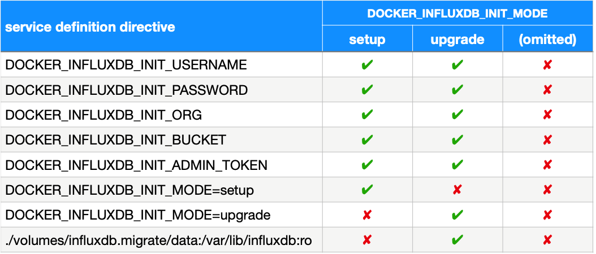
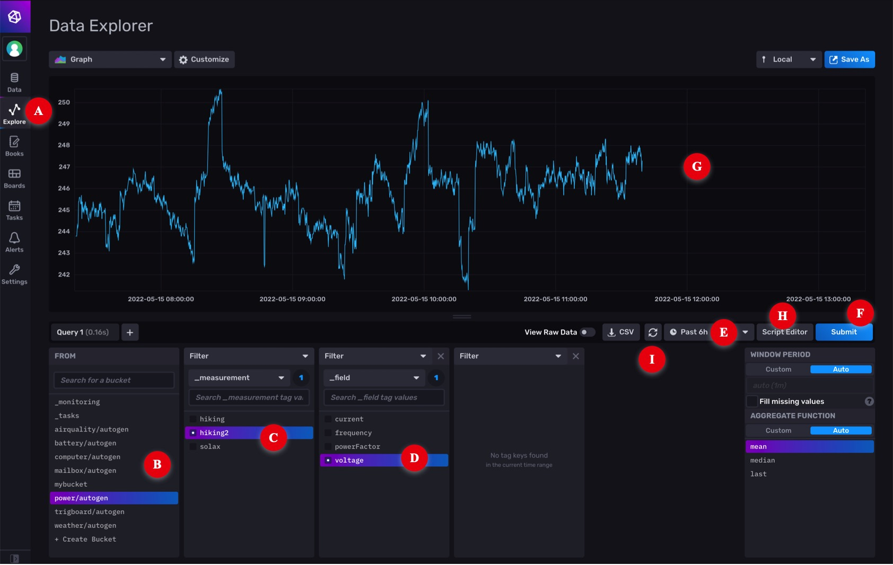
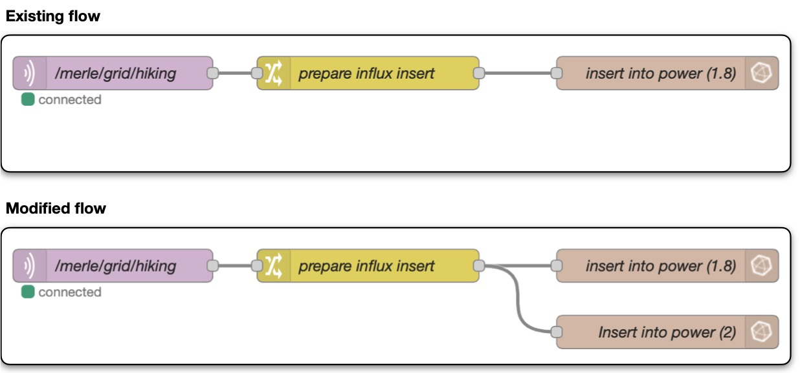
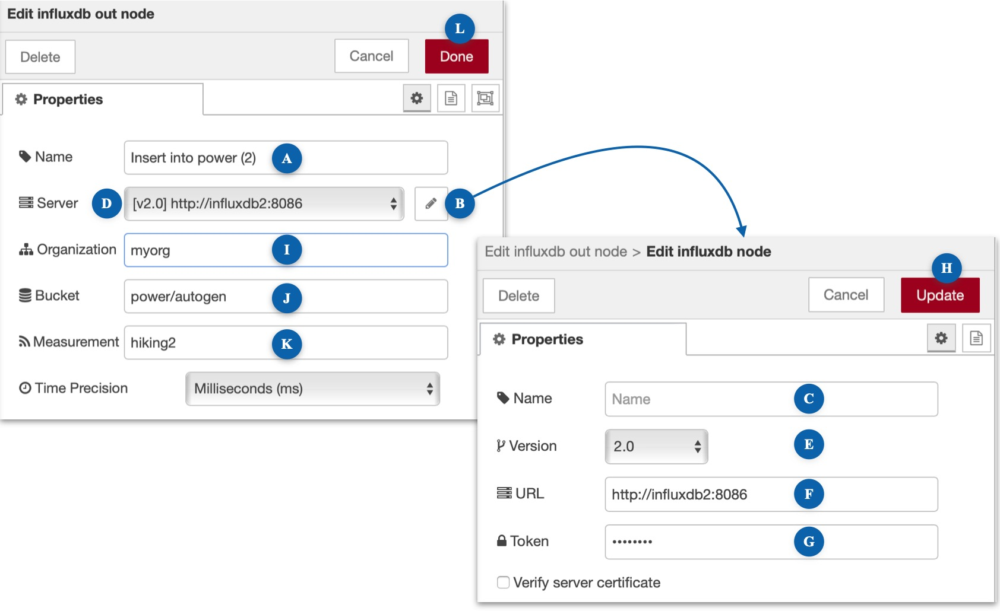
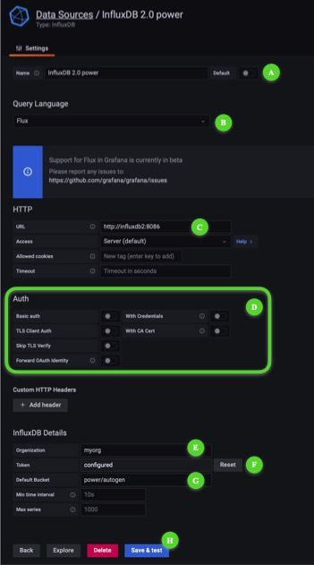
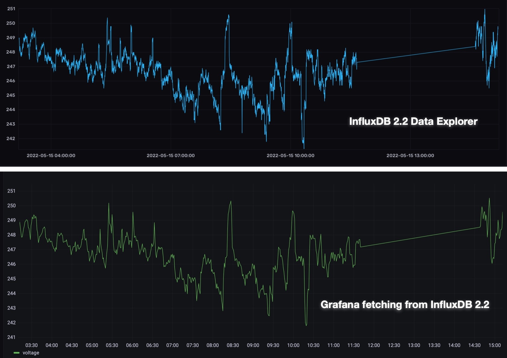

# InfluxDB 2

## references

* [InfluxData home page](https://docs.influxdata.com)
* [DockerHub](https://hub.docker.com/_/influxdb)
* [GitHub](https://github.com/influxdata/influxdata-docker)

## <a name="keyAssumptions"></a>assumptions

1. Your Raspberry Pi is running **full** 64-bit Raspberry Pi OS Debian GNU/Linux 11 (bullseye).

	- DockerHub does not have a 32-bit image for InfluxDB&nbsp;2 so you can't run this container until you have upgraded.
	- Running full 64-bit is **not** the same as enabling the 64-bit kernel in `/boot/config.txt`. User-mode needs to be 64-bit capable as well. You must start from a [full 64-bit image](https://www.raspberrypi.com/software/operating-systems/#raspberry-pi-os-64-bit).

2. Node-RED is your principal mechanism for feeding data to InfluxDB&nbsp;1.8.

	- You may have other services feeding data to InfluxDB&nbsp;1.8 (eg Telegraf). The steps documented here will migrate all your existing data but do not discuss how to adapt services other than Node-RED to feed new data to InfluxDB&nbsp;2.

3. Grafana is your principle mechanism for creating dashboards based on data stored in InfluxDB&nbsp;1.8.

	- You may have other visualisation tools. You may gain insights from studying how Grafana needs to be changed to run Flux queries against InfluxDB&nbsp;2 buckets but this documentation does not explore alternatives.

4. Node-RED, InfluxDB&nbsp;1.8 and Grafana are all running in *non-host* mode on the same Docker instance, and that it is your intention to deploy InfluxDB&nbsp;2 in *non-host* mode as well.

	- If you are running any containers in *host* mode or have distributed the services across multiple Docker instances, you will have to adapt appropriately.

## terminology: *database* vs *bucket*

InfluxDB&nbsp;1.8 and InfluxDB&nbsp;2 are both database management systems (DBMS), sometimes referred to as "engines", optimised for storage and retrieval of time-series data. InfluxDB&nbsp;1.8 uses the term *database* to mean a collection of *measurements*. InfluxDB&nbsp;2 uses the term *bucket* to mean the same thing.

When an InfluxDB&nbsp;1.8 *database* is migrated, it becomes an InfluxDB&nbsp;2 *bucket*. You will see this change in terminology in various places, such as the InfluxDB-out node in Node-RED. When that node is set to:

* Version 1.x, the user interface has a "Database" field which travels with the *connection*. For example:

	- <kbd>[v1.x] influxdb:8086/power</kbd> (set up in the connection sheet)

	This implies that you need one *connection* per *database*.

* Version 2.0, the user interface has a "Bucket" field which is independent of the connection. For example:

	- <kbd>[v2.0] influxdb2:8086</kbd> (set up in the connection sheet)
	- <kbd>Bucket</kbd><kbd>power/autogen</kbd> (set up in the node)

	This implies that you need one *connection* per *engine*. It is a subtle but important difference.

## <a name="svcDef"></a>reference service definition

The InfluxDB&nbsp;2 service definition is added to your compose file by the IOTstack menu.

```{ .yaml linenums="1" }
influxdb2:
  container_name: influxdb2
  image: "influxdb:latest"
  restart: unless-stopped
  environment:
    - TZ=Etc/UTC
    - DOCKER_INFLUXDB_INIT_USERNAME=me
    - DOCKER_INFLUXDB_INIT_PASSWORD=mypassword
    - DOCKER_INFLUXDB_INIT_ORG=myorg
    - DOCKER_INFLUXDB_INIT_BUCKET=mybucket
    - DOCKER_INFLUXDB_INIT_ADMIN_TOKEN=my-super-secret-auth-token
    - DOCKER_INFLUXDB_INIT_MODE=setup
  # - DOCKER_INFLUXDB_INIT_MODE=upgrade
  ports:
    - "8087:8086"
  volumes:
    - ./volumes/influxdb2/data:/var/lib/influxdb2
    - ./volumes/influxdb2/config:/etc/influxdb2
    - ./volumes/influxdb2/backup:/var/lib/backup
  # - ./volumes/influxdb.migrate/data:/var/lib/influxdb:ro
  healthcheck:
    test: ["CMD", "influx", "ping"]
    interval: 30s
    timeout: 10s
    retries: 3
    start_period: 30s
```

As an alternative to using the menu, you can copy and paste the service definition into your compose file from the template at:

```
~/IOTstack/.templates/influxdb2/service.yml
``` 

### <a name="svcDefEdits"></a>required edits

Edit the service definition in your compose file to change the following variables:

- `TZ=`«country»/«city»

- <a name="influxUsername"></a>`DOCKER_INFLUXDB_INIT_USERNAME=`«username»

	This name becomes the administrative user. It is associated with your [«password»](#influxPassword) and [«token»](#influxToken).

- <a name="influxPassword"></a>`DOCKER_INFLUXDB_INIT_PASSWORD=`«password»

	Your «username» and «password» form your login credentials when you administer InfluxDB&nbsp;2 using its web-based graphical user interface. The strength of your password is up to you.

- <a name="influxOrg"></a>`DOCKER_INFLUXDB_INIT_ORG=`«organisation»

	An organisation name is **required**. Examples:

	- myorg
	- my-house
	- com.mydomain.myhouse

- <a name="influxBucket"></a>`DOCKER_INFLUXDB_INIT_BUCKET=`«bucket»

	A default bucket name is **required**. The name does not matter because you won't actually be using it so you can accept the default of "mybucket". You can [delete the unused bucket](#delBucket) later if you want to be tidy.

- <a name="influxToken"></a>`DOCKER_INFLUXDB_INIT_ADMIN_TOKEN=`«token»

	Although you can let InfluxDB&nbsp;2 generate your access token for you, it will keep things simple if you generate your own. Here are some possible approaches:

	1. use a universally-unique ID:

		```bash
		$ uuidgen
		4fef85b4-2f56-480f-b143-fa5cb6e8f18a
		``` 

	2. use GnuPG to generate a random string:

		```bash
		$ gpg --gen-random -a 0 25
		bYS3EsnnY0AlRxJ2uk44Hzwm7GMKYu5unw==
		```

	3. use a password-generator of your choosing.

Note:

* Unless a container's documentation explicitly states that it is supported, you should never use quote marks to encapsulate the values you supply via environment variables. InfluxDB&nbsp;2 treats quotes as being part of the value (eg a password of "fred" is the 6-character string that *includes* the quotes). If you put quote marks around anything as you were editing, please go back and remove them.

### <a name="svcDefVars"></a>Table 1: mode-specific directives

InfluxDB 2 operates in three distinct modes which are controlled by the `DOCKER_INFLUXDB_INIT_MODE` environment variable. The table below summarises the variables and volumes mappings that need to be active in each mode.



## <a name="initContainer"></a>initialising InfluxDB 2

If you have only just included the [template service definition](#svcDef) in your compose file and performed the [required edits](#svcDefEdits), then you can follow the initialisation process below.

However, if you want to **re-initialise** the container, go to [re-initialising InfluxDB&nbsp;2](#reinitContainer).

To initialise InfluxDB&nbsp;2:

1. Confirm that the service definition directives are set as per the "setup" column of [Table 1](#svcDefVars). 
2. Be in the correct directory (assumed throughout):

	```bash
	$ cd ~/IOTstack
	```

3. Start the InfluxDB&nbsp;2 container:

	```bash
	$ docker-compose up -d influxdb2
	```

4. InfluxDB&nbsp;2 will notice the following environment variable:

	```yaml
	DOCKER_INFLUXDB_INIT_MODE=setup
	```

	This instructs the container to initialise the database engine structures based on a combination of defaults and the values you provide via the other environment variables.

5. Confirm that the InfluxDB&nbsp;2 container is not in a restart loop and isn't reporting errors by using commands like:

	```bash
	$ docker ps
	$ docker logs influxdb2
	```

If you don't need to migrate any data from InfluxDB&nbsp;1.8 you can go straight to [running InfluxDB&nbsp;2](#runContainer), otherwise follow the [data-migration procedure](#migrateContainer) instructions below.

## <a name="migrateContainer"></a>data-migration procedure

Successful migration depends on the following assumptions being true:

* The InfluxDB&nbsp;2 container is running and has just been initialised as per [initialising InfluxDB&nbsp;2](#initContainer).
* The InfluxDB&nbsp;1.8 container is running, and is based on the IOTstack service definition (or reasonable facsimile) at:

	```
	~/IOTstack/.templates/influxdb/service.yml
	```  

To migrate your InfluxDB&nbsp;1.8 data:

1. Be in the correct directory (assumed throughout):

	```bash
	$ cd ~/IOTstack
	```

2. InfluxDB&nbsp;1.8 runs as root and its persistent store is owned by root but not all files and folders in the persistent store are *group* or *world* readable. InfluxDB&nbsp;2 runs as user ID 1000 (user "influxdb" inside the container). Because of this, you need to give InfluxDB&nbsp;2 permission to read the InfluxDB&nbsp;1.8 persistent store.

	It is not a good idea to interfere with a persistent store while a container is running so best practice is to stop InfluxDB&nbsp;1.8 for long enough to make a copy of its persistent store:

	```bash
	$ sudo rm -rf ./volumes/influxdb.migrate
	$ docker-compose down influxdb
	$ sudo cp -a ./volumes/influxdb ./volumes/influxdb.migrate
	$ docker-compose up -d influxdb
	$ sudo chown -R 1000:1000 ./volumes/influxdb.migrate/data
	```
	
	> see also [if downing a container doesn't work](../Basic_setup/index.md/#downContainer)

	In words:

	1. Ensure any previous attempts at migration are removed. Always be *extremely* careful with any `sudo rm` command. Check your work **before** you press <kbd>return</kbd>.
	2. Stop InfluxDB&nbsp;1.8.
	3. Make a copy of the InfluxDB&nbsp;1.8 persistent store.
	4. Start InfluxDB&nbsp;1.8 again.
	5. Change ownership of the **copy** of the InfluxDB&nbsp;1.8 persistent store.

3. Edit your compose file as per the "upgrade" column of [Table 1](#svcDefVars). The changes you need to make are:

	1. Change the initialisation mode from `setup` to `upgrade`:

		- before editing:

			```{ .yaml linenums="12" }
			    - DOCKER_INFLUXDB_INIT_MODE=setup
			  # - DOCKER_INFLUXDB_INIT_MODE=upgrade
			```

		- after editing:

			```{ .yaml linenums="12" }
			  # - DOCKER_INFLUXDB_INIT_MODE=setup
			    - DOCKER_INFLUXDB_INIT_MODE=upgrade
			```

	2. Activate the volume mapping to give InfluxDB&nbsp;2 read-only access to the **copy** of the InfluxDB&nbsp;1.8 persistent store that you made in step 2:

		- before editing:

			```{ .yaml linenums="20" }
			  # - ./volumes/influxdb.migrate/data:/var/lib/influxdb:ro
			```

		- after editing:

			```{ .yaml linenums="20" }
			    - ./volumes/influxdb.migrate/data:/var/lib/influxdb:ro
			```

	Save your work but do not execute any `docker-compose` commands.

4. InfluxDB&nbsp;2 creates a "bolt" (lock) file to prevent accidental data-migrations. That file needs to be removed:

	```bash
	$ rm ./volumes/influxdb2/data/influxd.bolt
	```

5. The InfluxDB&nbsp;2 container is still running. The following command causes the container to be recreated with the edits you made in step 3:

	```bash
	$ docker-compose up -d influxdb2
	```

6. InfluxDB&nbsp;2 will notice the following environment variable:

	```yaml
	DOCKER_INFLUXDB_INIT_MODE=upgrade
	```

	This, combined with the absence of the "bolt" file, starts the migration process. You need to wait until the migration is complete. The simplest way to do that is to watch the size of the persistent store for InfluxDB&nbsp;2 until it stops increasing. Experience suggests that the InfluxDB&nbsp;2 persistent store will usually be a bit larger than InfluxDB&nbsp;1.8. For example:

	* reference size for an InfluxDB&nbsp;1.8 installation:

		```bash
		$ sudo du -sh ./volumes/influxdb
		633M	./volumes/influxdb
		```

	* final size after migration to InfluxDB&nbsp;2:

		```bash
		$ sudo du -sh ./volumes/influxdb2
		721M	./volumes/influxdb2
		```

7. Data migration is complete once the folder size stops changing.

Proceed to [running InfluxDB&nbsp;2](#runContainer) below.

## <a name="runContainer"></a>running InfluxDB 2

The container now needs to be instructed to run in normal mode.

1. Be in the correct directory (assumed throughout):

	```bash
	$ cd ~/IOTstack
	```

2. Edit your compose file as per the "(omitted)" column of [Table 1](#svcDefVars). The changes are:

	1. Deactivate all `DOCKER_INFLUXDB_INIT_` environment variables. After editing, the relevant lines should look like:

		```{ .yaml linenums="7" }
		  # - DOCKER_INFLUXDB_INIT_USERNAME=me
		  # - DOCKER_INFLUXDB_INIT_PASSWORD=mypassword
		  # - DOCKER_INFLUXDB_INIT_ORG=myorg
		  # - DOCKER_INFLUXDB_INIT_BUCKET=mybucket
		  # - DOCKER_INFLUXDB_INIT_ADMIN_TOKEN=my-super-secret-auth-token
		  # - DOCKER_INFLUXDB_INIT_MODE=setup
		  # - DOCKER_INFLUXDB_INIT_MODE=upgrade
		```

	2. Deactivate the volume mapping if it is active. After editing, the line should look like:

		```{ .yaml linenums="20" }
		  # - ./volumes/influxdb.migrate/data:/var/lib/influxdb:ro
		```

	Save your work.

3. The InfluxDB&nbsp;2 container is still running. The following command causes the container to be recreated with the edits you have just made:

	```bash
	$ docker-compose up -d influxdb2
	```
	
	The absence of an active `DOCKER_INFLUXDB_INIT_MODE` variable places InfluxDB&nbsp;2 into normal run mode.

4. If you have just performed a data migration, you can remove the **copy** of the InfluxDB&nbsp;1.8 persistent store:

	```bash
	$ sudo rm -rf ./volumes/influxdb.migrate
	```
	
	> always be *extremely* careful with any `sudo rm` command. Always check your work **before** you press <kbd>return</kbd>.

## <a name="reinitContainer"></a>re-initialising InfluxDB 2

If you need to start over from a clean slate:

1. Be in the correct directory (assumed throughout):

	```bash
	$ cd ~/IOTstack
	```

2. Terminate the InfluxDB&nbsp;2 container:

	```bash
	$ docker-compose down influxdb2
	```
	
	> see also [if downing a container doesn't work](../Basic_setup/index.md/#downContainer)

3. Remove the persistent store:

	```bash
	$ sudo rm -rf ./volumes/influxdb2
	```

	> always be *extremely* careful with any `sudo rm` command. Always check your work **before** you press <kbd>return</kbd>.

4. Edit your compose file as per the "setup" column of [Table 1](#svcDefVars). After editing, the relevant lines should look like this:

	```{ .yaml linenums="7" }
	    - DOCKER_INFLUXDB_INIT_USERNAME=me
	    - DOCKER_INFLUXDB_INIT_PASSWORD=mypassword
	    - DOCKER_INFLUXDB_INIT_ORG=myorg
	    - DOCKER_INFLUXDB_INIT_BUCKET=mybucket
	    - DOCKER_INFLUXDB_INIT_ADMIN_TOKEN=my-super-secret-auth-token
	    - DOCKER_INFLUXDB_INIT_MODE=setup
	  # - DOCKER_INFLUXDB_INIT_MODE=upgrade
	```

Go to [initialising InfluxDB&nbsp;2](#initContainer).

## exploring InfluxDB 2 data



1. Launch a browser and connect it to port 8087 on your Raspberry Pi. For example:

	```
	http://raspberrypi.local:8087
	```

	You can also use the IP address or domain name of your Raspberry Pi. In this context, 8087 is the *external* port number from the left hand side of the port mapping in the service definition:

	```{ .yaml linenums="14" }
	  ports:
	    - "8087:8086"
	```

2. Sign in to the InfluxDB&nbsp;2 instance using your [«username»](#influxUsername) and [«password»](#influxPassword).
3. Click on "Explore" in the left-hand tool strip. That is marked [A] in the screen shot. In the area marked [B] you should be able to see a list of the *buckets* that were migrated from InfluxDB&nbsp;1.8 *databases*.

	In the screen shot, I clicked on other fields to create a query:

	- In area <a name="influxExplorer-B"></a>[B], I selected the "power/autogen" *bucket*;
	- In area <a name="influxExplorer-C"></a>[C], I selected the "hiking2" (electricity meter) *measurement*;
	- In area <a name="influxExplorer-D"></a>[D], I selected the "voltage" *field*;
	- The bucket in this test is a migrated copy of an InfluxDB&nbsp;1.8 database. It was not ingesting live data so I also needed to change the duration popup menu [E] to a time-span that included the most-recent insertions;
	- Then I clicked the "Submit" button [F]; and
	- The result was the graph in [G].

You can explore your own tables using similar techniques.

## Flux queries via point-and-click

Grafana does not (yet) seem to have the ability to let you build Flux queries via point-and-click like you can with InfluxQL queries. Until Grafana gains that ability, it's probably a good idea to learn how to build Flux queries in InfluxDB, so you can copy-and-paste the Flux statements into Grafana.

Once you have constructed a query in the "Query Builder", click the "Script Editor" button [H] to switch to the editor view. 

For this example, the <a name="queryText"></a>query text is:

```flux
from(bucket: "power/autogen")
  |> range(start: v.timeRangeStart, stop: v.timeRangeStop)
  |> filter(fn: (r) => r["_measurement"] == "hiking2")
  |> filter(fn: (r) => r["_field"] == "voltage")
  |> aggregateWindow(every: v.windowPeriod, fn: mean, createEmpty: false)
  |> yield(name: "mean")
```

Two important things to note here are:

1. The <a name="bucketName"></a>*bucket* name: `power/autogen`; and
2. The <a name="measurementName"></a>*measurement* name: `hiking2`.

## example: adapting Node-RED



1. Assume you have an existing flow (eg a fairly standard [3-node flow](https://gist.github.com/Paraphraser/c9db25d131dd4c09848ffb353b69038f)) which is logging to an InfluxDB&nbsp;1.8 database. Your goal is to modify the flow to log the same data to the recently-migrated InfluxDB&nbsp;2 bucket. 

2. Start Node-RED if it is not running:

	```bash
	$ cd ~/IOTstack
	$ docker-compose up -d nodered
	```

3. Use a web browser to connect to your Node-RED instance.
4. Drag a **new** InfluxDB-out node onto the canvas:

	- This is exactly the same InfluxDB-out node that you have been using to write to your InfluxDB&nbsp;1.8 databases. There isn't a different node or package for InfluxDB&nbsp;2.
	- Always drag a **new** InfluxDB-out node from the palette onto the canvas. Do not make the mistake of re-using an existing InfluxDB-out node (eg via copy and paste) because that is a very good way of breaking your flows.

5. Double-click the InfluxDB-out node to open it:

	

	* At [A], give the node a sensible name.
	* Click the pencil icon [B] adjacent to the Server field:

		- Leave the Name field [C] blank. This ensures that the title in the popup menu [D] automatically reflects the version and connection URL.
		- Change the Version popup menu [E] to "2.0". 
		- Set the URL [F] to point to your InfluxDB&nbsp;2 instance:

			```
			http://influxdb2:8086
			```

			> In this context, "influxdb2" is the container name and 8086 is the container's *internal* port. Node-RED communicates with InfluxDB&nbsp;2 across the internal bridged network (see [assumptions](#keyAssumptions)).

		- Paste your [«token»](#influxToken) into the Token field [G].
		- Click "Update" [H].

	* Set the Organisation field [I] to your [«organisation»](#influxOrg).
	* Set the Bucket [J] to the correct value. You can get that from either:

		- area [[B]](#influxExplorer-B) in the Influx Explorer screen shot; or
		- the [bucket name](#bucketName) from the saved Flux query.

		In this example, the bucket name is "power/autogen".

	* Set the Measurement [K] to the measurement name. You can get that from either:

		- area [[C]](#influxExplorer-C) in the Influx Explorer screen shot; or
		- the [measurement name ](#measurementName) from the saved Flux query.

		In this example, the measurement name is "hiking2".

	* Click Done [L].

6. Connect the outlet of the Change node to the inlet of the InfluxDB-out node.
7. Click Deploy.
8. Watch the debug panel to make sure no errors are being reported.
9. Go back to the InfluxDB&nbsp;2 Data Explorer and click the refresh button "I". If everything has gone according to plan, you should see recent observations added to your graph. 

	> You may need to wait until your sensor has sent new data.

## example: adapting Grafana

### defining an InfluxDB 2 data source

1. Start Grafana if it is not running:

	```bash
	$ cd ~/IOTstack
	$ docker-compose up -d grafana
	```

2. Use a web browser to connect to your Grafana instance and login as an administrator.
3. Hover your mouse over the "gear" icon in the tool-strip on the left hand side, and choose "Data sources".
4. Click the "Add data source" button.
5. Select the "InfluxDB" option.
6. Configure as follows:

	

	- Change the Name [A] to a <a name="bucketConnection"></a> meaningful title that reflects the **bucket** you are going to query. For example, "InfluxDB&nbsp;2.0 power".
	- Change the Query Language popup menu [B] to "Flux".

		> Ignore the advice about Flux support being in beta.

	- Change the URL [C] to point to your InfluxDB&nbsp;2 instance:

		```
		http://influxdb2:8086
		```

		> In this context, "influxdb2" is the container name and 8086 is the container's *internal* port. Grafana communicates with InfluxDB&nbsp;2 across the internal bridged network (see [assumptions](#keyAssumptions)).

	- Turn off all the switches in the "Auth" group [D].
	- Set the Organisation [E] to your [«organisation»](#influxOrg).
	- Paste your [«token»](#influxToken) into the Token field [F].

		> ignore the fact that the prompt text says "password" - you need the token!

	- Set the Default Bucket [G] to the bucket (database) you want to query. You can get that from either:

		- area [[B]](#influxExplorer-B) in the Influx Explorer screen shot; or
		- the [bucket name](#bucketName) from the saved Flux query.

		In this example, the value is "power/autogen".

	- Click Save & Test [H].

### using an InfluxDB 2 data source in a dashboard

1. Find the + icon in the tool-strip on the left hand side, hover your mouse over it and choose "Create » dashboard".
2. Click "Add a new panel".
3. Change the "Data source" popup to the [bucket connection](#bucketConnection) you created earlier ("InfluxDB&nbsp;2.2 power").
4. The editor automatically switches into Flux mode.
5. Paste the [query text](#queryText) you saved earlier from the InfluxDB&nbsp;2 query inspector.
6. If necessary, change the duration to a period that is likely to contain some data to display.
7. Click the Refresh button.
8. Click Apply.

In the side-by-side screen shots below, observations before the straight-line (missing data) segment were imported from InfluxDB&nbsp;1.8 while observations after the straight-line segment were inserted by the new InfluxDB-out node in Node-RED.



## odds and ends

1. Forgot your token:

	```bash
	$ docker exec influxdb2 influx auth ls
	```

2. Create a new user, password and token:

	```bash
	$ docker exec influxdb2 influx user create --name «username» --password «password»
	$ docker exec influxdb2 influx auth create --user «username» --all-access
	```

3. List available buckets:

	```bash
	$ docker exec influxdb2 influx bucket ls
	```
 
4. <a name="delBucket"></a>Delete the [default «bucket»](#influxBucket):

	```bash
	$ docker exec influxdb2 influx bucket delete --org «organisation» --name «bucket»
	```

## migration strategy

From the fact that both InfluxDB&nbsp;1.8 and InfluxDB&nbsp;2 can run in parallel, with Node-RED feeding the same data to both, it should be self-evident that you can repeat the data-migration as often as necessary, simply by starting from [re-initialising InfluxDB&nbsp;2](#reinitContainer).

This implies that you can concentrate on one database at a time, adjusting Node-RED so that it writes each row of sensor data to both the InfluxDB&nbsp;1.8 database and corresponding InfluxDB&nbsp;2 bucket.

Having the data going to both engines means you can take your time adjusting your Grafana dashboards to be based on Flux queries. You can either retrofit InfluxDB&nbsp;2 bucket sources and Flux queries to existing dashboards, or build parallel dashboards from the ground up.
