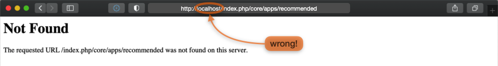
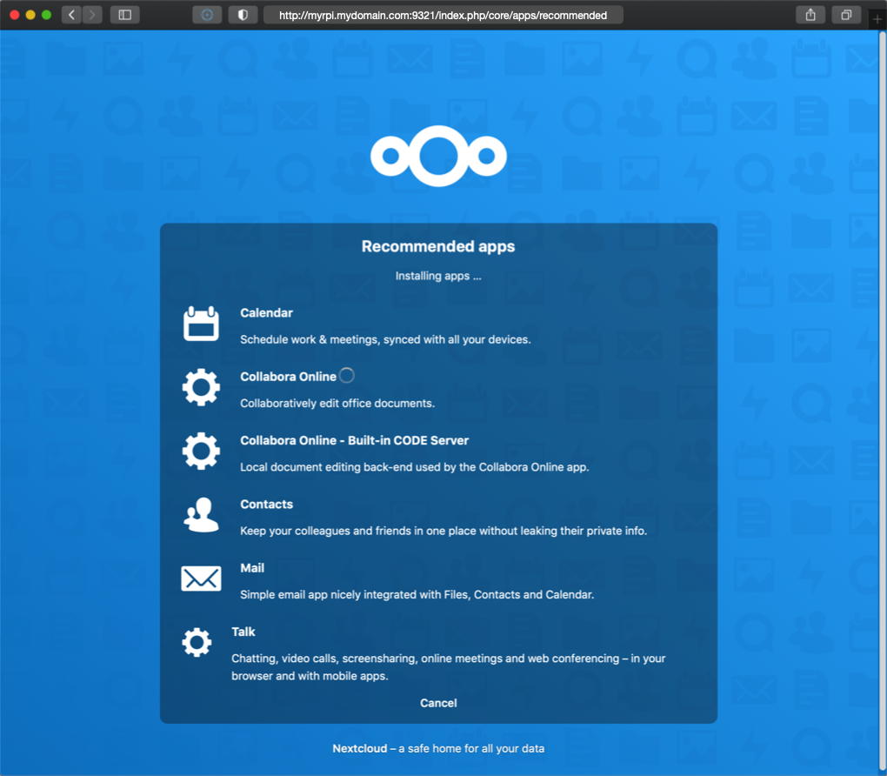

# Nextcloud

## <a name="serviceDefinition"> Service definition </a>

This is the **core** of the IOTstack Nextcloud service definition:

```yml
nextcloud:
  container_name: nextcloud
  image: nextcloud
  restart: unless-stopped
  environment:
    - MYSQL_HOST=nextcloud_db
    - MYSQL_PASSWORD=«user_password»
    - MYSQL_DATABASE=nextcloud
    - MYSQL_USER=nextcloud
  ports:
    - "9321:80"
  volumes:
    - ./volumes/nextcloud/html:/var/www/html
  depends_on:
    - nextcloud_db

nextcloud_db:
  container_name: nextcloud_db
  image: ghcr.io/linuxserver/mariadb
  restart: unless-stopped
  environment:
    - TZ=Etc/UTC
    - PUID=1000
    - PGID=1000
    - MYSQL_ROOT_PASSWORD=«root_password»
    - MYSQL_PASSWORD=«user_password»
    - MYSQL_DATABASE=nextcloud
    - MYSQL_USER=nextcloud
  volumes:
    - ./volumes/nextcloud/db:/config
```

There are two containers, one for the cloud service itself, and the other for the database. Both containers share the same persistent storage area in the volumes subdirectory so they are treated as a unit. This will not interfere with any other MariaDB containers you might wish to run.

Depending on the IOTstack branch you are running, there may also be `networks:` directives. Other than to note that new menu dedicates a network to inter-container communications, those directives make no difference for this discussion.

Under old-menu, you are responsible for setting passwords. The passwords are "internal use only" and it is unlikely that you will need them unless you plan to go ferreting-about in the database using SQL. The rules are:

* The two instances of `«user_password»` **must** be the same.
* The instance of `«root_password»` *should* be different from `«user_password»`.

Under new-menu, the menu can generate random passwords for you. You can either use that feature or roll your own using the old-menu approach by replacing:

* Two instances of `%randomMySqlPassword%` (the `«user_password»`)
* One instance of `%randomPassword%` (the `«root_password»`)

The passwords need to be set before you bring up the Nextcloud service for the first time but the following initialisation steps assume you might not have done that and always start over from a clean slate.

## <a name="initialisation"> Initialising Nextcloud </a>

1. Be in the correct directory:

	```
	$ cd ~/IOTstack
	```
	
2. If the stack is running, take it down:

	```
	$ docker-compose down
	```
	
3. Erase the persistent storage area for Nextcloud (double-check the command *before* you hit return):

	```
	$ sudo rm -rf ./volumes/nextcloud
	```
	
	This is done to force re-initialisation. In particular, it gives you assurance that the passwords in your `docker-compose.yml` are the ones that are actually in effect.

4. Bring up the stack:

	```
	$ docker-compose up -d
	```

5. Check for errors:

	Repeat the following command two or three times at 10-second intervals:
	
	```
	$ docker ps
	```

	You are looking for evidence that the `nextcloud` and `nextcloud_db` containers are up, stable, and not restarting. If you see any evidence of restarts, try to figure out why using:
	
	```
	$ docker logs nextcloud
	```
	
6. If you want to be sure Nextcloud gets set up correctly, it is best to perform the remaining steps from a **different** computer.

	That means you need to decide how that **other** computer will refer to your Raspberry Pi running Nextcloud. Your choices are:

	* the IP address of your Raspberry Pi – eg `192.168.203.200`
	* your Raspberry Pi's fully-qualified domain name – eg `myrpi.mydomain.com`
	* your Raspberry Pi's host name – eg `myrpi`

	Key points:
	
	* You **can't** use a multicast domain name (eg `myrpi.local`). An mDNS name will not work until Nextcloud has been initialised!
	* Once you have picked a connection method, **STICK TO IT**.
	* You are only stuck with this restriction until Nextcloud has been initialised. You **can** (and should) fix it later by completing the steps in ["Access through untrusted domain"](#untrustedDomain).

7. On a computer that is **not** the Raspberry Pi running Nextcloud, launch a browser and point to the Raspberry Pi running Nextcloud using your chosen connection method. Examples:

	- If you are using an IP address:

		```
		http://192.168.203.200:9321
		```

	- If you are using a domain name:

		```
		http://myrpi.mydomain.com:9321
		```

	- If you are using a host name in `/etc/hosts`:

		```
		http://myrpi:9321
		```
	
	The expected result is:
	
	

8. Create an administrator account and then click "Finish Setup".

9. There is a long delay. And then you get an error:

	
	
	If you examine the contents of your browser's URL bar, you will find:
	
	```
	http://localhost/index.php/core/apps/recommended
	```
	
	That is **clearly** wrong and it is probably a bug in Nextcloud.	
10. Edit the URL to replace `localhost` with what it *should* be, which will be **one** of the following patterns, depending on which method you chose to access Nextcloud:

	* `http://192.168.203.200:9321/index.php/core/apps/recommended`
	* `http://myrpi.mydomain.com:9321/index.php/core/apps/recommended`
	* `http://myrpi:9321/index.php/core/apps/recommended`
	
	Note:
	
	* This seems to be the only time Nextcloud misbehaves and forces `localhost` into a URL.
	
11. After a delay, you will see the "Recommended apps" screen with a spinner moving down the list of apps as they are loaded:

	
	
	Wait for the loading to complete.

12. Eventually, the dashboard will appear. Then the dashboard will be obscured by the "Nextcloud Hub" floating window:

	

	Hover your mouse to the right of the floating window and keep clicking on the right-arrow button until you reach the last screen, then click "Start using Nextcloud".

13. Congratulations. Your IOTstack implementation of Nextcloud is ready to roll:

	

## <a name="untrustedDomain">"Access through untrusted domain"</a>

During Nextcloud initialisation you had to choose between an IP address, a domain name or a host name. Now that Nextcloud is running, you have the opportunity to expand your connection options.

> If you are reading this because you are staring at an "access through untrusted domain" message then you have come to the right place.

Let's assume the following:

* You used `raspi-config` to give your Raspberry Pi the name "myrpi".
* Your Raspberry Pi has the fixed IP address "192.168.203.200" (via either a static binding in your DHCP server or a static IP address on your Raspberry Pi).

Out of the box, a Raspberry Pi participates in multicast DNS so it will also have the mDNS name:

* "myrpi.local"

Let's also assume you have a local Domain Name System server where your Raspberry Pi:

* has the canonical name (A record) "myrpi.mydomain.com"; plus
* an alias (CNAME record) of "nextcloud.mydomain.com".

Rolling all that together, you would expect your Nextcloud service to be reachable at any of the following URLs:

* `http://192.168.203.200:9321`
* `http://myrpi.local:9321`
* `http://myrpi.mydomain.com:9321`
* `http://nextcloud.mydomain.com:9321`

To tell Nextcloud that all of those URLs are valid, you need to use `sudo` and your favourite text editor to edit this file:

```
~/IOTstack/volumes/nextcloud/html/config/config.php
```

Hint:

* It is a good idea to make a backup of any file before you edit it. For example:

	```
	$ cd ~/IOTstack/volumes/nextcloud/html/config/
	$ sudo cp config.php config.php.bak
	```

Search for "trusted_domains". To tell Nextcloud to trust **all** of the URLs above, edit the array structure like this:

```
  'trusted_domains' =>
  array (
    0 => '192.168.203.200:9321',
    1 => 'myrpi.local:9321',
    2 => 'myrpi.mydomain.com:9321',
    3 => 'nextcloud.mydomain.com:9321',
  ),
```

> Note: *all* the trailing commas are intentional!

Once you have finished editing the file, save your work then restart Nextcloud:

```
$ cd ~/IOTstack
$ docker-compose restart nextcloud
```

Use `docker ps` to check that the container has restarted properly and hasn't gone into a restart loop.

See also:

* [Nextcloud documentation - trusted domains](https://docs.nextcloud.com/server/21/admin_manual/installation/installation_wizard.html#trusted-domains).

### <a name="dnsAlias"> Using a DNS alias for your Nextcloud service </a>

The examples above include using a DNS alias (a CNAME record) for your Nextcloud service. If you decide to do that, you may see this warning in the log:

```
Could not reliably determine the server's fully qualified domain name
```

You can silence the warning by editing the Nextcloud service definition in `docker-compose.yml` to add your fully-qualified DNS alias to at `hostname` directive. For example:

```
    hostname: nextcloud.mydomain.com
```

## <a name="security"> Security considerations</a>

Nextcloud traffic is not encrypted. Do **not** expose it to the web by opening a port on your home router. Instead, use a VPN like Wireguard to provide secure access to your home network, and let your remote clients access Nextcloud over the VPN tunnel.

## <a name="backups"> Backups </a>

Nextcloud is currently excluded from the IOTstack-supplied backup scripts due to its potential size.

> This is also true for [Paraphraser/IOTstackBackup](https://github.com/Paraphraser/IOTstackBackup).

If you want to take a backup, something like the following will get the job done:

```
$ cd ~/IOTstack
$ BACKUP_TAR_GZ=$PWD/backups/$(date +"%Y-%m-%d_%H%M").$HOSTNAME.nextcloud-backup.tar.gz
$ touch "$BACKUP_TAR_GZ"
$ docker-compose stop nextcloud nextcloud_db
$ docker-compose rm -f nextcloud nextcloud_db
$ sudo tar -czf "$BACKUP_TAR_GZ" -C "./volumes/nextcloud" .
$ docker-compose up -d
```

Note:

* A *baseline* backup takes over 400MB and about 2 minutes. Once you start adding your own data, it will take even more time and storage.

To restore, you first need to identify the name of the backup file by looking in the `backups` directory. Then:

```
$ cd ~/IOTstack
$ RESTORE_TAR_GZ=$PWD/backups/2021-06-12_1321.sec-dev.nextcloud-backup.tar.gz
$ docker-compose stop nextcloud nextcloud_db
$ docker-compose rm -f nextcloud nextcloud_db
$ sudo rm -rf ./volumes/nextcloud/*
$ sudo tar -x --same-owner -z -f "$RESTORE_TAR_GZ" -C "./volumes/nextcloud"
$ docker-compose up -d
```

If you are running from an SD card, it would be a good idea to mount an external drive to store the data. Something like:


The external drive will have to be an ext4 formatted drive because smb, fat32 and NTFS can't handle Linux file permissions. If the permissions aren't set to "www-data" then the container won't be able to write to the disk.

Finally, a warning:

* If your database gets corrupted then your Nextcloud is pretty much stuffed.
