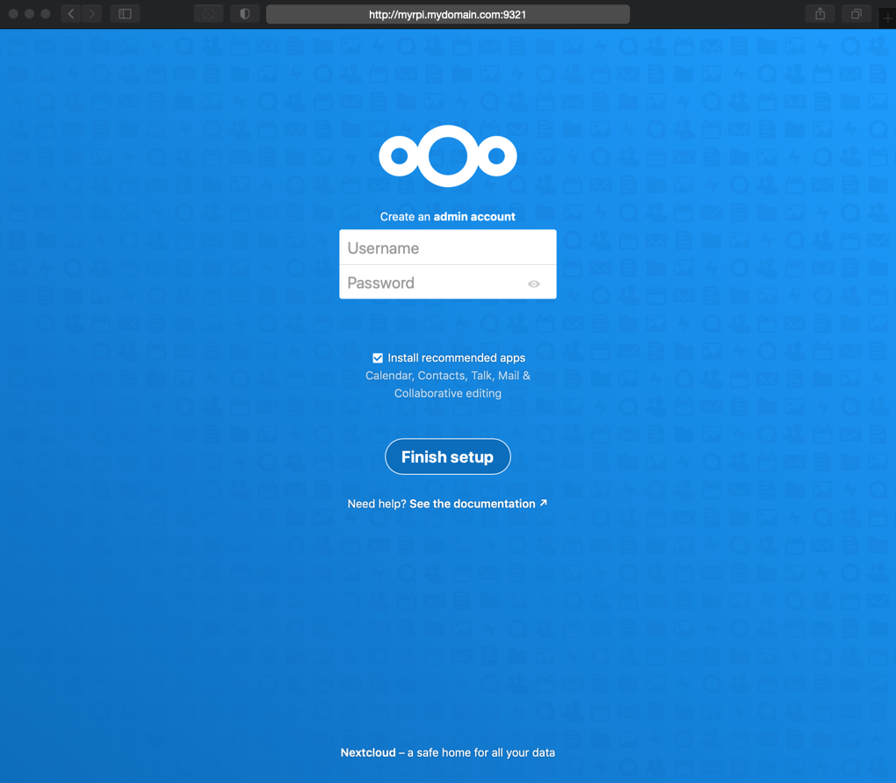
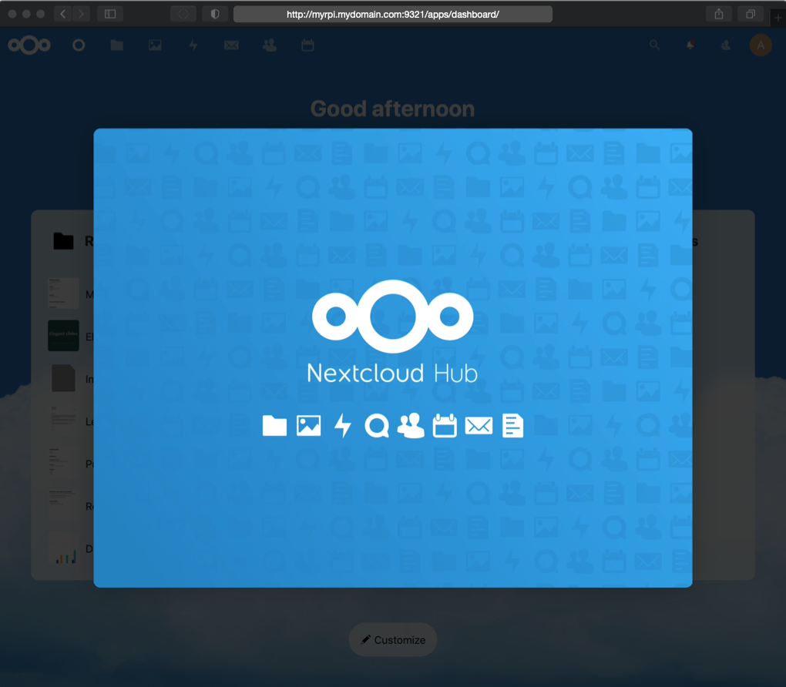
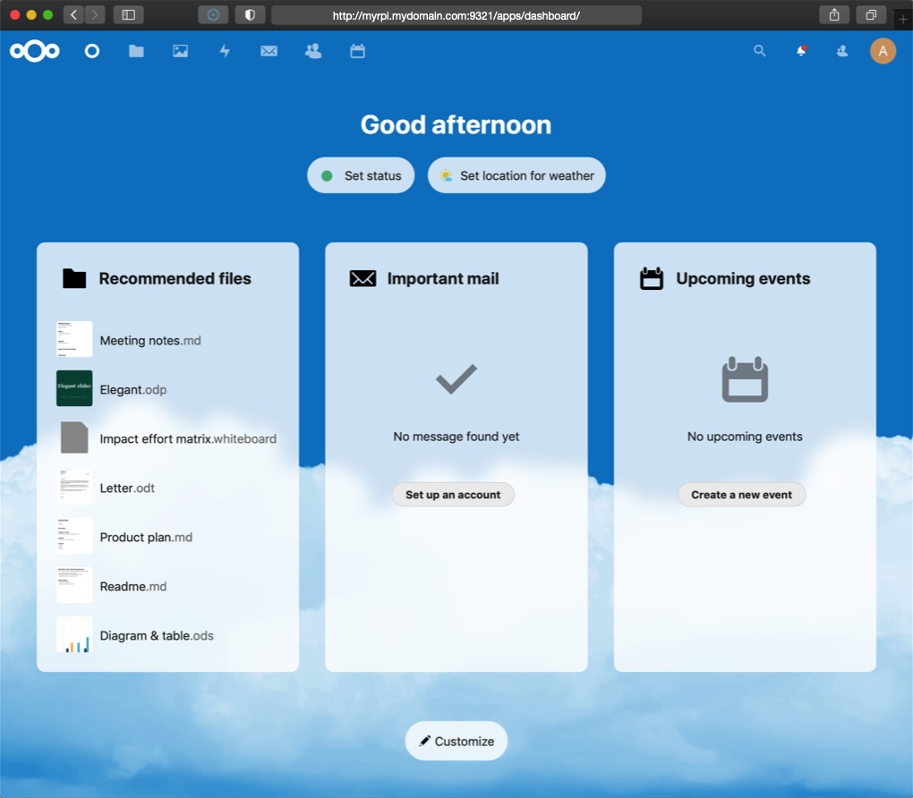
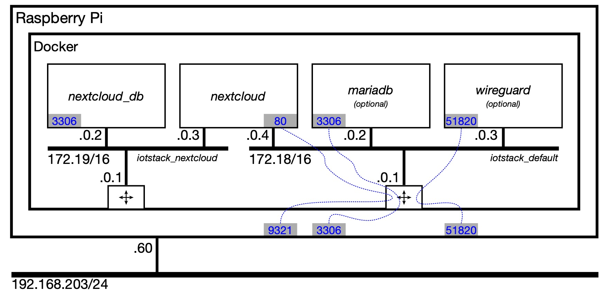
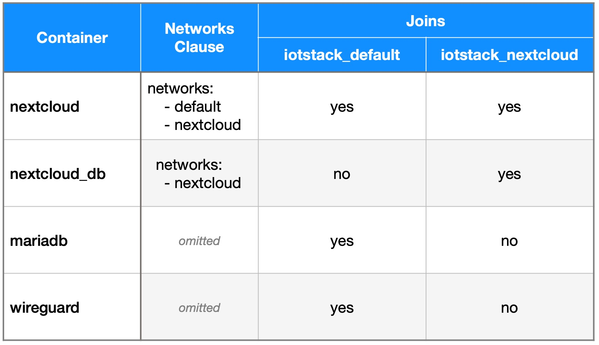

# Nextcloud

## Service definition { #serviceDefinition }

This is the **core** of the IOTstack Nextcloud service definition:

``` { .yaml linenums="1" }
nextcloud:
  container_name: nextcloud
  image: nextcloud
  restart: unless-stopped
  environment:
    - TZ=${TZ:-Etc/UTC}
    - MYSQL_HOST=nextcloud_db
    - MYSQL_PASSWORD=%randomMySqlPassword%
    - MYSQL_DATABASE=nextcloud
    - MYSQL_USER=nextcloud
  ports:
    - "9321:80"
    - "9343:443"
  volumes:
    - ./volumes/nextcloud/html:/var/www/html
  depends_on:
    - nextcloud_db
  networks:
    - default
    - nextcloud

nextcloud_db:
  container_name: nextcloud_db
  build: ./.templates/mariadb/.
  restart: unless-stopped
  environment:
    - TZ=${TZ:-Etc/UTC}
    - PUID=1000
    - PGID=1000
    - MYSQL_ROOT_PASSWORD=%randomPassword%
    - MYSQL_PASSWORD=%randomMySqlPassword%
    - MYSQL_DATABASE=nextcloud
    - MYSQL_USER=nextcloud
  volumes:
    - ./volumes/nextcloud/db:/config
    - ./volumes/nextcloud/db_backup:/backup
  networks:
    - nextcloud
```

There are two containers, one for the cloud service itself, and the other for the database. Both containers share the same persistent storage area in the volumes subdirectory so they are treated as a unit. This will not interfere with any other MariaDB containers you might wish to run.

Key points:

* You do **not** need to select MariaDB in the IOTstack menu just to run NextCloud. Some tutorials suggest you do. They are wrong!
* If you *choose* to select MariaDB in the IOTstack menu, understand that it is a *separate* instance of the relational database management system. It has no relationship with NextCloud.  

Under old-menu, you are responsible for setting passwords. The passwords are "internal use only" and it is unlikely that you will need them unless you plan to go ferreting-about in the database using SQL. The rules are:

* The two instances of `«user_password»` **must** be the same.
* The instance of `«root_password»` *should* be different from `«user_password»`.

Under new-menu, the menu can generate random passwords for you. You can either use that feature or roll your own using the old-menu approach by replacing:

* Two instances of `%randomMySqlPassword%` (the `«user_password»`)
* One instance of `%randomPassword%` (the `«root_password»`)

The passwords need to be set before you bring up the Nextcloud service for the first time. However, the following initialisation steps assume you might not have done that and always start from a clean slate.

## Initialising Nextcloud  { #initialisation }

1. Be in the correct directory:

	```console
	$ cd ~/IOTstack
	```

2. If the stack is running, take it down:

	```console
	$ docker-compose down
	```
	
	> see also [if downing a container doesn't work](../Basic_setup/index.md/#downContainer)

3. Erase the persistent storage area for Nextcloud (double-check the command *before* you hit return):

	```console
	$ sudo rm -rf ./volumes/nextcloud
	```

	This is done to force re-initialisation. In particular, it gives you assurance that the passwords in your `docker-compose.yml` are the ones that are actually in effect.

4. Bring up the stack:

	```console
	$ docker-compose up -d
	```

5. Check for errors:

	Repeat the following command two or three times at 10-second intervals:

	```console
	$ docker ps
	```

	You are looking for evidence that the `nextcloud` and `nextcloud_db` containers are up, stable, and not restarting. If you see any evidence of restarts, try to figure out why using:

	```console
	$ docker logs nextcloud
	```

6. On a computer that is **not** the device running Nextcloud, launch a browser and point to the device running Nextcloud using your chosen connection method. Examples:

	```
	http://192.168.203.200:9321
	http://myrpi.mydomain.com:9321
	http://myrpi.local:9321
	http://myrpi:9321
	```

	The expected result is:

	

7. Create an administrator account and then click "Install" and wait for the loading to complete.

8. Eventually, the dashboard will appear. Then the dashboard will be obscured by the "Nextcloud Hub" floating window which you can dismiss:

	

9. Congratulations. Your IOTstack implementation of Nextcloud is ready to roll:

	

## "Access through untrusted domain" { #untrustedDomain }

> If you are reading this because you are staring at an "access through untrusted domain" message then you have come to the right place.

Let's assume the following:

* You used `raspi-config` to give your Raspberry Pi the name "myrpi".
* Your Raspberry Pi has the fixed IP address "192.168.203.200" (via either a static binding in your DHCP server or a static IP address on your Raspberry Pi).

Out of the box, a Raspberry Pi participates in multicast DNS so it will also have the mDNS name:

* "myrpi.local"

Let's also assume you have a local Domain Name System server where your Raspberry Pi:

* has the canonical name (A record) "myrpi.mydomain.com"; plus
* an alias (CNAME record) of "nextcloud.mydomain.com".

Rolling all that together, you would expect your Nextcloud service to be reachable at any of the following URLs:

* `http://192.168.203.200:9321`
* `http://myrpi.local:9321`
* `http://myrpi.mydomain.com:9321`
* `http://nextcloud.mydomain.com:9321`

To tell Nextcloud that all of those URLs are valid, you need to use `sudo` and your favourite text editor to edit this file:

```
~/IOTstack/volumes/nextcloud/html/config/config.php
```

Hint:

* It is a good idea to make a backup of any file before you edit it. For example:

	```console
	$ cd ~/IOTstack/volumes/nextcloud/html/config/
	$ sudo cp config.php config.php.bak
	```

Search for "trusted_domains". To tell Nextcloud to trust **all** of the URLs above, edit the array structure like this:

```
  'trusted_domains' =>
  array (
    0 => '192.168.203.200:9321',
    1 => 'myrpi.local:9321',
    2 => 'myrpi.mydomain.com:9321',
    3 => 'nextcloud.mydomain.com:9321',
  ),
```

> Note: *all* the trailing commas are intentional!

Once you have finished editing the file, save your work then restart Nextcloud:

```console
$ cd ~/IOTstack
$ docker-compose restart nextcloud
```

Use `docker ps` to check that the container has restarted properly and hasn't gone into a restart loop.

See also:

* [Nextcloud documentation - trusted domains](https://docs.nextcloud.com/server/21/admin_manual/installation/installation_wizard.html#trusted-domains).

### Using a DNS alias for your Nextcloud service { #dnsAlias }

> The information in this section *may* be out of date. Recent tests suggest it is no longer necessary to add a `hostname` clause to your `docker-compose.yml` to silence warnings when using DNS aliases to reach your NextCloud service. This section is being left here so you will know what to do if you encounter the problem.

The examples above include using a DNS alias (a CNAME record) for your Nextcloud service. If you decide to do that, you may see this warning in the log:

```
Could not reliably determine the server's fully qualified domain name
```

You can silence the warning by editing the Nextcloud service definition in `docker-compose.yml` to add your fully-qualified DNS alias using a `hostname` directive. For example:

```yaml
    hostname: nextcloud.mydomain.com
```

## Security considerations { #security }

Nextcloud traffic is not encrypted. Do **not** expose it to the web by opening a port on your home router. Instead, use a VPN like Wireguard to provide secure access to your home network, and let your remote clients access Nextcloud over the VPN tunnel.

The IOTstack service definition for NextCloud reserves port 9343 for HTTPS access but leaves it as an exercise for the reader to figure out how to make it work. You may get some guidance [here](https://youtu.be/qlcVx-k-02E?si=qtVNFAvSB8w202Jh).

## Container health check  { #healthCheck }

A script , or "agent", to assess the health of the MariaDB container has been added to the *local image* via the *Dockerfile*. In other words, the script is specific to IOTstack.

Because it is an instance of MariaDB, Nextcloud_DB inherits the health-check agent. See the [IOTstack MariaDB](MariaDB.md) documentation for more information.

## Keeping Nextcloud up-to-date { #updatingNextcloud }

To update the `nextcloud` container:

```console
$ cd ~/IOTstack
$ docker-compose pull nextcloud
$ docker-compose up -d nextcloud
$ docker system prune
```

To update the `nextcloud_db` container:

```console
$ cd ~/IOTstack
$ docker-compose build --no-cache --pull nextcloud_db
$ docker-compose up -d nextcloud_db
$ docker system prune
```

> You may need to run the `prune` command twice if you are using a 1.x version of `docker-compose`.

## Backups { #backups }

Nextcloud is currently excluded from the IOTstack-supplied backup scripts due to its potential size.

> [Paraphraser/IOTstackBackup](https://github.com/Paraphraser/IOTstackBackup) includes backup and restore for NextCloud.

If you want to take a backup, something like the following will get the job done:

```console
$ cd ~/IOTstack
$ BACKUP_TAR_GZ=$PWD/backups/$(date +"%Y-%m-%d_%H%M").$HOSTNAME.nextcloud-backup.tar.gz
$ touch "$BACKUP_TAR_GZ"
$ docker-compose down nextcloud nextcloud_db
$ sudo tar -czf "$BACKUP_TAR_GZ" -C "./volumes/nextcloud" .
$ docker-compose up -d nextcloud
```

Notes:

* A *baseline* backup takes over 400MB and about 2 minutes. Once you start adding your own data, it will take even more time and storage.
* The `up` of the NextCloud container implies the `up` of the Nextcloud_DB container.
* See also [if downing a container doesn't work](../Basic_setup/index.md/#downContainer)

To restore, you first need to identify the name of the backup file by looking in the `backups` directory. Then:

```console
$ cd ~/IOTstack
$ RESTORE_TAR_GZ=$PWD/backups/2021-06-12_1321.sec-dev.nextcloud-backup.tar.gz
$ docker-compose down nextcloud nextcloud_db
$ sudo rm -rf ./volumes/nextcloud/*
$ sudo tar -x --same-owner -z -f "$RESTORE_TAR_GZ" -C "./volumes/nextcloud"
$ docker-compose up -d nextcloud
```

If you are running from an SD card, it would be a good idea to mount an external drive to store the data. Something like:


The external drive will have to be an ext4 formatted drive because smb, fat32 and NTFS can't handle Linux file permissions. If the permissions aren't set to "www-data" then the container won't be able to write to the disk.

Finally, a warning:

* If your database gets corrupted then your Nextcloud is pretty much stuffed.

## Network Model { #networkModel }

A walkthrough of a network model may help you to understand how Nextcloud and its database communicate. To help set the scene, the following model shows a Raspberry Pi with Docker running four containers:

* `nextcloud` and `nextcloud_db` - both added when you select "NextCloud"
* `mariadb` - optional container added when you select "MariaDB"
* `wireguard` - optional container added when you select "WireGuard"



The first thing to understand is that the `nextcloud_db` and `mariadb` containers are both instances of MariaDB. They are instantiated from the same *image* but they have completely separate existences. They have different persistent storage areas (ie databases) and they do not share data.

The second thing to understand is how the networks inside the "Docker" rectangle shown in the model are created. The `networks` section of your compose file defines the networks:

``` yaml
networks:

  default:
    driver: bridge
    ipam:
      driver: default

  nextcloud:
    driver: bridge
    internal: true
    ipam:
      driver: default
```

At run time, the lower-case representation of the directory containing the compose file (ie "iotstack") is prepended to the network names, resulting in:

* `default` ⟹ `iotstack_default`
* `nextcloud` ⟹ `iotstack_nextcloud`

Each network is assigned a /16 IPv4 subnet. Unless you override it, the subnet ranges are chosen at random. This model assumes:

* `iotstack_default` is assigned 172.18.0.0/16
* `iotstack_nextcloud` is assigned 172.19.0.0/16

The logical router on each network takes the `.0.1` address.

> The reason why two octets are devoted to the host address is because a /16 network prefix implies a 16-bit host portion. Each octet describes 8 bits.

As each container is brought up, the network(s) it joins are governed by the following rules:

1. If there is an explicit `networks:` clause in the container's service definition then the container joins the network(s) listed in the body of the clause; otherwise
2. The container joins the `default` network.

Assuming that the `mariadb` and `wireguard` containers do not have `networks:` clauses, the result of applying those rules is shown in the following table.
 


Each container is assigned an IPv4 address on each network it joins. In general, the addresses are assigned in the order in which the containers start.

No container can easily predict either the network prefix of the networks it joins or the IP address of any other container. However, Docker provides a mechanism for any container to reach any other container with which it shares a network by using the destination container's name.

In this model there are two MariaDB instances, one named `nextcloud_db` and the other named `mariadb`. How does the `nextcloud` container know which **name** to use? Simple. It's passed in an environment variable:

```
environment:
  - MYSQL_HOST=nextcloud_db
```

At runtime, the `nextcloud` container references `nextcloud_db:3306`. Docker resolves `nextcloud_db` to 172.19.0.2 so the traffic traverses the 172.19/16 internal bridged network and arrives at the `nextcloud_db` container.

The `nextcloud` container *could* reach the `mariadb` container via `mariadb:3306`. There's no ambiguity because Docker resolves `mariadb` to 172.18.0.2, which is a different subnet and an entirely different internal bridged network. 

> There would still be no ambiguity even if all containers attached to the `iotstack_default` network because each container name still resolves to a distinct IP address.

In terms of **external** ports, only `mariadb` exposes port 3306. Any external process trying to reach 192.168.203.60:3306 will always be port-forwarded to the `mariadb` container. The `iotstack_nextcloud` network is declared "internal" which means it is unreachable from beyond the Raspberry Pi. Any port-mappings associated with that network are ignored.
