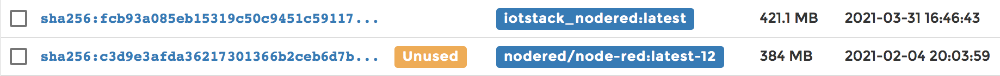
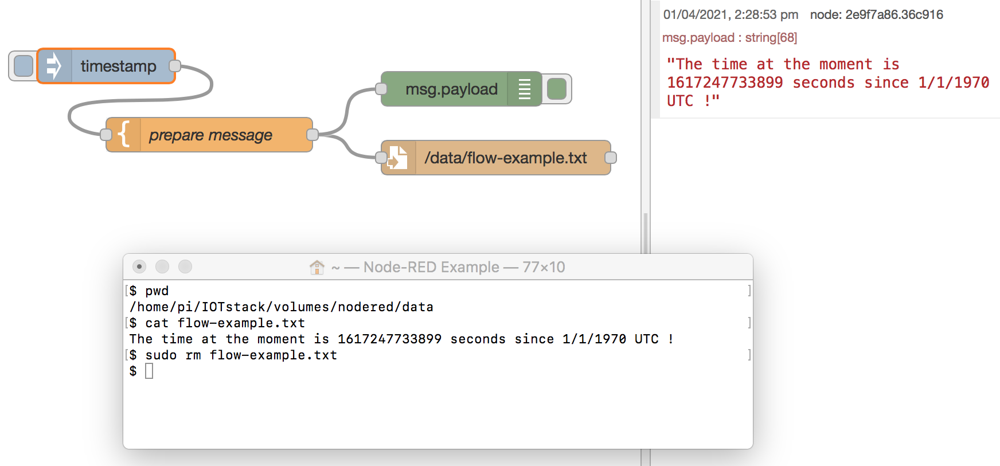
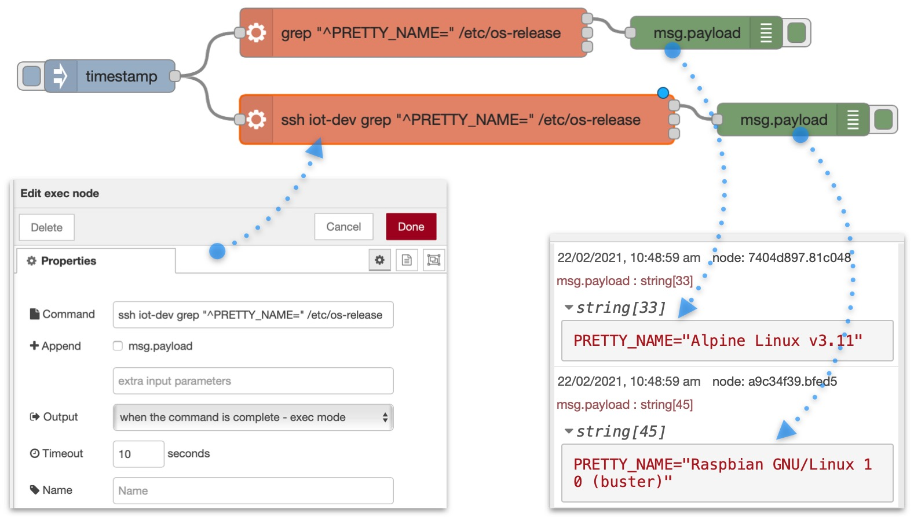

# Node-RED

## References { #references }

- [nodered.org home](https://nodered.org/)
- [GitHub: node-red/node-red-docker](https://github.com/node-red/node-red-docker)
- [DockerHub: nodered/node-red](https://hub.docker.com/r/nodered/node-red)
- [Tutorial: from MQTT to InfluxDB via Node-Red](https://gist.github.com/Paraphraser/c9db25d131dd4c09848ffb353b69038f)

## Significant files { #significant-files }

```
~/IOTstack
├── .templates
│   └── nodered
│       └── service.yml ❶
├── services
│   └── nodered
│       ├── Dockerfile ❷
│       └── service.yml ❸
├── docker-compose.yml ❹
└── volumes
    └── nodered ❺
        ├── data ❻
        └── ssh ❼
```

1. Template *service definition*.
2. The *Dockerfile*.
3. Working *service definition* (old-menu only, copied from ❶).
4. The *Compose* file (includes ❶)
5. Persistent storage area.
6. Data directory (mapped volume).
7. SSH directory (mapped volume).

## How Node-RED gets built for IOTstack { #iotstackBuild }

### Node-RED source code ([GitHub](https://github.com)) { #gitHubSource }

The source code for Node-RED lives at [GitHub node-red/node-red-docker](https://github.com/node-red/node-red-docker).

### Node-RED images ([DockerHub](https://hub.docker.com)) { #dockerHubImages }

Periodically, the source code is recompiled and pushed to [nodered/node-red](https://hub.docker.com/r/nodered/node-red/tags?page=1&ordering=last_updated) on *DockerHub*. See [Node-RED and `node.js` versions](#containerVersions) for an explanation of the versioning tags associated with images on *DockerHub*.

### IOTstack menu { #iotstackMenu }

When you select Node-RED in the IOTstack menu, the *template service definition* is copied into the *Compose* file.

> Under old menu, it is also copied to the *working service definition* and then not really used.

You choose add-on nodes from a supplementary menu. We recommend accepting the default nodes, and adding others that you think you are likely to need. Node-RED will not build if you do not select at least one add-on node.

Key points: 

* Under new menu, you must press the right arrow to access the supplementary menu. Under old menu, the list of add-on nodes is displayed automatically. 
* Do not be concerned if you can't find an add-on node you need in the list. You can also add nodes via Manage Palette once Node-RED is running. See [component management](#componentManagement).

Choosing add-on nodes in the menu causes the *Dockerfile* to be created.

### IOTstack first run { #iotstackFirstRun }

On a first install of IOTstack, you are told to do this:

``` console
$ cd ~/IOTstack
$ docker-compose up -d
```

`docker-compose` reads the *Compose* file. When it arrives at the `nodered` service definition, it finds:

``` yaml linenums="1"
  nodered:
    container_name: nodered
    build:
      context: ./services/nodered/.
      args:
      - DOCKERHUB_TAG=latest
      - EXTRA_PACKAGES=
```

Note:

* Prior to July 2022, IOTstack used the following one-line syntax for the `build` directive:

	``` yaml linenums="3"
	    build: ./services/nodered/.
	```

	The older syntax meant all local customisations (version-pinning and adding extra packages) needed manual edits to the *Dockerfile*. Those edits would be overwritten each time the menu was re-run to alter the selected add-on nodes. The newer multi-line syntax avoids that problem.

	See also [updating to July 2022 syntax](#july2022syntax).

In either case, the path `./services/nodered/.` tells `docker-compose` to look for:

```
~/IOTstack/services/nodered/Dockerfile
```

which contains instructions to download a *base* image from [*DockerHub*](https://hub.docker.com) and then apply local customisations such as the add-on nodes you chose in the IOTstack menu. The result is a *local* image which is instantiated to become your running container.

Notes:

1. During the build you may see warnings and deprecation notices. You may also see messages about "vulnerabilities" along with recommendations to run `npm audit fix`. You should ignore all such messages. There is no need to take any action.
2. If SQLite is in your list of nodes, be aware that it needs to be compiled from its source code. It takes a *long* time, outputs an astonishing number of warnings and, from time to time, will look as if it has gotten stuck. Be patient.

	> Acknowledgement: Successful installation of the SQLite node is thanks to @fragolinux.

When you run the `docker images` command after Node-RED has been built, you *may* see two rows for Node-RED:

``` console
$ docker images
REPOSITORY               TAG                 IMAGE ID            CREATED             SIZE
iotstack_nodered         latest              b0b21a97b8bb        4 days ago          462MB
nodered/node-red         latest              deb99584fa75        5 days ago          385MB
```

* `nodered/node-red` is the *base image*; and
* `iotstack_nodered` is the *local image*. The *local* image is the one that is instantiated to become the running container.

You *may* see the same pattern in Portainer, which reports the *base image* as "unused":



You should not remove the *base* image, even though it appears to be unused.

> Whether you see one or two rows depends on the version of Docker you are using and how your version of `docker-compose` builds local images.

## Securing Node-RED { #securingNodeRed }

### Setting an encryption key for your credentials { #encryptionKey }

After you install Node-RED, you should set an encryption key. Completing this step will silence the warning you will see when you run:

``` console
$ docker logs nodered
…
---------------------------------------------------------------------
Your flow credentials file is encrypted using a system-generated key.

If the system-generated key is lost for any reason, your credentials
file will not be recoverable, you will have to delete it and re-enter
your credentials.

You should set your own key using the 'credentialSecret' option in
your settings file. Node-RED will then re-encrypt your credentials
file using your chosen key the next time you deploy a change.
---------------------------------------------------------------------
…
```

Setting an encryption key also means that any credentials you create will be *portable*, in the sense that you can backup Node-RED on one machine and restore it on another.

The encryption key can be any string. For example, if you have UUID support installed (`sudo apt install -y uuid-runtime`), you could generate a UUID as your key:

``` console
$ uuidgen
2deb50d4-38f5-4ab3-a97e-d59741802e2d
```

Once you have defined your encryption key, use `sudo` and your favourite text editor to open this file:

```
~/IOTstack/volumes/nodered/data/settings.js
```

Search for `credentialSecret`:

```
    //credentialSecret: "a-secret-key",
```

Un-comment the line and replace `a-secret-key` with your chosen key. Do not remove the comma at the end of the line. The result should look something like this:

```
    credentialSecret: "2deb50d4-38f5-4ab3-a97e-d59741802e2d",
```

Save the file and then restart Node-RED:

``` console
$ cd ~/IOTstack
$ docker-compose restart nodered
```

### Setting a username and password for Node-RED { #credentials }

To secure Node-RED you need a password hash. Run the following command, replacing `PASSWORD` with your own password:

``` console
$ docker exec nodered node -e "console.log(require('bcryptjs').hashSync(process.argv[1], 8));" PASSWORD
```

You will get an answer that looks something like this:

```
$2a$08$gTdx7SkckJVCw1U98o4r0O7b8P.gd5/LAPlZI6geg5LRg4AUKuDhS
```

Copy that text to your clipboard, then follow the instructions at [Node-RED User Guide - Securing Node-RED - Username & Password-based authentication](https://nodered.org/docs/user-guide/runtime/securing-node-red#usernamepassword-based-authentication).

## Referring to other containers { #containerNames }

Node-RED can run in two modes. By default, it runs in "non-host mode" but you can also move the container to "host mode" by editing the Node-RED service definition in your *Compose* file to:

1. Add the following directive:

	``` yml
	network_mode: host
	```

2. Remove the `ports` directive and the mapping of port 1880.

### When Node-RED is not in host mode { #nonHostMode }

Most examples on the web assume Node-RED and other services in the MING (Mosquitto, InfluxDB, Node-RED, Grafana) stack have been installed natively, rather than in Docker containers. Those examples typically include the loopback address + port syntax, like this:

```
127.0.0.1:1883
```

The loopback address will not work when Node-RED is in non-host mode. This is because each container behaves like a self-contained computer. The loopback address means "this container". It does not mean "this Raspberry Pi".

You refer to other containers by their container name. For example, a flow subscribing to an MQTT feed provided by the mosquitto container uses:

```
mosquitto:1883
```

Similarly, if a flow writes to an InfluxDB database maintained by the influxdb container, the flow uses:

```
influxdb:8086
```

Behind the scenes, Docker maintains a table, similar to an `/etc/hosts` file, mapping container names to the IP addresses on the internal bridged network that are assigned, dynamically, by Docker, when it spins up each container.

### When Node-RED is in host mode { #hostmode }

This is where you use loopback+port syntax, such as the following to communicate with Mosquitto:

```
127.0.0.1:1883
```

What actually occurs is that Docker is listening to external port 1883 on behalf of Mosquitto. It receives the packet and routes it (layer three) to the internal bridged network, performing network address translation (NAT) along the way to map the external port to the internal port. Then the packet is delivered to Mosquitto. The reverse happens when Mosquitto replies. It works but is less efficient than when all containers are in non-host mode. 

## Referring to the host { #hostReference }

When the container is running in non-host mode, there are several ways in which it can refer to the host on which the container is running:

1. via the IP address of one of the host's interfaces;
2. via the fully-qualified domain name of the host (ie same as the above but via the Domain Name System)
3. via the default gateway on the Docker bridge network.

The problem with the first two is that they tie your flows to the specific host.

The third method is *portable*, meaning a flow can conceptually refer to "this" host and be independent of the actual host on which the container is running.

### Bridge network - default gateway { #defaultBridge }

* Method 1

	The default gateway on the Docker bridge network is *usually* "172.17.0.1". You can confirm the IP address by running:

	``` console
	$ docker network inspect bridge | jq .[0].IPAM.Config[0].Gateway
	"172.17.0.1"
	```
	
	> If `jq` is not installed on your system, you can install it by running `sudo apt install -y jq`.
	
	If you use this method, your flows can refer to "this" host using the IP address "172.17.0.1".

* Method 2

	Alternatively, you can add the following lines to your Node-RED service definition:

	``` yaml
	extra_hosts:
	- "host.docker.internal:host-gateway"
	```

	If you use this method, your flows can refer to "this" host using the domain name "host.docker.internal".
	
	Generally the second method is recommended for IOTstack. That is because your flows will continue to work even if the 172.17.0.1 IP address changes. However, it does come with the disadvantage that, if you publish a flow containing this domain name, the flow will not work unless the recipient also adds the `extra_hosts` clause.

## GPIO Access { #accessGPIO }

To communicate with your Raspberry Pi's GPIO you need to do the following:

1. Install dependencies:

	``` console
	$ sudo apt update
	$ sudo apt install pigpio python-pigpio python3-pigpio
	```

	Notes:

	* `pigpio` and `python3-pigpio` are usually installed by default in standard releases of Raspberry Pi OS.
	* Only `pigpio` is actually *required*.
	* The Python packages are *optional*.

2. Install the `node-red-node-pi-gpiod` node. See [component management](#componentManagement). It allows you to connect to multiple Pis from the same Node-RED service.

	Note:

	* Unless you explicitly removed `node-red-node-pi-gpiod` from the list of add-on nodes added to your [Dockerfile](#viaDockerfile) by the IOTstack menu, it will be installed already. You can confirm this by examining your Node-RED Dockerfile&nbsp;❷.

3. Configure the `pigpdiod` daemon:

	* copy the following text to the clipboard:

		``` ini linenums="1"
		[Unit]
		Requires=default.target
		After=default.target
		[Service]
		ExecStart=
		ExecStart=/usr/bin/pigpiod
		[Install]
		WantedBy=
		WantedBy=default.target
		```

		> Acknowledgement: some of the above from [joan2937/pigpio issue 554](https://github.com/joan2937/pigpio/issues/554#issuecomment-1405364041)

	* execute the following commands:

		``` console
		$ sudo systemctl stop pigpiod
		$ sudo systemctl revert pigpiod
		$ sudo systemctl edit pigpiod
		```

	* follow the on-screen instructions and paste the contents of the clipboard into the blank area between the lines. The final result should be (lines 4…12 are the pasted material):

		``` ini linenums="1"
		### Editing /etc/systemd/system/pigpiod.service.d/override.conf
		### Anything between here and the comment below will become the new contents of the file

		[Unit]
		Requires=default.target
		After=default.target
		[Service]
		ExecStart=
		ExecStart=/usr/bin/pigpiod
		[Install]
		WantedBy=
		WantedBy=default.target

		### Lines below this comment will be discarded

		### /lib/systemd/system/pigpiod.service
		# [Unit]
		# Description=Daemon required to control GPIO pins via pigpio
		# [Service]
		# ExecStart=/usr/bin/pigpiod -l
		# ExecStop=/bin/systemctl kill pigpiod
		# Type=forking
		# [Install]
		# WantedBy=multi-user.target
		```

	* Save your work by pressing:

		- <kbd>control</kbd>+<kbd>O</kbd> (letter O not zero)
		- <kbd>return</kbd>
		- <kbd>control</kbd>+<kbd>X</kbd>

	* Check your work by running:

		``` console
		$ sudo systemctl cat pigpiod
		```

		The expected result is:

		``` ini linenums="1"
		# /lib/systemd/system/pigpiod.service
		[Unit]
		Description=Daemon required to control GPIO pins via pigpio
		[Service]
		ExecStart=/usr/bin/pigpiod -l
		ExecStop=/bin/systemctl kill pigpiod
		Type=forking
		[Install]
		WantedBy=multi-user.target

		# /etc/systemd/system/pigpiod.service.d/override.conf
		[Unit]
		Requires=default.target
		After=default.target
		[Service]
		ExecStart=
		ExecStart=/usr/bin/pigpiod
		[Install]
		WantedBy=
		WantedBy=default.target
		```

		Lines 12…20 should be those you copied to the clipboard at the start of this step. If you do not see the expected result, go back and start from the beginning of this step.

	* Activate the daemon:

		``` console
		$ sudo systemctl enable pigpiod
		$ sudo systemctl start pigpiod
		```

	* Reboot.

	* Check that the daemon is running:

		``` console
		$ sudo systemctl status pigpiod
		```

		Once you have configured `pigpiod` correctly and it has come up after a reboot, you should not need to worry about it again.

		`pigpiod` provides open access to your Raspberry Pi's GPIO via port 8888. Consult the `man` pages if you want to make it more secure. Once you have decided what to do, start over from the beginning of this step, and add your parameters to the line:

		``` ini linenums="6"
		ExecStart=/usr/bin/pigpiod
		```

4. Drag a `pi gpio` node onto the canvas. Configure it according to your needs.

	The `Host` field should be set to one of:
	
	*  `172.17.0.1`; or
	*  `host.docker.internal`

	See also [Bridge network - default gateway](#defaultBridge).
	
	Don't try to use 127.0.0.1 because that is the loopback address of the Node-RED container.

## Serial Port Access { #accessSerial }

Node-RED running in a container *can* communicate with serial devices attached to your Raspberry Pi's USB ports. However, it does not work "out of the box". You need to set it up.

Let's make an assumption. A device connected to one of your Raspberry Pi's USB ports presents itself as:

```
/dev/ttyUSB0
```

You have three basic options:

1. You can map the device into the container using that name:

	``` yaml
	devices:
	- …
	  - "/dev/ttyUSB0:/dev/ttyUSB0"
	```

	This is simple and effective but it suffers from a few problems:

	* If the device is disconnected while the container is running, there's a good chance the container will crash.
	* `docker-compose` will not start your container if the device is not present when you bring up your stack.
	* You can't guarantee that the device will *always* enumerate as "ttyUSB0". It might come up as "ttyUSB1".

	You can deal with the last problem by using the device's "by-id" path. There's an example of this in the [Zigbee2MQTT](https://sensorsiot.github.io/IOTstack/Containers/Zigbee2MQTT/#identifyAdapter) documentation.

	Options 2 and 3 (below) deal with the first two problems in the sense that:

	* a device disconnection is unlikely to cause the container to crash (the flow might);
	* `docker-compose` will always start the container, irrespective of whether devices are actually attached to your USB ports.

	Options 2 and 3 (below) can't provide a workaround for devices being given different names via enumeration but you can still deal with that by using the device's "by-id" path (as explained above).

2. You can map a *class* of devices:

	* modify the `volumes` clause to add a read-only mapping for `/dev`:

		``` yaml
		volumes:
		- …
		- /dev:/dev:ro
		```

		> The "read-only" flag (`:ro`) prevents the container from doing dangerous things like destroying your Raspberry Pi's SD or SSD. Please don't omit that flag!

	* discover the major number for your device:

		``` console
		$ ls -l /dev/ttyUSB0
		crw-rw---- 1 root dialout 188, 0 Feb 18 15:30 /dev/ttyUSB0
		```

		In the above, the `188, 0` string means the major number for ttyUSB0 is "188" and "0" the minor number.

	* add two device CGroup rules:

		```	 yaml
		device_cgroup_rules:
		- 'c 1:* rw' # access to devices like /dev/null
		- 'c 188:* rmw' # change numbers to your device
		```

		In the above:
		
		* "188" is the major number for ttyUSB0 and you should substitute accordingly if your device has a different major number.

		* the "*" is a wildcard for the minor number.

3. Use the "privileged" flag by adding the following to your Node-RED service definition:

	``` yaml
	privileged: true
	```

	Please make sure you read the following references **BEFORE** you select this option:

	* [Privileged vs root](https://www.howtogeek.com/devops/privileged-vs-root-in-docker-whats-the-difference/)
	* [Mind the 'privileged' flag](https://betterprogramming.pub/docker-tips-mind-the-privileged-flag-d6e2ae71bdb4)

### node-red-node-serialport { #nodeSerial }

At the time of writing (Feb 2023), it was not possible to add `node-red-node-serialport` to the list of nodes in your Dockerfile. Attempting to do so crashed the Node-RED container with a *segmentation fault.* The workaround is to build the node from source by adding an extra line at the *end* of your Dockerfile: 

``` Dockerfile
RUN npm install node-red-node-serialport --build-from-source
```

## Sharing files between Node-RED and the Raspberry Pi { #fileSharing }

Containers run in a sandboxed environment. A process running inside a container can't see the Raspberry Pi's file system. Neither can a process running outside a container access files inside the container.

This presents a problem if you want write to a file outside a container, then read from it inside the container, or vice-versa.

IOTstack containers have been set up with shared volume mappings. Each volume mapping associates a specific directory in the Raspberry Pi file system with a specific directory inside the container. If you write to files in a shared directory (or one of its sub-directories), both the host and the container can see the same sub-directories and files.

Key point:

* Files and directories in the shared volume are persistent between restarts. If you save your data anywhere else inside the container, it will be lost when the container is rebuilt.

The Node-RED service definition in the *Compose* file includes the following:

``` yaml
volumes:
  - ./volumes/nodered/data:/data
```

That decomposes into:

* external path = `./volumes/nodered/data`
* internal path = `/data`

The leading "." on the external path implies "the folder containing the *Compose* file so it actually means:

* external path = `~/IOTstack/volumes/nodered/data`
* internal path = `/data`

If you write to the **internal** path from **inside** the Node-RED container, the Raspberry Pi will see the results at the **external** path, and vice versa. Example:

``` console
$ docker exec -it nodered bash
# echo "The time now is $(date)" >/data/example.txt
# cat /data/example.txt 
The time now is Thu Apr  1 11:25:56 AEDT 2021
# exit
$ cat ~/IOTstack/volumes/nodered/data/example.txt 
The time now is Thu Apr  1 11:25:56 AEDT 2021
$ sudo rm ~/IOTstack/volumes/nodered/data/example.txt
```

In words:

1. Open a shell into the Node-RED container. Two things happen:

	* You are now **inside** the container. Any commands you execute while in this shell are run **inside** the container; and
	* The prompt changes to a "#" indicating that you are running as the "root" user, meaning you don't need `sudo` for anything.

2. Use the `echo` command to create a small file which embeds the current timestamp. The path is in the `/data` directory which is mapped to the Raspberry Pi's file system.
3. Show that the file has been created inside the container.
4. Exit the shell:
	* You can either type the `exit` command and press <kbd>return</kbd>, or press <kbd>Control</kbd>+<kbd>D</kbd>.
	* Exiting the shell drops you out of the container so the "$" prompt returns, indicating that you are **outside** the Node-Red container, running as a non-root user ("pi").
5. Show that the same file can be seen from **outside** the container.
6. Tidy-up by removing the file. You need `sudo` to do that because the persistent storage area at the **external** path is owned by root, and you are running as user "pi".

You can do the same thing from within a Node-RED flow.



The flow comprises:

* An Inject node, wired to a Template node.

	- *When an Inject node's input tab is clicked, it sets the message payload to the number of seconds since 1/1/1970 UTC and triggers the flow.*

* A Template node, wired to both a Debug node and a File node. The template field is set to:

	```
	The time at the moment is {{payload}} seconds since 1/1/1970 UTC !
	```

	- *When this node runs, it replaces `{{payload}}` with the seconds value supplied by the Inject node.*

* A Debug node.

	- *When this node runs, it displays the payload in the debug window on the right hand side of the Node-RED GUI.*

* A File node. The "Filename" field of the node is set to write to the path:

	```
	/data/flow-example.txt
	```

	- *When this node runs, it writes the payload to the specified file. Remember that `/data` is an internal path within the Node-RED container.*

Deploying the flow and clicking on the Inject node results in the debug message shown on the right hand side of the screen shot. The embedded terminal window shows that the same information is accessible from outside the container.

You can reverse this process. Any file you place within the path `~/IOTstack/volumes/nodered/data` can be read by a "File in" node.

## Executing commands outside the Node-RED container { #sshOutside }

A reasonably common requirement in a Node-RED flow is the ability to execute a command on the host system. The standard tool for this is an "exec" node.

An "exec" node works as expected when Node-RED is running as a native service but not when Node-RED is running in a container. That's because the command spawned by the "exec" node runs **inside** the container.

To help you understand the difference, consider this command:

``` console
$ grep "^PRETTY_NAME=" /etc/os-release
```

When you run that command on a Raspberry Pi **outside** container-space, the answer will be something like:

```
PRETTY_NAME="Debian GNU/Linux 11 (bullseye)"
```

If you run the same command **inside** a Node-RED container, the output will reflect the operating system upon which the container is based, such as:

```
PRETTY_NAME="Alpine Linux v3.16"
```

The same thing will happen if a Node-RED "exec" node executes that `grep` command when Node-RED is running in a container. It will see the "Alpine Linux" answer.

Docker doesn't provide any mechanism for a container to execute an arbitrary command **outside** of its container. A workaround is to utilise SSH. This remainder of this section explains how to set up the SSH scaffolding so that "exec" nodes running in a Node-RED container can invoke arbitrary commands **outside** container-space.

### Task Goal { #sshTaskGoal }

Be able to use a Node-RED "exec" node to perform the equivalent of:

``` console
$ ssh host.docker.internal «COMMAND»
```

where `«COMMAND»` is any command known to the target host.

This section uses `host.docker.internal` throughout. That name comes from method 2 of [bridge network - default gateway](#defaultBridge) but, in principle, you can refer to the host using any mechanism described in [referring to the host](#hostReference).

### Assumptions { #sshAssumptions }

* [SensorsIot/IOTstack](https://github.com/SensorsIot/IOTstack) is installed on your Raspberry Pi.
* The Node-RED container is running.
* The user name of the account on the host where you want Node-RED flows to be able to run commands is "pi". This user name is not mandatory. Simply substitute your own user name wherever you see "pi" in these examples.

These instructions are specific to IOTstack but the underlying concepts should apply to any installation of Node-RED in a Docker container. 

### Executing commands "inside" a container { #dockerExec }

These instructions make frequent use of the ability to run commands "inside" the Node-RED container. For example, suppose you want to execute:

``` console
$ grep "^PRETTY_NAME=" /etc/os-release
```

You have several options:

1. You can do it from the normal Raspberry Pi command line using a Docker command. The basic syntax is:

	``` console
	$ docker exec {-it} «containerName» «command and parameters»
	```

	The actual command you would need would be:

	``` console
	$ docker exec nodered grep "^PRETTY_NAME=" /etc/os-release
	```

	Note:

	* The `-it` flags are *optional*. They mean "interactive" and "allocate pseudo-TTY". Their presence tells Docker that the command may need user interaction, such as entering a password or typing "yes" to a question.

2. You can open a shell into the container, run as many commands as you like inside the container, and then exit. For example:

	``` console
	$ docker exec -it nodered bash
	# grep "^PRETTY_NAME=" /etc/os-release
	# whoami
	# exit
	$
	```

	In words:

	* Run the `bash` shell inside the Node-RED container. You need to be able to interact with the shell to type commands so the `-it` flag is required.
	* The "#" prompt is coming from `bash` running inside the container. It also signals that you are running as the root user inside the container.
	* You run the `grep`, `whoami` and any other commands.
	* You finish with the `exit` command (or <kbd>Control</kbd>+<kbd>D</kbd>).
	* The "$" prompt means you have left the container and are back at the normal Raspberry Pi command line.

3. Run the command from Portainer by selecting the container, then clicking the ">_ console" link. This is identical to opening a shell.

### Step 1: *Generate SSH key-pair for Node-RED* (one time) { #sshStep1 }

Create a key-pair for Node-RED. This is done by executing the `ssh-keygen` command **inside** the container:

``` console
$ docker exec -it nodered ssh-keygen -q -t ed25519 -C "Node-RED container key-pair" -N ""
```

Notes:

* The "ed25519" elliptic curve algorithm is recommended (generally described as quicker and more secure than RSA) but you can use the default RSA algorithm if you prefer.
* Respond to the "Enter file in which to save the key" prompt by pressing <kbd>return</kbd> to accept the default location.
* If `ssh-keygen` displays an "Overwrite (y/n)?" message, it implies that a key-pair already exists. You will need to decide what to do:
	* press <kbd>y</kbd> to overwrite (and lose the old keys)
	* press <kbd>n</kbd> to terminate the command, after which you can investigate why a key-pair already exists.

### Step 2: *Exchange keys with target hosts* (once per target host) { #sshStep2 }

Node-RED's public key needs to be copied to the "pi" user account on the host where you want a Node-RED "exec" node to be able to execute commands. At the same time, the Node-RED container needs to learn the host's public key. The `ssh-copy-id` command does both steps. The command is:

``` console
$ docker exec -it nodered ssh-copy-id pi@host.docker.internal
```

The output will be something similar to the following:

```
/usr/bin/ssh-copy-id: INFO: Source of key(s) to be installed: "/root/.ssh/id_ed25519.pub"
The authenticity of host 'host.docker.internal (172.17.0.1)' can't be established.
ED25519 key fingerprint is SHA256:gHMlhvArbUPJ807vh5qNEuyRCeNUQQTKEkmDS6qKY6c.
This key is not known by any other names
Are you sure you want to continue connecting (yes/no/[fingerprint])? yes
```

Respond to the prompt by typing "yes" and pressing <kbd>return</kbd>.

The output continues:

```
/usr/bin/ssh-copy-id: INFO: attempting to log in with the new key(s), to filter out any that are already installed
expr: warning: '^ERROR: ': using '^' as the first character
of a basic regular expression is not portable; it is ignored
/usr/bin/ssh-copy-id: INFO: 1 key(s) remain to be installed -- if you are prompted now it is to install the new keys
pi@host.docker.internal's password: 
```
The response may look like it contains errors but those can be ignored. 

Enter the password you use to login as "pi" on the host and press <kbd>return</kbd>.

Normal completion looks similar to this:

```
Number of key(s) added: 1

Now try logging into the machine, with:   "ssh 'pi@host.docker.internal'"
and check to make sure that only the key(s) you wanted were added.
```

If you do not see an indication that a key has been added, you may need to retrace your steps.

### Step 3: *Perform the recommended test* { #sshStep3 }

The output above recommends a test. The test needs to be run **inside** the Node-RED container so the syntax is:

``` console
$ docker exec -it nodered ssh pi@host.docker.internal ls -1 /home/pi/IOTstack
```

You should not be prompted for a password. If you are, you may need to retrace your steps.

If everything works as expected, you should see a list of the files in your IOTstack folder.

Assuming success, think about what just happened? You told SSH **inside** the Node-RED container to run the `ls` command **outside** the container on your Raspberry Pi. You broke through the containerisation.

### Understanding what's where and what each file does { #sshWhatsWhere }

#### What files are where { #sshFileLocations }

Six files are relevant to Node-RED's ability to execute commands outside of container-space:

* in `/etc/ssh`:

	- `ssh_host_ed25519_key` is the Raspberry Pi's private host key
	- `ssh_host_ed25519_key.pub` is the Raspberry Pi's public host key

		Those keys were created when your Raspberry Pi was initialised. They are unique to the host.

		Unless you take precautions, those keys will change whenever your Raspberry Pi is rebuilt from scratch and that **will** prevent a Node-RED "exec" node from being able to invoke SSH to call out of the container.

		You can recover by re-running [`ssh-copy-id`](#sshStep2).

* in `~/IOTstack/volumes/nodered/ssh`:

	- `id_ed25519` is the Node-RED container's private key 
	- `id_ed25519.pub` is the Node-RED container's public key

		Those keys were created when you generated the SSH key-pair for Node-RED.

		They are unique to Node-RED but will follow the container in backups and will work on the same machine, or other machines, if you restore the backup.

		It does not matter if the Node-RED container is rebuilt or if a new version of Node-RED comes down from DockerHub. These keys will remain valid until lost or overwritten.

		If you lose or destroy these keys, that **will** prevent a Node-RED "exec" node from being able to invoke SSH to call out of the container.

		You can recover by [generating new keys](#sshStep1) and then re-running [`ssh-copy-id`](#sshStep2).

	- `known_hosts`

		The `known_hosts` file contains a copy of the Raspberry Pi's public host key. It was put there by `ssh-copy-id`.

		If you lose this file or it gets overwritten, invoking SSH inside the container **will** still work but it will re-prompt for authorisation to connect. You will see the prompt if you run commands via `docker exec -it` but not when invoking SSH from an "exec" node.

		Note that authorising the connection at the command line ("Are you sure you want to continue connecting?") will auto-repair the `known_hosts` file.

* in `~/.ssh/`:

	- `authorized_keys`

		That file contains a copy of the Node-RED container's public key. It was put there by `ssh-copy-id`.

		Pay attention to the path. It implies that there is one `authorized_keys` file per user, per target host.

		If you lose this file or it gets overwritten, SSH **will** still work but will ask for the password for "pi". This works when you are running commands from `docker exec -it` but not when invoking SSH from an "exec" node.

		Note that providing the correct password at the command line will auto-repair the `authorized_keys` file.

#### What each file does { #sshFilePurpose }

SSH running **inside** the Node-RED container uses the Node-RED container's private key to provide assurance to SSH running **outside** the container that it (the Node-RED container) is who it claims to be.

SSH running **outside** container-space verifies that assurance by using its copy of the Node-RED container's public key in `authorized_keys`.

SSH running **outside** container-space uses the Raspberry Pi's private host key to provide assurance to SSH running **inside** the Node-RED container that it (the RPi) is who it claims to be.

SSH running **inside** the Node-RED container verifies that assurance by using its copy of the Raspberry Pi's public host key stored in `known_hosts`.

### Config file (optional) { #sshConfig }

You don't **have** to do this step but it will simplify your exec node commands and reduce your maintenance problems if you do.

At this point, SSH commands can be executed from **inside** the container using this syntax:

``` console
# ssh pi@host.docker.internal «COMMAND»
```

A `config` file is needed to achieve the task goal of the simpler syntax:

``` console
# ssh host.docker.internal «COMMAND»
```

The goal is to set up this file:

```
-rw-r--r-- 1 root root ~/IOTstack/volumes/nodered/ssh/config
``` 

The file needs the ownership and permissions shown. There are several ways of going about this and you are free to choose the one that works for you. The method described here creates the file first, then sets correct ownership and permissions, and then moves the file into place.

Start in a directory where you can create a file without needing `sudo`. The IOTstack folder is just as good as anywhere else:

``` console
$ cd ~/IOTstack
$ touch config
```

Select the following text, copy it to the clipboard.

``` sshconfig
host host.docker.internal
  user pi
  IdentitiesOnly yes
  IdentityFile /root/.ssh/id_ed25519
```

Open `~/IOTstack/config` in your favourite text editor and paste the contents of the clipboard. Save the file. Change the config file's ownership and permissions, and move it into the correct directory:

``` console
$ chmod 644 config
$ sudo chown root:root config
$ sudo mv config ./volumes/nodered/ssh
```

#### Re-test with config file in place { #sshConfigTest }

The previous test used this syntax:

``` console
$ docker exec nodered ssh pi@host.docker.internal ls -1 /home/pi/IOTstack
```

Now that the config file is in place, the syntax changes to:

``` console
$ docker exec nodered ssh host.docker.internal ls -1 /home/pi/IOTstack
```

The result should be the same as the earlier test. 

### A test flow { #sshTestFlow }



In the Node-RED GUI:

1. Click the "+" to create a new, empty flow.
2. Drag the following nodes onto the canvas:
	- One "inject" node
	- Two "exec" nodes
	- Two "debug" nodes
3. Wire the outlet of the "inject" node to the inlet of both "exec" nodes.
4. Wire the uppermost "stdout" outlet of the first "exec" node to the inlet of the first "debug" node.
5. Repeat step 4 with the other "exec" and "debug" node.
6. Open the first "exec" node and:
	- set the "command" field to:

		```
		grep "^PRETTY_NAME=" /etc/os-release
		```
	- turn off the "append msg.payload" checkbox
	- set the timeout to a reasonable value (eg 10 seconds)
	- click "Done".
7. Repeat step 6 with the other "exec" node, with one difference:
	- set the "command" field to:

		```
		ssh host.docker.internal grep "^PRETTY_NAME=" /etc/os-release
		```

8. Click the Deploy button.
9. Set the right hand panel to display debug messages.
10. Click the touch panel of the "inject" node to trigger the flow.
11. Inspect the result in the debug panel. You should see payload differences similar to the following:

	```
	PRETTY_NAME="Alpine Linux v3.16""
	PRETTY_NAME="Debian GNU/Linux 11 (bullseye)"
	```

	The first line is the result of running the command inside the Node-RED container. The second line is the result of running the same command outside the Node-RED container on the Raspberry Pi.

## Maintaining Node-RED { #maintainNodeRed }

### Starting Node-RED { #startNodeRed }

Use these commands to:

1. Start the container; or
2. Re-create the container if you have made a material change to the container's service definition in your *Compose* file.

``` console
$ cd ~/IOTstack
$ docker-compose up -d nodered
```

The first time you execute this command, the *base* image of Node-RED is downloaded from DockerHub, and then the *Dockerfile* is run to produce a *local* image. The *local* image is then instantiated to become the running container.


### Stopping Node-RED { #stopNodeRed }

To stop the running container:

``` console
$ cd ~/IOTstack
$ docker-compose down nodered
```

> see also [if downing a container doesn't work](../Basic_setup/index.md/#downContainer)

Alternatively, you can stop the entire stack:

``` console
$ cd ~/IOTstack
$ docker-compose down
```

### Restarting Node-RED { #restartNodeRed }

The `restart` command sends a signal to the processes running within the container. The container itself does not stop.

``` console
$ cd ~/IOTstack
$ docker-compose restart nodered
```

### Re-building the local image { #rebuildNodeRed }

You need to rebuild the *local* image if you do any of the following:

1. Change either of the build arguments (`DOCKERHUB_TAG` or `EXTRA_PACKAGES`) in your *Compose* file.
2. Make a material change to your Node-RED *Dockerfile*, such as re-running the menu to change your selection of add-on nodes.

To rebuild your *local* image:

``` console
$ cd ~/IOTstack
$ docker-compose up --build -d nodered
$ docker system prune
```

Think of these commands as "re-running the *Dockerfile*". The only time a *base* image will be downloaded from *DockerHub is when a *base* image with a tag matching the value of `DOCKERHUB_TAG` can't be found on your Raspberry Pi.

Your existing Node-RED container continues to run while the rebuild proceeds. Once the freshly-built *local* image is ready, the `up` tells `docker-compose` to do a new-for-old swap. There is barely any downtime for your Node-RED service.

### Checking for Node-RED updates { #updateNodeRed }

IOTstack provides a convenience script which can help you work out if a new version of Node-RED is available. You can run it like this:

``` console
$ ~/IOTstack/scripts/nodered_version_check.sh
```

The script is not infallible. It works by comparing the version number in the Node-RED image on your system with a version number stored on GitHub.

GitHub is always updated *before* a new image appears on *DockerHub*. Sometimes there is a delay of weeks between the two events. For that reason, the script should be viewed more like a meteorological forecast than hard fact.

The script assumes that your local image builds as `iotstack-nodered:latest`. If you use different tags, you can pass that information to the script. Example:

``` console
$ ~/IOTstack/scripts/nodered_version_check.sh iotstack-nodered:3.0.2
```

### Upgrading Node-RED { #upgradeNodeRed }

The only way to know, for certain, when an update to Node-RED is available is to check the [nodered/node-red tags page](https://hub.docker.com/r/nodered/node-red/tags?page=1&ordering=last_updated) on *DockerHub*.

Once a new version appears on [*DockerHub*](https://hub.docker.com), you can upgrade Node-RED like this:

``` console
$ cd ~/IOTstack
$ docker-compose build --no-cache --pull nodered
$ docker-compose up -d nodered
$ docker system prune
```

Breaking it down into parts:

* `build` causes the named container to be rebuilt;
* `--no-cache` tells the Dockerfile process that it must not take any shortcuts. It really **must** rebuild the *local image*;
* `--pull` tells the Dockerfile process to actually check with [*DockerHub*](https://hub.docker.com) to see if there is a later version of the *base image* and, if so, to download it before starting the build;
* `nodered` is the named container argument required by the `build` command.

Your existing Node-RED container continues to run while the rebuild proceeds. Once the freshly-built *local* image is ready, the `up` tells `docker-compose` to do a new-for-old swap. There is barely any downtime for your Node-RED service.

The `prune` is the simplest way of cleaning up old images. Sometimes you need to run this twice, the first time to clean up the old *local* image, the second time for the old *base* image. Whether an old *base* image exists depends on the version of `docker-compose` you are using and how your version of `docker-compose` builds local images.


## Node-RED and `node.js` versions { #containerVersions }

### Checking versions { #checkingVersions }

You can use the `npm version` command to check which versions of Node-RED and `node.js` are running in your container:

``` console
$ docker exec nodered npm version
{
  'node-red-docker': '2.2.2',
  npm: '6.14.15',
  ares: '1.18.1',
  brotli: '1.0.9',
  cldr: '37.0',
  http_parser: '2.9.4',
  icu: '67.1',
  llhttp: '2.1.4',
  modules: '72',
  napi: '8',
  nghttp2: '1.41.0',
  node: '12.22.8',
  openssl: '1.1.1m',
  tz: '2019c',
  unicode: '13.0',
  uv: '1.40.0',
  v8: '7.8.279.23-node.56',
  zlib: '1.2.11'
}
```

In the above:

* `'node-red-docker': '2.2.2'` indicates that version 2.2.2 of Node-RED is running. This is the version number you see at the bottom of the main menu when you click on the "hamburger" icon ("≡") at the top, right of the *Node-Red* window in your browser.
* `node: '12.22.8'` indicates that version 12.x of `node.js` is installed.

### Controlling versions { #versionControl }

IOTstack uses a service definition for Node-RED that includes these lines:

``` yaml linenums="3"
    build:
      context: ./services/nodered/.
      args:
      - DOCKERHUB_TAG=latest
```

> If you do not see this structure in your *Compose* file, refer to [updating to July 2022 syntax](#july2022syntax).

The value of the `DOCKERHUB_TAG` gives you the ability to control, from your *Compose* file, which versions of Node-RED and `node.js` run within your Node-RED container.

The allowable values of `DOCKERHUB_TAG` can be found on the [*DockerHub* Node-RED tags page](https://hub.docker.com/r/nodered/node-red/tags). The table below contains examples of tags that were available on *DockerHub* at the time of writing (2022-07-06):

tag       | Node-RED version | `node.js` version
----------|------------------|------------------
latest    | 2.2.2            | 14.x
latest-14 | 2.2.2            | 14.x &#x1F4CC;
2.2.2     | 2.2.2 &#x1F4CC;  | 14.x
2.2.2-14  | 2.2.2 &#x1F4CC;  | 14.x &#x1F4CC;

Interpreting the tag:

1. The sub-string to the left of the hyphen determines the version of Node-RED:

	- "latest" means the most up-to-date version, implying that the actual version number can change any time you follow the process to [upgrade Node-RED](#upgradeNodeRed).
	- "2.2.2" pins your container to that specific version of Node-RED, implying that the version number will be frozen until you change the pin.

2. The sub-string to the right of the hyphen determines the version of `node.js`:

	- "-14" refers to `node.js` version 14.x and pins your container to that specific version of `node.js`.
	- If the hyphen and suffix are omitted, it implies that the actual version of `node.js` can change any time you follow the process to [upgrade Node-RED](#upgradeNodeRed).

In short:

* If you pin both sides to specific values (eg "2.2.2-14") then all decisions about when to upgrade and which versions to use are under **your** control; but
* If you use "latest" then all timing and version decisions are under the control of the maintainers of the *DockerHub* images.

IOTstack defaults to "latest". Although this appears to cede control to the maintainers of the *DockerHub* images, in practice it is no different to any other container where you pull its image directly from *DockerHub* using the `latest` tag (irrespective of whether `latest` is explicit or implied by omission).

The `DOCKERHUB_TAG` argument for Node-RED merely gives you the ability to pin to specific versions of Node-RED from within your *Compose* file, in the same way as you can use tags on `image` directives for other containers.

For example, suppose you wanted to pin to Node-RED version 2.2.2 with `node.js` version 12:

1. Edit your *Compose* file so that the `DOCKERHUB_TAG` looks like this:

	``` yaml
	- DOCKERHUB_TAG=2.2.2-12
	``` 

2. Run the [re-building the local Node-RED image](#rebuildNodeRed) commands.

Changing a pinned version and rebuilding *may* result in a new *base* image being downloaded from *DockerHub*.

## Component management { #componentManagement }

### via Dockerfile { #viaDockerfile }

You can install components by adjusting the Node-RED *Dockerfile*. This can be done by:

* Running the IOTstack menu and changing the selected Node-RED nodes; or
* Editing your Node-RED *Dockerfile* using a text editor.

Using the IOTstack menu limits your choice of components to those presented in the menu. Editing the *Dockerfile* with a text editor is more flexible but carries the risk that your changes could be lost if you subsequently use the menu method.

To apply changes made to your *Dockerfile*, run the [re-building the local Node-RED image](#rebuildNodeRed) commands.

### via Manage Palette { #viaManagePalette }

You can add, remove or update components in Manage Palette. Node-RED will remind you to restart Node-RED and that is something you have to do by hand:

``` console
$ cd ~/IOTstack
$ docker-compose restart nodered
```

Note:

* Some users have reported misbehaviour from Node-RED if they do too many iterations of:

	- make a change in Manage Palette
	- restart Node-RED

	It is better to make **all** the changes you intend to make, and only *then* restart Node-RED.

### via `npm` { #viaNPM }

You can also run `npm` inside the container to install any component that could be installed by `npm` in a non-container environment. This is the basic syntax:

``` console
$ cd ~/IOTstack
$ docker exec -w /data nodered npm «command» «arguments…»
$ docker-compose restart nodered
```

Examples:

* To add the "find my iphone" node:

	``` console
	$ docker exec -w /data nodered npm install find-my-iphone-node
	$ docker-compose restart nodered
	```

* To remove the "find my iphone" node:

	``` console
	$ docker exec -w /data nodered npm uninstall find-my-iphone-node
	$ docker-compose restart nodered
	```

Note:

* You **must** include `-w /data` on each command. Any formula you find on the web will not include this. You have to remember to do it yourself!
* Many web examples include the `--save` flag on the `npm` command. That flag is not needed (it is ignored because the behaviour it used to control has been the default since NPM version 5. Node-RED containers have been using NPM version 6 for some time.
* See also the note above about restarting too frequently.
* You can use this approach if you need to force the installation of a specific version (which you don't appear to be able to do in Manage Palette). For example, to install version 4.0.0 of the "moment" node:

	``` console
	$ docker exec -w /data nodered npm install node-red-contrib-moment@4.0.0
	$ docker-compose restart nodered
	```

### Comparison of methods { #viaWhich }

In terms of outcome, there is no real difference between the various methods. However, some nodes (eg "node-red-contrib-generic-ble" and "node-red-node-sqlite") **must** be installed by *Dockerfile*. The only way of finding out if a component **must** be installed via *Dockerfile* is to try Manage Palette and find that it doesn't work.

Aside from the exception cases that require *Dockerfile* or where you need to force a specific version, it is quicker to install nodes via Manage Palette and applying updates is a bit easier too. But it's really up to you.

If you're wondering about "backup", nodes installed via:

* *Dockerfile* – implicitly backed up when the *Dockerfile* is backed-up.
* Manage Palette or `npm install` – explicitly backed up when the `~/IOTstack/volumes` directory is backed-up.

Basically, if you're running IOTstack backups then your add-on nodes will be backed-up.

### Component precedence { #componentPrecedence }

Components that are installed via *Dockerfile* wind up at the **internal** path:

```
/usr/src/node-red
```

Components installed via Manage Palette or `docker exec -w /data` wind up at the **internal** path:

```
/data
```

which is the same as the **external** path:

```
~/IOTstack/volumes/nodered/data
```

Because there are two places, this invites the question of what happens if a given component is installed in both? The answer is that components installed in `/data` take precedence.

Or, to put it more simply: in any contest between methods, *Dockerfile* comes last.

### Resolving node duplication { #fixDuplicateNodes }

Sometimes, even when you are 100% certain that **you** didn't do it, a component will turn up in both places. There is probably some logical reason for this but I don't know what it is.

The problem this creates is that a later version of a component installed via *Dockerfile* will be blocked by the presence of an older version of that component installed by a different method.

The `nodered_list_installed_nodes.sh` script helps discover when this situation exists. For example:

``` console
$ nodered_list_installed_nodes.sh 

Fetching list of candidates installed via Dockerfile

Components built into the image (via Dockerfile)
  ACTIVE: node-red-admin
  ACTIVE: node-red-configurable-ping
  ACTIVE: node-red-contrib-boolean-logic
  ACTIVE: node-red-contrib-generic-ble
  ACTIVE: node-red-contrib-influxdb
  ACTIVE: node-red-dashboard
 BLOCKED: node-red-node-email
  ACTIVE: node-red-node-pi-gpiod
  ACTIVE: node-red-node-rbe
  ACTIVE: node-red-node-sqlite
  ACTIVE: node-red-node-tail

Fetching list of candidates installed via Manage Palette or npm

Components in persistent store at
 /home/pi/IOTstack/volumes/nodered/data/node_modules
  node-red-contrib-boolean-logic-ultimate
  node-red-contrib-chartjs
  node-red-node-email
  node-red-contrib-md5
  node-red-contrib-moment
  node-red-contrib-pushsafer
```

Notice how the `node-red-node-email` instance installed in the Dockerfile is being blocked. To fix this problem:

``` console
$ cd ~/IOTstack
$ docker exec -w /data nodered npm uninstall node-red-node-email
$ docker-compose restart nodered
```


## Package management { #packageManagement }

As well as providing the Node-RED service, the nodered container is an excellent testbed. Installing the DNS tools, Mosquitto clients and tcpdump will help you to figure out what is going on **inside** container-space.

There are two ways to add extra packages. The first method is to add them to the running container. For example, to add the Mosquitto clients:

``` console
$ docker exec nodered apk add --no-cache mosquitto-clients
```

> The "apk" implies that the Node-RED container is based on Alpine Linux. Keep that in mind when you search for instructions on installing packages.

Packages installed this way will persist until the container is re-created (eg a `down` and `up` of the stack, or a reboot of your Raspberry Pi). This is a good choice if you only want to run a quick experiment.

The second method adds the packages to your *local* image every time you rebuild. Because the packages are in the *local* image, they are always in the running container. For example, to include the Mosquitto clients in every build:

1. Edit your *Compose* file to include the package on the `EXTRA_PACKAGES` argument:

	``` yaml
	- EXTRA_PACKAGES=mosquitto-clients
	```

	> If you do not see the `EXTRA_PACKAGES` argument in your *Compose* file, refer to [updating to July 2022 syntax](#july2022syntax).

2. Rebuild your *local* image by running the [re-building the local Node-RED image](#rebuildNodeRed) commands.

You can specify multiple packages on the same line. For example:

``` yaml
- EXTRA_PACKAGES=mosquitto-clients bind-tools tcpdump
```

Notes:

1. Use a space to separate package names.
2. Do **not** encapsulate the list in quote marks.

## Updating to July 2022 syntax { #july2022syntax }

The primary benefit of the new syntax is that you no longer risk the IOTstack menu overwriting any custom changes you may have made to your Node-RED *Dockerfile*.

If you install a clean copy of IOTstack, run the menu, enable Node-RED and select one or more add-on nodes then both your *Compose* file and *Dockerfile* will use the latest syntax automatically.

If you have an older version of IOTstack installed, the syntax used in your *Compose* file and *Dockerfile* will depend on when you last ran the menu and manipulated Node-RED.

To avoid any uncertainties, you can use a text editor to update your existing *Compose* file and *Dockerfile* to adopt the latest syntax.

### Updating your *Compose* file  { #july2022compose }

* Step 1: Implement the new syntactic scaffolding:

	The first three lines of the old syntax are:

	``` yaml linenums="1"
	  nodered:
	    container_name: nodered
	    build: ./services/nodered/.
	```

	Replace line 3 (the one-line `build:` directive) with the following lines:

	``` yaml linenums="3"
	    build:
	      context: ./services/nodered/.
	      args:
	      - DOCKERHUB_TAG=latest
	      - EXTRA_PACKAGES=
	```

* Step 2: Pin to the desired version (optional):

	If your existing *Dockerfile* pins to a specific version, edit the value of `DOCKERHUB_TAG` (line 6 of your updated *Compose* file) to use the tag from your *Dockerfile*. For example, if your existing *Dockerfile* begins with:

	``` Dockerfile
	FROM nodered/node-red:latest-12
	```

	then line 6 of your *Compose* file should be:
	 

	``` yaml linenums="6"
	      - DOCKERHUB_TAG=latest-12
	```

	Note:

	* IOTstack switched to `latest-12` in March 2021. The default for July 2022 syntax is `latest`. At the time of writing, that is the same as `latest-14`, which is what is recommended by Node-RED. If any of your flows has a dependence on `node.js` version 12 (or if you do not want to take the risk), use `latest-12`.

* Step 3: Define extra packages (optional):

	If your existing *Dockerfile* includes extra packages, edit the value of `EXTRA_PACKAGES` (line 7 of your updated *Compose* file) to list the same packages. For example, if your existing *Dockerfile* includes:

	``` Dockerfile
	RUN apk update && apk add --no-cache eudev-dev mosquitto-clients bind-tools tcpdump
	```

	then everything *after* `eudev-dev` should appear on line 7 of your *Compose* file: 

	``` yaml linenums="6"
	      - EXTRA_PACKAGES=mosquitto-clients bind-tools tcpdump
	```

	Notes:

	* use spaces between package names.
	* do **not** enclose the list of packages in quotes.
	* do **not** include `eudev-dev` (it is specified in the [updated *Dockerfile*](#july2022dockerfile)).

### Updating your *Dockerfile*  { #july2022dockerfile }

The first four lines of your existing *Dockerfile* will have a structure similar to this:

``` Dockerfile linenums="1"
FROM nodered/node-red:latest-12
USER root
RUN apk update && apk add --no-cache eudev-dev
USER node-red
```

> The actual text will depend on whether you have modified the tag in the first line or added extra packages to the third line.

Replace the first four lines of your *Dockerfile* with the following lines:

``` Dockerfile linenums="1"
# reference argument - omitted defaults to latest
ARG DOCKERHUB_TAG=latest

# Download base image
FROM nodered/node-red:${DOCKERHUB_TAG}

# reference argument - omitted defaults to null
ARG EXTRA_PACKAGES
ENV EXTRA_PACKAGES=${EXTRA_PACKAGES}

# default user is node-red - need to be root to install packages
USER root

# install packages
RUN apk update && apk add --no-cache eudev-dev ${EXTRA_PACKAGES}

# switch back to default user
USER node-red

# variable not needed inside running container
ENV EXTRA_PACKAGES=

# add-on nodes follow
```

All remaining lines of your original *Dockerfile* should be left as-is.

### Applying the new syntax { #july2022build }

Run the [re-building the local Node-RED image](#rebuildNodeRed) commands.

## Bluetooth support { #bluetoothSupport }

If you enable the `node-red-contrib-generic-ble` add on node, you will also need to make the following changes to the Node-RED service definition in your `docker-compose.yml`:

* Add the following mapping to the `volumes:` clause:

	```yaml
	- /var/run/dbus/system_bus_socket:/var/run/dbus/system_bus_socket
	```

* Add the following `devices:` clause:

	```yaml
	devices:
	  - "/dev/serial1:/dev/serial1"
	  - "/dev/vcio:/dev/vcio"
	  - "/dev/gpiomem:/dev/gpiomem"
	```

Notes:

* These changes are *specific* to the Raspberry Pi. If you need Bluetooth support on non-Pi hardware, you will need to figure out the details for your chosen platform.
* Historically, `/dev/ttyAMA0` meant "the serial interface" on Raspberry Pis. Subsequently, it came to mean "the Bluetooth interface" where Bluetooth support was present. Now, `/dev/serial1` is used to mean "the Bluetooth interface".
