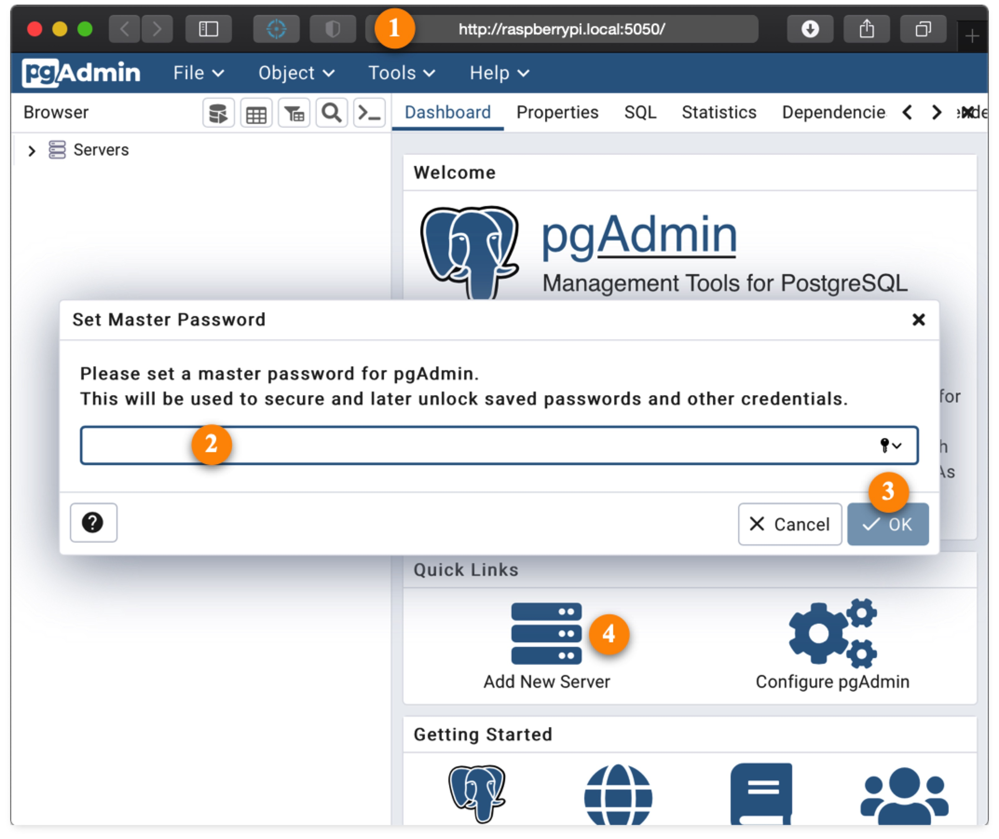
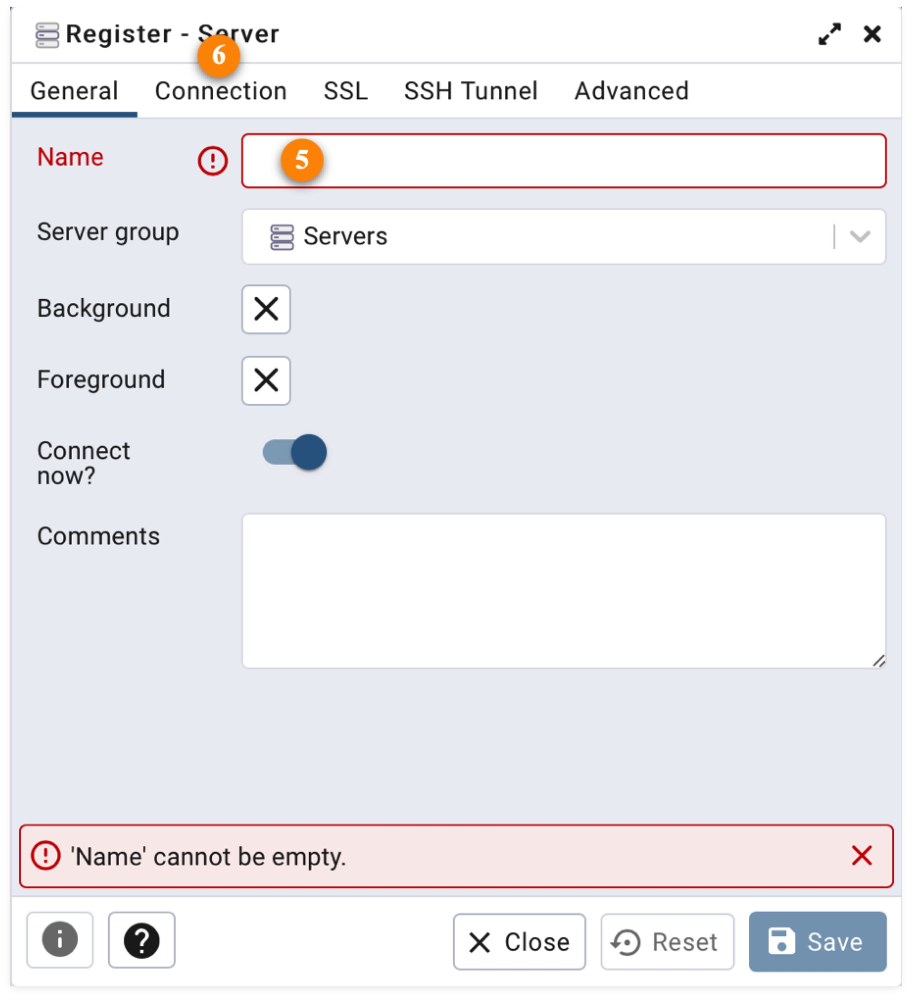
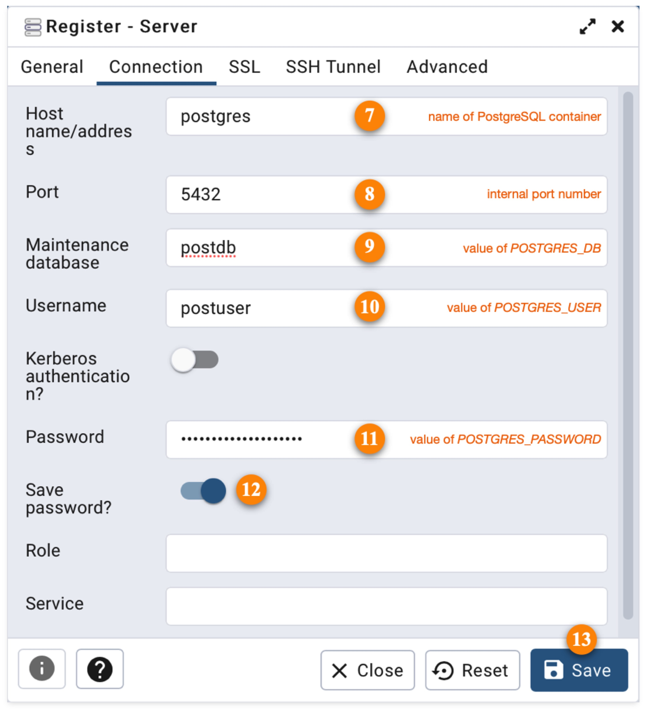

# pgAdmin4

## References

- [Docker Hub](https://hub.docker.com/r/gpongelli/pgadmin4-arm)
- [GitHub](https://github.com/gpongelli/pgadmin4-docker-arm/)
- [pgAdmin4 home page](https://www.pgadmin.org)

## About

pgAdmin4 is a graphical user interface to PostgreSQL.

## Configuration

### Runtime image

The service definition includes the following lines:

``` yaml
  image: gpongelli/pgadmin4-arm:latest-armv7
  platform: linux/arm/v7
# image: gpongelli/pgadmin4-arm:latest-armv8
```

The ARMv7 image is enabled by default. This will run on both 32-bit (ARMv7) and 64-bit (ARMv8) systems. The `platform` clause silences warnings from docker-compose that arise when you try to run an ARMv7 image on ARMv8 architecture.

If you are running on a full 64-bit system, you should edit your service definition so that it looks like this:

``` yaml
# image: gpongelli/pgadmin4-arm:latest-armv7
# platform: linux/arm/v7
  image: gpongelli/pgadmin4-arm:latest-armv8
```

### Container Time Zone

The service definition includes the `TZ` environment variable. It defaults to `Etc/UTC`. You can either edit the environment variable directly in your compose file, or provide your own substitute by editing `~/IOTstack/.env`. Example:

``` console
$ cat ~/IOTstack/.env
TZ=Australia/Sydney
```

## First run

These instructions assume you have selected the `postgresql` container from the IOTstack menu, and that that container is running.

Complete the following steps:

1. Use your web browser to connect to pgAdmin4 on port `5050`. For example:

	* `http://raspberrypi.local:5050`

	The pgAdmin4 service takes a while to start so please be patient if you have only just launched the container. Once your browser is able to connect to pgAdmin4 successfully, the home screeen will be displayed, overlaid with a prompt to enter a master password:

	

2. Enter a master password.
3. Click "OK" to set the master password. The dialog will disappear leaving the home screen.
4. Click "Add New Server". This displays the server registration sheet:

	

5. Give the server a name. The name is not important. It just needs to be meaningful to you.
6. Click the "Connection" tab:

	

7. Enter the name of the PostgreSQL container (ie "postgres").
8. The default port is 5432. This is the **internal** port number the PostgreSQL container is listening on. It is unlikely that you will need to change this.
9. In the "Maintenance database" field, enter the *value* of the `POSTGRES_DB` environment variable as it applies to the PostgreSQL container.
10. In the "Username" field, enter the *value* of the `POSTGRES_USER` environment variable as it applies to the PostgreSQL container.
11. In the "Password" field, enter the *value* of the `POSTGRES_PASSWORD` environment variable as it applies to the PostgreSQL container.
12. Enable the "Save password" switch if you think that is appropriate.
13. Click the "Save" button.

Keep in mind that the values of the environment variables you set in steps 9, 10 and 11 only apply the first time you launch the PostgreSQL container. If you change any of these in PostgreSQL, you will have to make matching changes in pgAdmin4.
