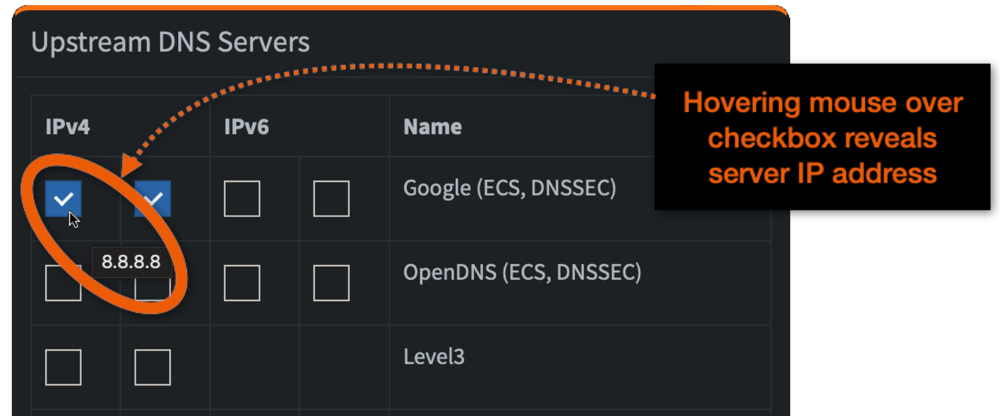

# Pi-hole

Pi-hole is a fantastic utility to reduce ads.

## References { #references }

* [Pi-hole on GitHub](https://github.com/pi-hole/docker-pi-hole)
* [Pi-hole on Dockerhub](https://hub.docker.com/r/pihole/pihole)
* [Pi-hole environment variables](https://github.com/pi-hole/docker-pi-hole#environment-variables)

## Environment variables  { #envVars }

In conjunction with controls in Pi-hole's web GUI, environment variables govern much of Pi-hole's behaviour.

If you are running new menu (master branch), environment variables are inline in your compose file. If you are running old menu, the variables will be in:

```
~/IOTstack/services/pihole/pihole.env
```

> There is nothing about old menu which *requires* the variables to be stored in the `pihole.env` file. You can migrate everything to `docker-compose.yml` if you wish.

Pi-hole's authoritative list of environment variables can be found [here](https://github.com/pi-hole/docker-pi-hole#environment-variables). Although many of Pi-hole's options can be set through its web GUI, there are two key advantages to using environment variables:

1. If you ever need to reset Pi-hole by [erasing its persistent storage area](#cleanSlate), configuration options set using environment variables will persist while those set through the GUI may be lost; and
2. On at least two occasions in its history, Pi-hole upgrades have had the effect of wiping configuration options set through the GUI, whereas options set using environment variables survived. 

### Admin password { #adminPassword }

By default, Pi-hole does not have an administrator password. That is because the default service definition provided by IOTstack contains the following environment variable with no value on its right hand side:

``` yaml
- WEBPASSWORD=
``` 

Each time the Pi-hole container is launched, it checks for the presence or absence of the `WEBPASSWORD` environment variable, then reacts like this:

* If `WEBPASSWORD` is *defined* but does **not** have a value:

	- No admin password is set;
	- Any previous admin password is cleared;
	- You will be able to [connect to Pi-hole's web interface](#connectGUI) without providing a password (you won't even see the login screen); and
	- The main menu (≡) will not contain a logout command.

	This is the default situation for IOTstack.

* If `WEBPASSWORD` is *defined* **and** has a value, that value will become the admin password. For example, to change your admin password to be "IOtSt4ckP1Hol3":

	1. Edit your compose file so that Pi-hole's service definition contains:

		``` yaml
		- WEBPASSWORD=IOtSt4ckP1Hol3
		```

	2. Run:

		``` console
		$ cd ~/IOTstack
		$ docker-compose up -d pihole
		```

		docker-compose will notice the change to the environment variable and re-create the container. The container will see that `WEBPASSWORD` has a value and will change the admin password to "IOtSt4ckP1Hol3".

		You will be prompted for a password whenever you [connect to Pi-hole's web interface](#connectGUI).

* If `WEBPASSWORD` is *undefined* (absent from your compose file), Pi-hole behaves like this:

	- If this is the first time Pi-hole has been launched, a random password is generated.

		Pi-hole senses "first launch" if it has to initialise its persistent storage area. See also [getting a clean slate](#cleanSlate). You can discover the password by running:

		``` console
		$ docker logs pihole | grep random
		```

		Remember, docker logs are cleared each time a container is terminated or re-created so you need to run that command before the log disappears!

	- Otherwise, whatever password was set on the previous launch will be re-used.

#### about `pihole -a -p` { #adminPassChange }

Some Pi-hole documentation on the web recommends using the following command to change Pi-hole's admin password:

``` console
$ docker exec pihole pihole -a -p «yourPasswordHere»
```

That command works but its effect will always be overridden by `WEBPASSWORD`. For example, suppose your service definition contains:

``` yaml
- WEBPASSWORD=myFirstPassword
```

When you start the container, the admin password will be "myFirstPassword". If you run:

``` console
$ docker exec pihole pihole -a -p mySecondPassword
```

then "mySecondPassword" will become the admin password **until** the next time the container is re-created by docker-compose, at which point the password will be reset to "myFirstPassword".

Given this behaviour, we recommend that you ignore the `pihole -a -p` command.

### Logging { #loggingVar }

You can control the amount of information Pi-hole retains about your DNS queries using the "Privacy Settings" tab of the "Settings" group. The default is "Show & record everything".

If you choose any option except "Anonymous mode", then Pi-hole divides the logging store into two parts:

* Entries which are more recent than 24 hours; and
* Entries which are older than 24 hours.

In the "System" tab of the "Settings" group is a <kbd>Flush logs (last 24 hours)</kbd> button. Clicking that button erases all log entries which are more recent than 24 hours. The button does **not** erase entries which are older than 24 hours.

Retention of log entries older than 24 hours is controlled by the following environment variable:

``` yaml
- FTLCONF_MAXDBDAYS=365
```

The default (which applies if the variable is omitted) is to retain log entries for 365 days.

Depending on your DNS activity, the database where the log entries are stored can become quite large. Setting this variable to a shorter period will help you control the amount of storage Pi-hole consumes on disk and in your backups.

Tip:

* Adding this variable to an existing service definition, or changing the number of days to be less than the previous setting will **not** reduce the size of the logging database. Although Pi-hole will implement the change, the SQLite database where the logs are written retains the released storage for subsequent re-use. If you want to reclaim that space, run the following command:   

	``` console
	$ sqlite3 ~/IOTstack/volumes/pihole/etc-pihole/pihole-FTL.db "vacuum;"
	```
	
	The command should not need `sudo` because `pi` is the owner by default. There is no need to terminate Pi-hole before running this command (SQLite handles any contention).

### Recursive resolvers { #upstreamDNS }

You can control which public DNS servers are used by PiHole when it needs to refer queries to the Internet. You do this by enabling or disabling checkboxes in the "Upstream DNS Servers" panel of the "DNS" tab in the "Settings" group.

The default is to use the two Google IPv4 DNS servers which correspond with 8.8.8.8 and 8.8.4.4, respectively.

An alternative to toggling checkboxes in the Pi-hole GUI is to use an environment variable:

``` yaml
- PIHOLE_DNS_=8.8.8.8;8.8.4.4
```

> The variable *does* end with an underscore!

This variable takes a semi-colon-separated list of DNS servers. You can discover the IP address associated with a checkbox by hovering your mouse pointer over the checkbox and waiting for a tool-tip to appear:



### Advanced variables { #advancedVars }

??? info "(advanced) reverse DNS query handling"

    First, understand that there are two basic types of DNS query:

    * *forward queries*:

        - question: "what is the IP address of fred.yourdomain.com?"
        - answer: 192.168.1.100

    * *reverse queries*:

        - question: "what is the domain name for 192.168.1.100?"
        - answer: fred.yourdomain.com

    Pi-hole has its own built-in DNS server which can answer both kinds of queries. The implementation is useful but doesn't offer all the features of a full-blown DNS server like BIND9. If you decide to implement a more capable DNS server to work alongside Pi-hole, you will need to understand the following Pi-hole environment variables:

    * `REV_SERVER=`

        If you configure Pi-hole's built-in DNS server to be authoritative for your local domain name, `REV_SERVER=false` is appropriate, in which case none of the variables discussed below has any effect.

        Setting `REV_SERVER=true` allows Pi-hole to forward queries that it can't answer to a local upstream DNS server, typically running inside your network.

    * `REV_SERVER_DOMAIN=yourdomain.com` (where "yourdomain.com" is an example)

        The Pi-hole documentation says:

        > *"If conditional forwarding is enabled, set the domain of the local network router".*

        The words "if conditional forwarding is enabled" mean "when `REV_SERVER=true`".

        However, this option really has little-to-nothing to do with the "domain of the local network **router**". Your router *may* have an IP address that reverse-resolves to a local domain name (eg gateway.mydomain.com) but this is something most routers are unaware of, even if you have configured your router's DHCP server to inform clients that they should assume a default domain of "yourdomain.com".

        This variable actually tells Pi-hole the name of your local domain. In other words, it tells Pi-hole to consider the possibility that an *unqualified* name like "fred" could be the fully-qualified domain name "fred.yourdomain.com".

    * `REV_SERVER_TARGET=192.168.1.5` (where 192.168.1.5 is an example):

        The Pi-hole documentation says:

        > *"If conditional forwarding is enabled, set the IP of the local network router".*

        This option tells Pi-hole where to direct *forward queries* that it can't answer. In other words, Pi-hole will send a forward query for fred.yourdomain.com to 192.168.1.5.

        It *may* be appropriate to set `REV_SERVER_TARGET` to the IP address of your router (eg 192.168.1.1) but, unless your router is running as a DNS server (not impossible but uncommon), the router will likely just relay any queries to your ISP's DNS servers (or other well-known DNS servers like 8.8.8.8 or 1.1.1.1 if you have configured those). Those external DNS servers are unlikely to be able to resolve queries for names in your private domain, and won't be able to do anything sensible with reverse queries if your home network uses RFC1918 addressing (which most do: 192.168.x.x being the most common example).

        Forwarding doesn't guarantee that 192.168.1.5 will be able to answer the query. The DNS server at 192.168.1.5 may well relay the query to yet another server. In other words, this environment variable does no more than set the next hop.

        If you are planning on using this option, the target needs to be a DNS server that is authoritative for your local domain and that, pretty much, is going to be a local upstream DNS server inside your home network like another Raspberry Pi running BIND9.

    * `REV_SERVER_CIDR=192.168.1.0/24` (where 192.168.1.0/24 is an example)

        The Pi-hole documentation says:

        > *"If conditional forwarding is enabled, set the reverse DNS zone (e.g. 192.168.0.0/24)".*

        This is correct but it lacks detail.

        The string "192.168.1.0/24" defines your local subnet using Classless Inter-Domain Routing (CIDR) notation. Most home subnets use a subnet-mask of 255.255.255.0. If you write that out in binary, it is 24 1-bits followed by 8 0-bits, as in:

        ```
           255  .   255  .   255  .   0
        11111111 11111111 11111111 00000000
        ```

        Those 24 one-bits are where the `/24` comes from in `192.168.1.0/24`. When you perform a bitwise logical AND between that subnet mask and 192.168.1.0, the ".0" is removed (conceptually), as in:

        ```
        192.168.1.0 AND 255.255.255.0 = 192.168.1
        ```

        What it **means** is:

        1. The network *prefix* is "192.168.1".
        2. *This* host on the 192.168.1 network is the reserved address "192.168.1.0". It is better to think of this as "the network prefix followed by all-zero bits in the host portion". It is not common to see the .0 address used in practice. A device either knows its IP address or it doesn't. If it doesn't then it won't know its prefix so it will use 0.0.0.0 as a substitute for "this".
        3. The *range* of IP addresses available for allocation to hosts on this subnet is 192.168.1.1 through 192.168.1.254 inclusive.
        4. *All* hosts on the 192.168.1 network (ie broadcast) is the reserved address "192.168.1.255". It is better to think of this as "the network prefix followed by all-one bits in the host portion".

        When you set `REV_SERVER_CIDR=192.168.1.0/24` you are telling Pi-hole that *reverse queries* for the host range 192.168.1.1 through 192.168.1.254 should be sent to the `REV_SERVER_TARGET=192.168.1.5`.

## Pi-hole Web GUI { #webGUI }

Note: in order for Web GUI settings to have any effects, you need to configure
the RPi or other machines to use it. This is described in the next topics.

### Connecting to the GUI { #connectGUI }

Point your browser to:

```
http://«your_ip»:8089/admin
```

where «your_ip» can be:

* The IP address of the Raspberry Pi running Pi-hole.
* The domain name of the Raspberry Pi running Pi-hole.
* The multicast DNS name (eg "raspberrypi.local") of the Raspberry Pi running Pi-hole.

### Adding local domain names { #localNames }

Login to the Pi-hole web interface: `http://raspberrypi.local:8089/admin`:

1. Select from Left menu: Local DNS -> DNS Records
2. Enter Domain: `raspberrypi.home.arpa` and the RPi's IP Address, e.g. `192.168.1.10`.
3. Press Add.

Now you can use `raspberrypi.home.arpa` as the domain name for the Raspberry Pi
in your whole local network. You can also add domain names for your other
devices, provided they too have static IPs.

!!! help "why .home.arpa?"

    Instead of `.home.arpa` - which is the real standard, but a mouthful - you
    can use `.internal`. Using `.local` would technically work, but it should
    be reserved for mDNS use only.
    { #homeArpa }

## Configure your Pi to use Pi-hole { #rpiDNS }

The Raspberry Pi itself does **not** have to use the Pi-hole container for its own DNS services. Some chicken-and-egg situations can exist if, for example, the Pi-hole container is down when another process (eg `apt` or `docker-compose`) needs to do something that depends on DNS services being available.

Nevertheless, if you configure Pi-hole to be local DNS resolver, then you will probably want to configure your Raspberry Pi to use the Pi-hole container in the first instance, and then fall back to a public DNS server if the container is down. As a beginner, this is probably what you want regardless. Do this by running the commands:

``` console
$ echo "name_servers=127.0.0.1" | sudo tee -a /etc/resolvconf.conf
$ echo "name_servers_append=8.8.8.8" | sudo tee -a /etc/resolvconf.conf
$ echo "resolv_conf_local_only=NO" | sudo tee -a /etc/resolvconf.conf
$ sudo resolvconf -u
```

This results in a configuration that will continue working, even if the Pi-hole
container isn't running.

??? info "Detailed explanations of these commands"

    1. `name_servers=127.0.0.1` instructs the Raspberry Pi to direct DNS queries to the loopback address. Port 53 is implied. If the Pi-hole container is running in:

        - non-host mode, Docker is listening to port 53 and forwards the queries to the Pi-hole container;
        - host mode, the Pi-hole container is listening to port 53.

    2. `name_servers_append=8.8.8.8` instructs the Raspberry Pi to fail-over to 8.8.8.8 if Pi-hole does not respond. You can replace `8.8.8.8` (a Google service) with:

        * Another well-known public DNS server like `1.1.1.1` (Cloudflare).
        * The IP address(es) of your ISP's DNS hosts (generally available from your ISP's web site).
        * The IP address of another DNS server running in your local network (eg BIND9).
        * The IP address of your home router. Most home routers default to the ISP's DNS hosts but you can usually change your router's configuration to bypass your ISP in favour of public servers like 8.8.8.8 and 1.1.1.1.

        You need slightly different syntax if you want to add multiple fallback servers. For example, suppose your fallback hosts are a local server (eg 192.168.1.2) running BIND9 and 8.8.8.8. The command would be:

        ``` console
        $ echo 'name_servers_append="192.168.1.2 8.8.8.8"' | sudo tee -a /etc/resolvconf.conf
        ```

    3. `resolv_conf_local_only=NO` is needed so that 127.0.0.1 and 8.8.8.8 can coexist.
    4. The `resolvconf -u` command instructs Raspberry Pi OS to rebuild the active resolver configuration. In principle, that means parsing `/etc/resolvconf.conf` to derive `/etc/resolv.conf`. This command can sometimes return the error "Too few arguments". You should ignore that error.

    ``` mermaid
    flowchart LR
      RERECONF["/etc/resolvconf.conf"] --- UP([resolvconf -u])
      DHCP[DHCP provided DNS-server] --- UP
      UP -- "generates" --> RECONF["/etc/resolv.conf"]
      classDef command fill:#9996,stroke-width:0px
      class UP command
    ```

??? note "Advanced options: ignoring DHCP provided DNS-servers, local domain name search"

    * If you wish to prevent the Raspberry Pi from including the address(es) of DNS servers learned from DHCP, you can instruct the DHCP client running on the Raspberry Pi to ignore the information coming from the DHCP server:

        ``` console
        $ echo 'nooption domain_name_servers' | sudo tee -a /etc/dhcpcd.conf
        $ sudo service dhcpcd reload
        $ sudo resolvconf -u
        ```

    * If you have followed the steps in [Adding local domain names](#localNames) to define names for your local hosts, you can inform the Raspberry Pi of that fact like this:

        ``` console
        $ echo 'search_domains=home.arpa' | sudo tee -a /etc/resolvconf.conf
        $ sudo resolvconf -u
        ```

        That will add the following line to `/etc/resolv.conf`:

        ```
        search home.arpa
        ```

        Then, when you refer to a host by a short name (eg "fred") the Raspberry Pi will also consider "fred.home.arpa" when trying to discover the IP address.

??? note "Interaction with other containers"

    Docker provides a special IP 127.0.0.11, which listens to DNS queries and
    resolves them according to the host RPi's resolv.conf. Containers usually
    rely on this to perform DNS lookups. This is nice as it won't present any
    surprises as DNS lookups on both the host and in the containers will yeild
    the same results.

    It's possible to make DNS queries directly cross-container, and even
    supported in some [rare use-cases](WireGuard.md#customContInit).

## Using Pi-hole as your local DNS

To use the Pi-hole in your LAN, you need to assign the Raspberry Pi a fixed IP-address and configure this IP as your DNS server.

### Fixed IP address for Pi-hole { #rpiFixedIP }

If you want clients on your network to use Pi-hole for their DNS, the Raspberry Pi running Pi-hole **must** have a fixed IP address. It does not have to be a *static* IP address (in the sense of being hard-coded into the Raspberry Pi). The Raspberry Pi can still obtain its IP address from DHCP at boot time, providing your DHCP server (usually your home router) always returns the same IP address. This is usually referred to as a *static binding* and associates the Raspberry Pi's MAC address with a fixed IP address.

Keep in mind that many Raspberry Pis have both Ethernet and WiFi interfaces. It is generally prudent to establish static bindings for *both* network interfaces in your DHCP server.

You can use the following command to discover the MAC addresses for your Raspberry Pi's Ethernet and WiFi interfaces:

``` console
$ for I in eth0 wlan0 ; do ip link show $I ; done
2: eth0: <BROADCAST,MULTICAST,UP,LOWER_UP> mtu 1500 qdisc mq state UP mode DEFAULT group default qlen 1000
    link/ether dc:a6:32:4c:89:f9 brd ff:ff:ff:ff:ff:ff
3: wlan0: <BROADCAST,MULTICAST,UP,LOWER_UP> mtu 1500 qdisc pfifo_fast state UP mode DEFAULT group default qlen 1000
    link/ether e5:4f:01:41:88:b2 brd ff:ff:ff:ff:ff:ff
```

In the above:

* The MAC address of the Ethernet interface is "dc:a6:32:4c:89:f9"
* The MAC address of the WiFi interface is "e5:4f:01:41:88:b2"

If a physical interface does not exist, the command returns "Device does not exist" for that interface. If you prefer, you can also substitute the `ifconfig` command for `ip link show`. It's just a little more wordy.

### Configure clients to use Pi-hole { #rpiConfig }

In order for Pi-hole to block ads or resolve anything, clients need to be told to use it as their DNS server. You can either:

1. Adopt a whole-of-network approach and edit the DNS settings in your DHCP server so that all clients are given the IP address of the Raspberry Pi running Pi-hole to use for DNS services when a lease is issued.
2. Adopt a case-by-case (manual) approach where you instruct particular clients to obtain DNS services from the IP address of the Raspberry Pi running Pi-hole.

Option 1 (whole-of-network) is the simplest approach. Assuming your Raspberry Pi has the static IP `192.168.1.10`:

1. Go to your network's DHCP server. In most home networks, this will be your Wireless Access Point/WLAN Router:

	* Login into its web-interface
	* Find where DNS servers are defined (generally with DHCP controls)
	* Change all DNS fields to `192.168.1.10`

2. All local clients have to be rebooted. Without this they will continue to use the old DNS setting from an old DHCP lease for quite some time.

Option 2 (case-by-case) generally involves finding the IP configuration options for each host and setting the DNS server manually. Manual changes are usually effective immediately without needing a reboot.

??? note "advanced configurations"

    Setting up a combination of Pi-hole (for ad-blocking services), and/or a local upstream DNS resolver (eg BIND9) to be authoritative for a local domain and reverse-resolution for your local IP addresses, and decisions about where each DNS server forwards queries it can't answer (eg your ISP's DNS servers, or Google's 8.8.8.8, or Cloudflare's 1.1.1.1) is a complex topic and depends on your specific needs.
    { #advancedConfig }

    The same applies to setting up a DHCP server (eg DHCPD) which is capable of distinguishing between the various clients on your network (ie by MAC address) to make case-by-case decisions as to where each client should obtain its DNS services. 

    If you need help, try asking questions on the [IOTstack Discord channel](https://discord.gg/ZpKHnks).

## Testing and Troubleshooting { #debugging }

Make these assumptions:

1. You have followed the instructions above to add these lines to `/etc/resolvconf.conf`:

	```
	name_servers=127.0.0.1
	name_servers_append=8.8.8.8
	resolv_conf_local_only=NO
	```

2. The Raspberry Pi running Pi-hole has the IP address 192.168.1.10 which it obtains as a static assignment from your DHCP server.
3. You have configured your DHCP server to provide 192.168.1.10 for client devices to use to obtain DNS services (ie, you are saying clients should use Pi-hole for DNS).

The result of the configuration appears in `/etc/resolv.conf`:

``` console
$ cat /etc/resolv.conf
# Generated by resolvconf
nameserver 127.0.0.1
nameserver 192.168.1.10
nameserver 8.8.8.8
```

Interpretation:

* `nameserver 127.0.0.1` is present because of `name_servers=127.0.0.1`
* `nameserver 192.168.1.10` is present because it was learned from DHCP
* `nameserver 8.8.8.8` is present because of `name_servers_append=8.8.8.8`

The fact that the Raspberry Pi is effectively represented twice (once as 127.0.0.1, and again as 192.168.1.10) does not matter. If the Pi-hole container stops running, the Raspberry Pi will bypass 192.168.1.10 and fail over to 8.8.8.8, failing back to 127.0.0.1 when the Pi-hole container starts again.

Install dig:

``` console
$ sudo apt install dnsutils
```

Test that Pi-hole is correctly configured (should respond 192.168.1.10):

``` console
$ dig raspberrypi.home.arpa @192.168.1.10
```

To test on another machine if your network's DNS configuration is correct, and
an ESP will resolve its DNS queries correctly, restart the other machine to
ensure DNS changes are updated and then use:

``` console
$ dig raspberrypi.home.arpa
```

This should produce the same result as the previous command.

If this fails to resolve the IP, check that the server in the response is
`192.168.1.10`. If it's `127.0.0.xx` check `/etc/resolv.conf` begins with
`nameserver 192.168.1.10`. If not, check the machine is configured to use DHCP
and revisit [Pi-hole as DNS](#rpiConfig).

## Microcontrollers { #iotConfig }

If you want to avoid hardcoding your Raspberry Pi IP to your ESPhome devices,
you need a DNS server that will do the resolving. This can be done using the
Pi-hole container as described above.

### `*.local` won't work for ESPhome { #esp32mDNS }

There is a special case for resolving `*.local` addresses. If you do a `ping raspberrypi.local` on your desktop Linux or the Raspberry Pi, it will first try using mDNS/bonjour to resolve the IP address raspberrypi.local. If this fails it will then ask the DNS server. ESPhome devices can't use mDNS to resolve an IP address. You need a proper DNS server to respond to queries made by an ESP. As such, `dig raspberrypi.local` will fail, simulating ESPhome device behavior. This is as intended, and you should use raspberrypi.home.arpa as the address on your ESP-device.

## Getting a clean slate { #cleanSlate }

If Pi-hole misbehaves, you can always try starting from a clean slate by erasing Pi-hole's persistent storage area. Erasing the persistent storage area causes PiHole to re-initialise its data structures on the next launch. You will lose:

1. Any configuration options you may have set via the web GUI that are not otherwise reflected in [environment variables](#envVars).
2. Any whitelist, blacklist or local DNS records you entered.
3. All DNS resolution and blocking history.

Also note that your [administrative password](#adminPassword) will reset.

The recommended approach is:

1. Login to Pi-hole's web GUI and navigate to Settings » Teleporter.
2. Click the <kbd>Backup</kbd> button to download a backup.
3. Logout of the Web GUI.
4. Run the following commands:

	``` console
	$ cd ~/IOTstack
	$ docker-compose down pihole
	$ sudo rm -rf ./volumes/pihole
	$ docker-compose up -d pihole
	```
	
	> see also [if downing a container doesn't work](../Basic_setup/index.md/#downContainer)

5. Login to Pi-hole's web GUI and navigate to Settings » Teleporter.
6. Use the checkboxes to select the settings you wish to restore, and click the <kbd>Browse</kbd> and <kbd>Restore</kbd> buttons.

## Docker Desktop { #dockerDesktop }

If you run Pi-hole using Docker Desktop for macOS, all client activity will be logged against the IP address of the default gateway on the internal bridged network.

It appears that Docker Desktop for macOS interposes an additional level of Network Address Translation (NAT) between clients and the Pi-hole service. This does not affect  Pi-hole's ability to block ads. It just makes the GUI reports a little less useful.

It is not known whether this is peculiar to Docker Desktop for macOS or also affects other variants of Docker Desktop.

This problem does not affect Pi-hole running in a container on a Raspberry Pi.
