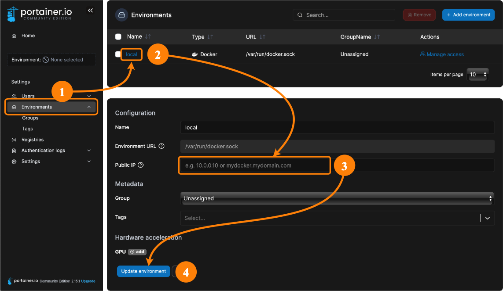

# Portainer CE

## <a name="references"> References </a>
 
- [Docker](https://hub.docker.com/r/portainer/portainer-ce/)
- [Website](https://www.portainer.io/portainer-ce/)

## <a name="definitions"> Definition </a>

- "#yourip" means any of the following:

	- the IP address of your Raspberry Pi (eg `192.168.1.10`)
	- the multicast domain name of your Raspberry Pi (eg `iot-hub.local`)
	- the domain name of your Raspberry Pi (eg `iot-hub.mydomain.com`) 

## <a name="about"> About *Portainer CE* </a>

*Portainer CE* (Community Edition) is an application for managing Docker. It is a successor to *Portainer*. According to [the *Portainer CE* documentation](https://www.portainer.io/2020/08/portainer-ce-2-0-what-to-expect/)

> Portainer 1.24.x will continue as a separate code branch, released as portainer/portainer:latest, and will receive ongoing security updates until at least 1st Sept 2021. No new features will be added beyond what was available in 1.24.1.

From that it should be clear that *Portainer* is deprecated and that *Portainer CE* is the way forward.

## <a name="installation"> Installing *Portainer CE* </a>

Run the menu:

```
$ cd ~/IOTstack
$ ./menu.sh
```

Choose "Build Stack", select "Portainer-ce", press [TAB] then "\<Ok\>" and follow through to the end of the menu process, typically choosing "Do not overwrite" for any existing services. When the menu finishes:

```
$ docker-compose up -d
```

Ignore any message like this:

> WARNING: Found orphan containers (portainer) for this project …

## <a name="firstRun"> First run of *Portainer CE* </a>

In your web browser navigate to `#yourip:9000/`:

- the first screen will suggest a username of "admin" and ask for a password. Supply those credentials and click "Create User".
- the second screen will ask you to select a connection method. For IOTstack, "Docker (Manage the local Docker environment)" is usually appropriate so click that and then click "Connect".

From there, you can click on the "Local" group and take a look around. One of the things *Portainer CE* can help you do is find unused containers but beware of reading too much into this because, sometimes, an "unused" container is actually the base for another container (eg Node-RED).

There are 'Quick actions' to view logs and other stats. This can all be done from terminal commands but *Portainer CE* makes it easier. 

## <a name="setPublicIP"> Setting the Public IP address for your end-point </a>

If you click on a "Published Port" in the "Containers" list, your browser may return an error saying something like "can't connect to server" associated with an IP address of "0.0.0.0".

To fix that problem, proceed as shown below:



1. Click "Endpoints" in the left hand panel.
2. Click the name "local" in the list of Endpoints.
3. Click in the "Public IP" field. Enter one of the following:
	- The multicast DNS (MDNS) name of your Raspberry Pi (eg `iot-hub.local`)
	- The fully-qualified domain name (FQDN) of your Raspberry Pi (eg `iot-hub.mydomain.com`)
	- The IP address of your Raspberry Pi (eg `192.168.1.10`)
4. Click "Update endpoint".

> To remove the Public IP address, repeat the above steps but clear the "Public IP" field in step 3.

The reason why you have to tell *Portainer CE* which Public IP address to use is because an instance of *Portainer CE* does not necessarily have to be running on the **same** Raspberry Pi as the Docker containers it is managing.

Keep in mind that clicking on a "Published Port" does not guarantee that your browser can open a connection. For example:

* Port 1883 for Mosquitto expects MQTT packets. It will not respond to HTTP, so any attempt will fail.
* Port 8089 for PiHole will respond to HTTP but PiHole may reject or mis-handle your attempt.
* Port 1880 for NodeRed will respond normally.

> All things considered, you will get more consistent behaviour if you simply bookmark the URLs you want to use for your IOTstack services.

## <a name="forgotPassword"> If you forget your password </a>

If you forget the password you created for *Portainer CE*, you can recover by doing the following:

```
$ cd ~/IOTstack
$ docker-compose stop portainer-ce
$ sudo rm -r ./volumes/portainer-ce
$ docker-compose start portainer-ce
```

Then, follow the steps in:

1. [First run of *Portainer CE*](#firstRun); and
2. [Setting the Public IP address for your end-point](#setPublicIP).
