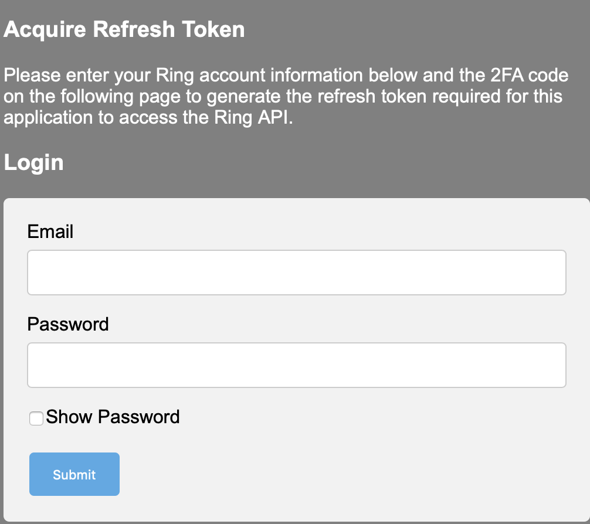

# Ring-MQTT 

## References

- [Ring-MQTT Wiki](https://github.com/tsightler/ring-mqtt/wiki) (documentation)
- [DockerHub](https://hub.docker.com/r/tsightler/ring-mqtt) (Docker images)
- [GitHub](https://github.com/tsightler/ring-mqtt) (Source code and issues)

## Getting started

1. Be in the correct directory (assumed throughout):

	``` console
	$ cd ~/IOTstack
	```

2. Run the IOTstack menu and choose `ring-mqtt`. An alternative to running the menu is to append the service definition template to your compose file like this:

	``` console
	$ sed -e "s/^/  /" ./.templates/ring-mqtt/service.yml >>docker-compose.yml
	```

	> The `sed` command is required because service definition templates are left-shifted by two spaces.

3. This step is optional. Use a text editor to open your `docker-compose.yml` file:

	- find the `ring-mqtt` service definition;
	- change the `TZ` environment variable to your time-zone;
	- save your work.

4. Bring up the container:

	``` console
	$ docker-compose up -d ring-mqtt
	```

	This pulls the image from DockerHub, instantiates the container, and initialises its persistent storage.

5. Use `sudo` and a text editor to open the configuration file at the path. For example:

	``` console
	$ sudo vi ./volumes/ring-mqtt/data/config.json
	```

	At the time of writing, the default configuration file looked like this:

	``` { .json linenums="1" }
	{
	    "mqtt_url": "mqtt://localhost:1883",
	    "mqtt_options": "",
	    "livestream_user": "",
	    "livestream_pass": "",
	    "disarm_code": "",
	    "enable_cameras": false,
	    "enable_modes": false,
	    "enable_panic": false,
	    "hass_topic": "homeassistant/status",
	    "ring_topic": "ring",
	    "location_ids": [
	        ""
	    ]
	}
	```

	From the perspective of any process running in a Docker container, `localhost` means "this container" rather than "this Raspberry Pi". You need to edit line 2 to point to your MQTT broker:

	* If the `ring-mqtt` container and your `mosquitto` container are running on the **same** Raspberry Pi:

		``` { .json linenums="2" }
		"mqtt_url": "mqtt://mosquitto:1883",
		```
	  
	* Otherwise, replace `localhost` with the IP address or domain name of the host where your MQTT broker is running. For example:

		``` { .json linenums="2" }
		"mqtt_url": "mqtt://192.168.0.100:1883",
		```

	* If your MQTT broker is protected by a username and password, refer to the [Ring-MQTT Wiki](https://github.com/tsightler/ring-mqtt/wiki/Configuration-Details#global-configuration-options) for the correct syntax.

	Save your work then restart the container:

	``` console
	$ docker-compose restart ring-mqtt
	```

6. Launch your browser (eg Chrome, Firefox, Safari) and open the following URL:

	```
	http://«ip-or-name»:55123
	```

	where `«ip-or-name»` is the IP address or domain name of the Raspberry Pi running your ring-mqtt container. Examples:

	* `http://192.168.1.100:55123`
	* `http://iot-hub.my.domain.com:55123`
	* `http://iot-hub.local:55123`

	You should see the following screen:

	

	Follow the instructions on the screen to generate your refresh token.

7. Check the logs:

	``` console
	$ docker logs ring-mqtt
	```

	Unless you see errors being reported, your `ring-mqtt` container should be ready.

## Environment variables

The default service definition includes two environment variables:

``` yaml
environment:
- TZ=Etc/UTC
- DEBUG=ring-*
```

* `TZ=` should be set to your local time zone (explained above).
* `DEBUG=ring-*` ("all debugging options enabled") is the default for `ring-mqtt` when running in a container. It is included as a placeholder if you want to tailor debugging output. Refer to the [Ring-MQTT Wiki](https://github.com/tsightler/ring-mqtt/wiki#debugging).

Whenever you change an environment variable, run:

``` console
$ cd ~/IOTstack
$ docker-compose up -d ring-mqtt
```

The "up" causes docker-compose to notice the configuration change and re-create the container.

## Configuration

Consult the [Ring-MQTT Wiki](https://github.com/tsightler/ring-mqtt/wiki/Configuration-Details).

## Maintenance

Periodically:

``` console
$ cd ~/IOTstack
$ docker-compose pull ring-mqtt
```

If a new image comes down from DockerHub:

``` console
$ docker-compose up -d ring-mqtt
$ docker system prune -f
```

The "up" instantiates the newly-downloaded image as the running container. The "prune" cleans up the older image.
