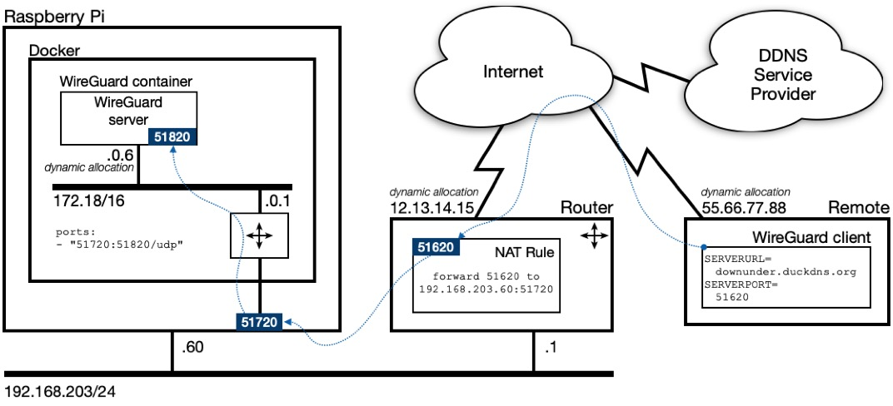
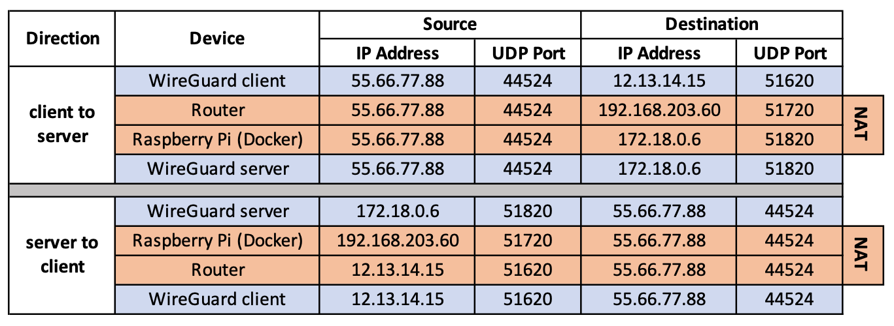

# WireGuard

WireGuard is a fast, modern, secure Virtual Private Network (VPN) tunnel. It can securely connect you to your home network, allowing you to access your home network's local services from anywhere. It can also secure your traffic when using public internet connections.

Reference:

* [WireGuard home page](https://www.wireguard.com)
* [IOTstack discussion paper : ZeroTier vs WireGuard](ZeroTier-vs-WireGuard.md)
* [2022-10-01 WireGuard migration](#migrateWireguard)

Assumptions:

* These instructions assume that you have privileges to configure your network's gateway (router). If you are not able to make changes to your network's firewall settings, then you will not be able to finish this setup.
* In common with most VPN technologies, WireGuard assumes that the WAN side of your network's gateway has a public IP address which is reachable directly. WireGuard may not work if that assumption does not hold. If you strike this problem, read [ZeroTier vs WireGuard](ZeroTier-vs-WireGuard.md).

## Installing WireGuard under IOTstack { #installWireguard }

You increase your chances of a trouble-free installation by performing the installation steps in the following order.

### Step 1: Update your Raspberry Pi OS { #updateRaspbian }

To be able to run WireGuard successfully, your Raspberry Pi needs to be **fully** up-to-date. If you want to understand why, see [the read only flag](#readOnlyFlag).

``` console
$ sudo apt update
$ sudo apt upgrade -y
```

### Step 2: Set up a Dynamic DNS name { #obtainDDNS }

Before you can use WireGuard (or any VPN solution), you need a mechanism for your remote clients to reach your home router. You have two choices:

1. Obtain a permanent IP address for your home router from your Internet Service Provider (ISP). Approach your ISP if you wish to pursue this option. It generally involves additional charges.
2. Use a Dynamic DNS service. See IOTstack documentation [Accessing your device from the internet](../Basic_setup/Accessing-your-Device-from-the-internet.md). The rest of this documentation assumes you have chosen this option.

### Step 3: Understand the Service Definition { #serviceDefinition }

This is the service definition *template* that IOTstack uses for WireGuard:

``` { .yaml linenums="1" }
wireguard:
  container_name: wireguard
  image: ghcr.io/linuxserver/wireguard
  restart: unless-stopped
  environment:
    - PUID=1000
    - PGID=1000
    - TZ=${TZ:-Etc/UTC}
    - SERVERURL=your.dynamic.dns.name
    - SERVERPORT=51820
    - PEERS=laptop,phone,tablet
    - PEERDNS=auto
    - ALLOWEDIPS=0.0.0.0/0
  ports:
    - "51820:51820/udp"
  volumes:
    - ./volumes/wireguard/config:/config
    - ./volumes/wireguard/custom-cont-init.d:/custom-cont-init.d
    - ./volumes/wireguard/custom-services.d:/custom-services.d
  cap_add:
    - NET_ADMIN
  sysctls:
    - net.ipv4.conf.all.src_valid_mark=1
```

Unfortunately, that service definition will not work "as is". It needs to be configured.

Key points:

* Everything in the `environment:` section from `SERVERURL=` down to `PEERDNS=` (inclusive) affects WireGuard's generated configurations (the QR codes). In other words, any time you change any of those values, any existing QR codes will stop working.

### Step 4: Decide what to configure { #configureWhat }

With most containers, you can continue to tweak environment variables and settings without upsetting the container's basic behaviour. WireGuard is a little different. You really need to think, carefully, about how you want to configure the service before you start. If you change your mind later, you generally have to [start from a clean slate](#cleanSlate).

#### Fields that you should always configure { #configureAlways }

* `SERVERURL=` should be set to the domain name you have registered with a Dynamic DNS service provider. Example:

	```yml
	- SERVERURL=downunda.duckdns.org
	```

* `PEERS=` should be a comma-separated list of your client devices (all the phones, tablets, laptops, desktops you want to use remotely to get back into your home network). Example:

	```yml
	- PEERS=jillMacbook,jackChromebook,alexNokiaG10
	```

	Notes:

	- Many examples on the web use "PEERS=n" where "n" is a number. In practice, that approach seems to be a little fragile and is not recommended for IOTstack.
	- Each name needs to start with a letter and be followed by one or more letters and/or digits. Letters can be upper- or lower-case. Do not use any other characters.

#### Optional configuration - DNS resolution for peers { #configurePeerDNS }

You have several options for how your remote peers resolve DNS requests:

* `PEERDNS=auto`

	DNS queries made on connected WireGuard clients should work as if they were made on the host. If you [configure](Pi-hole.md#piholePrimary) your ad-blocker into the host's `resolveconf.conf`, Wireguard clients will also automatically use it.

	Details:
	    
	* The default value of `auto` instructs the WireGuard *service* running within the WireGuard *container* to use a DNS-service, coredns, also running in the Wireguard container. Coredns by default directs queries to 127.0.0.11, which Docker intercepts and forwards to whichever resolvers are specified in the Raspberry Pi's `/etc/resolv.conf`.

* `PEERDNS=auto` with `custom-cont-init`
    { #customContInit }

	This configuration instructs WireGuard to forward DNS queries from remote peers to any host daemon or **container** which is listening on port 53. This is the option you will want to choose if you are running an ad-blocking DNS server (eg *PiHole* or *AdGuardHome*) in a container on the same host as WireGuard, and you want your remote clients to obtain DNS resolution via the ad-blocker, but don't want your Raspberry Pi host to use it.

	> Acknowledgement: thanks to @ukkopahis for developing this option.

	To activate this feature:

	1. Make sure your WireGuard service definition contains `PEERDNS=auto`.
	2. Start the WireGuard container by executing:

		``` console
		$ cd ~/IOTstack
		$ docker-compose up -d wireguard
		```

		This ensures that the `~/IOTstack/volumes/wireguard` folder structure is created and remote client configurations are (re)generated properly.

	3. Run the following commands:  

		``` console
		$ cd ~/IOTstack
		$ sudo cp ./.templates/wireguard/use-container-dns.sh ./volumes/wireguard/custom-cont-init.d/
		$ docker-compose restart wireguard
		```

	 	The presence of `use-container-dns.sh` causes WireGuard to redirect incoming DNS queries to the default gateway on the internal bridged network. That, in turn, results in the queries being forwarded to any other container that is listening for DNS traffic on port 53. It does not matter if that other container is PiHole, AdGuardHome, bind9 or any other kind of DNS server.
	 
	 	Do note, however, that this configuration creates a dependency between WireGuard and the container providing DNS resolution. You may wish to make that explicit in your `docker-compose.yml` by adding these lines to your WireGuard service definition:
	 
		```yaml
		depends_on:
		  - pihole
		```

	 	> Substitute `adguardhome` or `bind9` for `pihole`, as appropriate.

	Once activated, this feature will remain active until you decide to deactivate it. If you ever wish to deactivate it, run the following commands:

	``` console
	$ cd ~/IOTstack
	$ sudo rm ./volumes/wireguard/custom-cont-init.d/use-container-dns.sh
	$ docker-compose restart wireguard
	```

* `PEERDNS=«ip address»`

	A third possibility is if you have a local upstream DNS server. You can specify the IP address of that server so that remote peers receive DNS resolution from that host. For example:

	```yml
	- PEERDNS=192.168.203.65
	```

	Do note that changes to `PEERDNS` will not be updated to existing clients, and as such you may want to use `PEERDNS=auto` unless you have a very specific requirement.

#### Optional configuration - WireGuard ports { #configurePorts }

The WireGuard service definition template follows the convention of using UDP port "51820" in three places. You can leave it like that and it will just work. There is no reason to change the defaults unless you want to.

To understand what each port number does, it is better to think of them like this:

```yml
environment:
- SERVERPORT=«public»
ports:
- "«external»:«internal»/udp"
```

These definitions are going to be used throughout this documentation:

* The *«public»* port is the port number that your remote WireGuard clients (phone, laptop etc) will try to reach. This is the port number that your router needs to expose to the outside world.

* The *«external»* port is the port number that Docker, running on your Raspberry Pi, will be listening on. Your router needs to forward WireGuard incoming traffic to the *«external»* port on your Raspberry Pi.

* The *«internal»* port is the port number that WireGuard (the server process) will be listening on inside the WireGuard container. Docker handles forwarding between the *«external»* and *«internal»* port.

Rule #1:

* You **can** change the *«public»* and *«external»* ports but you **can't** change the *«internal»* port unless you are prepared to do a lot more work.

Rule #2:

* The *«public»* port forms part of the QR codes. If you decide to change the *«public»* port after you generate the QR codes, you will have to [start over from a clean slate](#cleanSlate).

Rule #3:

* Your router needs to know about both the *«public»* and *«external»* ports so, if you decide to change either of those, you must also reconfigure your router.

See [Understanding WireGuard's port numbers](#understandingPorts) if you want more information on how the various port numbers are used.

### Step 5: Configure WireGuard { #configureWireGuard }

There are two approaches:

1. Let the menu generate a `docker-compose.yml` with the default WireGuard service definition template, and then edit `docker-compose.yml`.
2. Prepare a `compose-override.yml` file, then run the menu and have it perform the substitutions for you.

Of the two, the first is generally the simpler and means you don't have to re-run the menu whenever you want to change WireGuard's configuration.

#### Method 1: Configure WireGuard by editing `docker-compose.yml` { #editCompose }

1. Run the menu:

	``` console
	$ cd ~/IOTstack
	$ ./menu.sh
	```

2. Choose the "Build Stack" option.
3. If WireGuard is not already selected, select it.
4. Press <kbd>enter</kbd> to begin the build.
5. Choose Exit.
6. Open `docker-compose.yml` in your favourite text editor.
7. Navigate to the WireGuard service definition.
8. Implement the decisions you took in [decide what to configure](#configureWhat).
9. Save your work.

#### Method 2: Configure WireGuard using `compose-override.yml` { #editOverride }

The [Custom services and overriding default settings for IOTstack](../Basic_setup/Custom.md) page describes how to use an override file to allow the menu to incorporate your custom configurations into the final `docker-compose.yml` file.

You will need to create the `compose-override.yml` **before** running the menu to build your stack. If you have already built your stack, you'll have to rebuild it after creating `compose-override.yml`.

1. Use your favourite text editor to create (or open) the override file. The file is expected to be at the path:

	```
	~/IOTstack/compose-override.yml
	```

2. Define overrides to implement the decisions you took in [Decide what to configure](#configureWhat). For example:

	``` { .yaml linenums="1" }
	services:
	  wireguard:
	    environment:
	    - PUID=1000
	    - PGID=1000
	    - TZ=${TZ:-Etc/UTC}
	    - SERVERURL=downunda.duckdns.org
	    - SERVERPORT=51820
	    - PEERS=laptop,phone,tablet
	    - PEERDNS=auto
	    - ALLOWEDIPS=0.0.0.0/0
	```

	Key points:

	* The override file works at the **section** level. Therefore, you have to include *all* of the environment variables from the template, not just the ones you want to alter.
	* If your override file contains configurations for other containers, make sure the file only has a single `services:` directive at the start.

3. Save your work.
4. Run the menu:

	``` console
	$ cd ~/IOTstack
	$ ./menu.sh
	```

5. Choose the "Build Stack" option.
6. If WireGuard is not already selected, select it.
7. Press <kbd>enter</kbd> to begin the build.
8. Choose Exit.
9. Check your work by running:

	``` console
	$ cat docker-compose.yml
	```

	and verify that the `wireguard` service definition is as you expect.

### Step 6: Start WireGuard { #startWireGuard }

1. To start WireGuard, bring up your stack:

	``` console
	$ cd ~/IOTstack
	$ docker-compose up -d
	```

2. Confirm that WireGuard has started properly by running:

	``` console
	$ docker ps --format "table {{.Names}}\t{{.RunningFor}}\t{{.Status}}" --filter name=wireguard
	```

	Repeat the command a few times with a short delay in between. You are looking for signs that the WireGuard container is restarting. If the container seems to be restarting then this command is your friend:

	``` console
	$ docker logs wireguard
	```

	See also discussion of [the read-only flag](#readOnlyFlag).

3. Confirm that WireGuard has generated the expected configurations. For example, given the following setting in `docker-compose.yml`:

	```yml
	- PEERS=jillMacbook,jackChromebook,alexNokiaG10
	```

	you would expect a result something like this:

	``` console
	$ tree ./volumes/wireguard/config
	./volumes/wireguard/config
	├── coredns
	│   └── Corefile
	├── peer_alexNokiaG10
	│   ├── peer_alexNokiaG10.conf
	│   ├── peer_alexNokiaG10.png
	│   ├── presharedkey-peer_alexNokiaG10
	│   ├── privatekey-peer_alexNokiaG10
	│   └── publickey-peer_alexNokiaG10
	├── peer_jackChromebook
	│   ├── peer_jackChromebook.conf
	│   ├── peer_jackChromebook.png
	│   ├── presharedkey-peer_jackChromebook
	│   ├── privatekey-peer_jackChromebook
	│   └── publickey-peer_jackChromebook
	├── peer_jillMacbook
	│   ├── peer_jillMacbook.conf
	│   ├── peer_jillMacbook.png
	│   ├── presharedkey-peer_jillMacbook
	│   ├── privatekey-peer_jillMacbook
	│   └── publickey-peer_jillMacbook
	├── server
	│   ├── privatekey-server
	│   └── publickey-server
	├── templates
	│   ├── peer.conf
	│   └── server.conf
	└── wg0.conf
	```

	Notice how each element in the `PEERS=` list is represented by a sub-directory prefixed with `peer_`. You should expect the same pattern for your peers.

### Step 7: Save your WireGuard client configuration files (QR codes) { #clientQRcodes }

The first time you launch WireGuard, it generates cryptographically protected configurations for your remote clients and encapsulates those configurations in QR codes. You can see the QR codes by running:

``` console
$ docker logs wireguard
```

WireGuard's log is ephemeral, which means it resets each time the container is re-created. In other words, you can't rely on going back to the log to obtain your QR codes if you lose them.

WireGuard also records the QR codes as `.png` files. In fact, the QR codes shown by `docker logs wireguard` are just side-effects of the `.png` files as they are created.

If your Raspberry Pi has a GUI (such as a screen attached to an HDMI port or a VNC connection), you can always retrieve the QR codes by opening the `.png` files in the GUI.

If, however, your Raspberry Pi is running headless, you will need to copy the `.png` files to a system that is capable of displaying them, such as a Mac or PC. You can use SCP to do that.

> See [ssh tutorial](https://github.com/Paraphraser/IOTstackBackup/blob/master/ssh_tutorial.md) if you need help setting up SSH (of which SCP is a part).

For example, to copy **all** PNG files from your Raspberry Pi to a target system:

``` console
$ find ~/IOTstack/volumes/wireguard/config -name "*.png" -exec scp {} user@hostorip:. \;
```

Note:

* `hostorip` is the host name, fully-qualified domain name, multicast domain name or IP address of the GUI-capable target computer; and
* `user` is a valid username on the target computer.

If you want to work in the other direction (ie from the GUI-capable system), you can try:

``` console
$ scp pi@hostorip:IOTstack/volumes/wireguard/peer_jill-macbook/peer_jill-macbook.png .
```

In this case:

* `hostorip` is the host name, fully-qualified domain name, multicast domain name or IP address of the Raspberry Pi that is running WireGuard.

Keep in mind that each QR code contains everything needed for **any** device to access your home network via WireGuard. Treat your `.png` files as "sensitive documents".

### Step 8: Configure your router with a NAT rule { #routerNATConfig }

A typical home network will have a firewall that effectively blocks all incoming attempts from the Internet to open a new connection with a device on your network.

To use a VPN from outside of your home network (which is precisely the point of running the service!), you need to configure your router to allow incoming WireGuard traffic to reach the Raspberry Pi running WireGuard. These instructions assume you have the privileges to do that.

If you have not used your router's administrative interface before, the default login credentials may be physically printed on the device or in its instruction manual.

> If you have never changed the default login credentials, you should take the time to do that. 

Routers have wildly different user interfaces but the concepts will be the same. This section describes the basic technique but if you are unsure how to do this on your particular router model, the best idea would be to search the web for:

* "[YOUR DEVICE NAME] port forwarding configuration"; or
* "[YOUR DEVICE NAME] NAT configuration"

A typical configuration process goes something like this:

1. The router sub-process you need to configure is called Network Address Translation (NAT) but it's not unheard of for this functionality to be grouped with FireWall.
2. The NAT component you are looking for probably has a name like "Port Redirection", "Port Forwarding", "NAT Forwarding" or "NAT Virtual Server".

	* It might also be under "Open Ports" but those are usually one-to-one mappings (ie incomingPort=outgoingPort), apply to port ranges, and are intended to target a single DMZ host.

3. The configuration screen will contain at least the following fields:

	Field        | Value
	-------------|-------
	Interface    | router's WAN interface
	Private IP   | x.x.x.x
	Private Port | «external»
	Protocol     | UDP
	Public Port  | «public»
	Service Name | WireGuard

	The fields in the above list are in alphabetical order. They will almost certainly be in a different order in your router and may also have different names:

	* *Interface* is typically a popup menu. Generally it will either default to the name of the physical port on your router that connects to the outside world, or be some other sensible default like "All".
	* *Private IP* (or *Internal IP*) is the IP address of the Raspberry Pi running WireGuard. Note that this pretty much forces you to give your Raspberry Pi a statically-configured IP address (either a static binding in your DHCP server or a hard-coded address in the Raspberry Pi itself).
	* *Private Port* (or *Internal Port*) needs to be the value you chose for «external» in the WireGuard service definition (51820 if you didn't change it).

		> Yes, this does sound counterintuitive but it's a matter of perspective. From the router's perspective, the port is on the *private* or *internal* part of your home network. From Docker's perspective, the port is «external» to container-space.

	* *Protocol* will usually default to "TCP" but you **must** change it to "UDP".
	* *Public Port* or *External Port* needs to be the value you chose for «public» in the WireGuard service definition (51820 if you didn't change it).
	* *Service Name* (or *Service Type*) is typically a text field, an editable menu (where you can either make a choice or type your own value), or a button approximating an editable menu. If you are given the option of choosing "WireGuard", do that, otherwise just type that name into the field. It has no significance other than reminding you what the rule is for. 

### Step 9: Configure your remote WireGuard clients { #configureClients }

This is a massive topic and one which is well beyond the scope of this guide. You really will have to work it out for yourself. Start by Googling:

* "[YOUR DEVICE NAME] install WireGuard client".

You will find the list of client software at [WireGuard Installation](https://www.wireguard.com/install/).

For portable devices (eg iOS and Android) it usually boils down to:

1. Install the app on your portable device.
2. Display the QR code the WireGuard server generated for the device.
3. Launch the app.
4. Point the device's camera at the QR code.
5. Follow your nose.

## Understanding WireGuard's port numbers { #understandingPorts }

Here's a concrete example configuration using three different port numbers:

```yml
environment:
- SERVERURL=downunda.duckdns.org
- SERVERPORT=51620
ports:
- "51720:51820/udp"
```

In other words:

1. The «public» port is 51620.
2. The «external» port is 51720.
3. The «internal» port is 51820.

You also need to make a few assumptions:

1. The host running the remote WireGuard client (eg a mobile phone with the WireGuard app installed) has been allocated the IP address 55.66.77.88 when it connected to the Internet over 3G/4G/5G.
2. When the remote WireGuard client initiated the session, it chose UDP port 44524 as its source port. The actual number chosen is (essentially) random and only significant to the client.
3. Your Internet Service Provider allocated the IP address 12.13.14.15 to the WAN side of your router.
4. You have done all the steps in [Set up a Dynamic DNS name](#obtainDDNS) and your WAN IP address (12.13.14.15) is being propagated to your Dynamic DNS service provider.

Here's a reference model to help explain what occurs:



The remote WireGuard client:

1. Obtains the Dynamic DNS domain name ("downunda.duckdns.org") and *«public»* UDP port (51620) from the configuration contained within the QR code. Recall that those values are obtained from the `SERVERURL=` and `SERVERPORT=` environment variables in `docker-compose.yml`.
2. Executes a DNS query for the domain name "downunda.duckdns.org" to obtains the WAN IP address (12.13.14.15) of your home router.
3. Addresses outgoing packets to 12.13.14.15:51620.

You configure a NAT port-forwarding rule in your router which accepts incoming traffic on the *«public»* UDP port (51620) and uses Network Address Translation to change the destination IP address to the Raspberry Pi and destination port to the *«external»* UDP port (51720). In other words, each incoming packet is readdressed to 192.168.203.60:51720.

Docker is listening to the Raspberry Pi's *«external»* UDP port 51720. Docker uses Network Address Translation to change the destination IP address to the WireGuard container and destination port to the *«internal»* UDP port (51820). In other words, each incoming packet is readdressed to 172.18.0.6:51820.

The packet is then routed to the internal bridged network, and delivered to the WireGuard server process running in the container which is listening on the *«internal»* UDP port (51820).

A reciprocal process occurs when the WireGuard server process sends packets back to the remote WireGuard client.

The following table summarises the transformations as the client and server exchange information:



Even if you use port 51820 everywhere (the default), all this Network Address Translation still occurs. Keep this in mind if you are trying to debug WireGuard because you may actually find it simpler to understand what is going on if you use different numbers for the *«public»* and *«external»* ports.

This model is a slight simplification because the remote client may also be also operating behind a router performing Network Address Translation. It is just easier to understand the basic concepts if you assume the remote client has a publicly-routable IP address.

## Debugging techniques { #debugging }

### Monitor WireGuard traffic between your router and your Raspberry Pi { #tcpdumpExternal }

If `tcpdump` is not installed on your Raspberry Pi, you can install it by:

``` console
$ sudo apt install tcpdump
```

After that, you can capture traffic between your router and your Raspberry Pi by:

``` console
$ sudo tcpdump -i eth0 -n udp port «external»
```

Press <kbd>ctrl</kbd><kbd>c</kbd> to terminate the capture.

### Monitor WireGuard traffic between your Raspberry Pi and the WireGuard container { #tcpdumpInternal }

First, you need to add `tcpdump` to the container. You only need to do this once per debugging session. The package will remain in place until the next time you re-create the container.

``` console
$ docker exec wireguard bash -c 'apt update ; apt install -y tcpdump'
```

To monitor traffic:

```console
$ docker exec -t wireguard tcpdump -i eth0 -n udp port «internal»
```

Press <kbd>ctrl</kbd><kbd>c</kbd> to terminate the capture.

### Is Docker listening on the Raspberry Pi's «external» port? { #listenExternal }

``` console
$ PORT=«external»; sudo nmap -sU -p $PORT 127.0.0.1 | grep "$PORT/udp"
```

There will be a short delay. The expected answer is either:

* `«external»/udp open|filtered unknown` = Docker is listening
* `«external»/udp closed unknown` = Docker is not listening

Success implies that the container is also listening.

### Is your router listening on the «public» port? { #listenPublic }

``` console
$ PORT=«public»; sudo nmap -sU -p $PORT downunda.duckdns.org | grep "$PORT/udp"
```                                           

There will be a short delay. The expected answer is either:

* `«public»/udp open|filtered unknown` = router is listening
* `«public»/udp closed unknown` = router is not listening

Note:

* Some routers always return the same answer irrespective of whether the router is or isn't listening to the port being checked. This stops malicious users from working out which ports might be open. This test will not be useful if your router behaves like that. You will have to rely on `tcpdump` telling you whether your router is forwarding traffic to your Raspberry Pi.

## The read-only flag { #readOnlyFlag }

The `:ro` at the end of the following line in WireGuard's service definition means "read only":

```yml
- /lib/modules:/lib/modules:ro
```

If that flag is omitted then WireGuard **may** try to update the `/lib/modules` path in your operating system. To be clear, `/lib/modules` is both **outside** the WireGuard container and **outside** the normal persistent storage area in the `./volumes` directory.

The basic idea of containers is that processes are *contained*, include all their own dependencies, can be added and removed cleanly, and don't change the underlying operating system.

Writing into `/lib/modules` is not needed on a Raspberry Pi, providing that Raspberry Pi OS is up-to-date. That is why the first step in the installation procedure tells you to bring the system up-to-date.

If WireGuard refuses to install and you have good reason to suspect that WireGuard may be trying to write to `/lib/modules` then you can *consider* removing the `:ro` flag and re-trying. Just be aware that WireGuard will likely be modifying your operating system.  

## Updating WireGuard { #pullWireguard }

To update the WireGuard container:

``` console
$ cd ~/IOTstack
$ docker-compose pull wireguard
```

If a new image comes down, then:

``` console
$ docker-compose up -d wireguard
$ docker system prune
```

### 2022-10-01 WireGuard migration { #migrateWireguard }

WireGuard's designers have redefined the structure they expect in the persistent storage area. Before the change, a single volume-mapping got the job done:

``` yml
volumes:
- ./volumes/wireguard:/config
```

After the change, three mappings are required:

``` yml
volumes:
- ./volumes/wireguard/config:/config
- ./volumes/wireguard/custom-cont-init.d:/custom-cont-init.d
- ./volumes/wireguard/custom-services.d:/custom-services.d
```

In essence, inside the container:

* old: `custom-cont-init.d` and `custom-services.d` directories were subdirectories of `/config`;
* new: `custom-cont-init.d` and `custom-services.d` are top-level directories alongside `/config`.

The new `custom-cont-init.d` and `custom-services.d` directories also need to be owned by root. Previously, they could be owned by "pi".

IOTstack users implementing WireGuard for the first time will get the correct structure. Existing users need to migrate. The process is a little messy so IOTstack provides a script to automate the restructure:

``` console
$ cd ~/IOTstack
$ docker-compose down wireguard
$ ./scripts/2022-10-01-wireguard-restructure.sh
```

> see also [if downing a container doesn't work](../Basic_setup/index.md/#downContainer)

In words:

* Be in the correct directory
* Stop WireGuard (the script won't run if you don't do this)
* Run the script

The script:

1. Renames `./volumes/wireguard` to `./volumes/wireguard.bak`; then
2. Builds the new `./volumes/wireguard` structure using `./volumes/wireguard.bak` for its source material.
3. Finishes by reminding you to update your `docker-compose.yml` to adopt the new service definition.

Your WireGuard client configurations (QR codes) are not affected by the migration.

Once the migration is complete **and** you have adopted the new service definition, you can start WireGuard again:

``` console
$ docker-compose up -d wireguard
``` 

You should test that your remote clients can still connect. Assuming a successful migration, you can safely delete the backup directory:

``` console
$ sudo rm -rf ./volumes/wireguard.bak
```

> Always be careful when using `sudo` in conjunction with recursive remove. Double-check everything before pressing <kbd>return</kbd>.

## Getting a clean slate { #cleanSlate }

If WireGuard misbehaves, you can start over from a clean slate. You *may* also need to do this if you change any of the following environment variables:

```yml
- SERVERURL=
- SERVERPORT=
- PEERS=
- PEERDNS=
```

The procedure is:

1. If WireGuard is running, terminate it:

	``` console
	$ cd ~/IOTstack
	$ docker-compose down wireguard
	```
	
	> see also [if downing a container doesn't work](../Basic_setup/index.md/#downContainer)

2. Erase the persistent storage area (essential):

	``` console
	$ sudo rm -rf ./volumes/wireguard
	```

	> Be very careful with that command and double-check your work **before** you hit <kbd>return</kbd>.

	Erasing the persistent storage area:

	* destroys the old client configurations and invalidates any copies of QR codes. Existing clients will stop working until presented with a new QR code.
	* deactivates [`PEERDNS=auto` with `custom-cont-init`](#customContInit).

3. Start WireGuard:

	``` console
	$ docker-compose up -d wireguard
	```

	This will generate new client configurations and QR codes for your devices.

	Remember to re-activate [`PEERDNS=auto` with `custom-cont-init`](#customContInit) if you need it.
