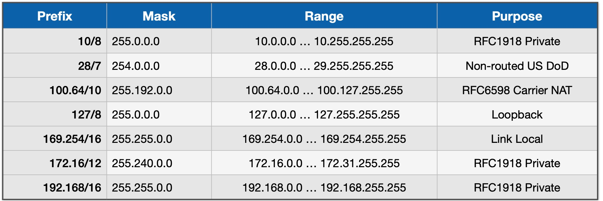

# ZeroTier vs WireGuard

ZeroTier and WireGuard are not mutually exclusive. You can run both if you wish. The purpose of this document is to try to offer some general guidance about the two solutions.

## Installation differences

Assume your goal is to give yourself access to your home network when you are on the road. This is something you can do with both WireGuard and ZeroTier.

### WireGuard

Providing you follow IOTstack's [WireGuard documentation](WireGuard.md) faithfully, WireGuard is a bit easier to get going than ZeroTier.

Although it helps to have some feeling for TCP/IP fundamentals, you definitely don't need to be a comms guru.

Using WireGuard to access your home network when you are on the road involves:

1. A **routable** IP address on the WAN side of your home router.

	> The IP address on the WAN side of your home router is allocated by your ISP. It can be fixed or dynamic. If you have not explicitly signed up for a fixed IP address service then your address is probably dynamic and can change each time you reboot your router, or if your ISP "bounces" your connection.

2. If your WAN IP address is dynamic then you need a mechanism for making it discoverable using a Dynamic Domain Name System (DDNS) service such as DuckDNS or NoIP.com.

	> That's a separate registration and setup process.

3. A WireGuard server running in a Docker container on your Raspberry Pi. Ideally, you give some thought to the clients you will need so that the QR codes can be generated the first time you bring up the container.

4. A WireGuard client running in each remote device. Each client needs to be configured with a QR code or configuration file created in the previous step.

5. A port-forwarding rule in your home router so that traffic originated by remote WireGuard clients can be relayed to the WireGuard server running on your Raspberry Pi.

### ZeroTier

Implementing ZeroTier is not actually any more difficult to get going than WireGuard. ZeroTier's apparent complexity arises from the way it inherently supports many network topologies. Getting it set up to meet your requirements takes planning. 

You still don't need to be a comms guru but it will help if you've had some experience making TCP/IP do what you want.

Using ZeroTier to access your home network when you are on the road involves:

1. Registering for a ZeroTier account (free and paid levels).

2. Either (or both) of the following:

	- A ZeroTier client running on every device at your home to which you need remote access;
	- A ZeroTier-router client running in a Docker container on a Raspberry Pi at your home. This is analogous to the WireGuard server.

3. A ZeroTier client running in each remote device.

4. Every ZeroTier client (home and remote) needs to be provided with your ZeroTier network identifier. You also need to authorise each client to join your ZeroTier network. Together, these are the equivalent of WireGuard's QR code. 

5. Depending on what you want to achieve, you may need to configure one or more static routes in the ZeroTier Cloud and in your home router.

The things you **don't** need to worry about include:

* Whether the IP address on the WAN side of your home router is routable;
* Any port-forwarding rules in your home router; or
* Setting up a Dynamic Domain Name System (DDNS) service.

## CGNAT – WireGuard's nemesis

Now that you have some appreciation for the comparative level of difficulty in setting up each service, let's focus on WireGuard's key problem.

WireGuard depends on the IP address on the WAN side of your home router being *routable*. What that means is that the IP address has to be known to the routing tables of the core routers that drive the Internet.

You will probably have seen quite a few of the addresses in the following table:

| Table 1: Reserved IP Address Ranges |
|:--:|
|  |

Nothing in that list is routable. That list is also far from complete (see [wikipedia](https://en.wikipedia.org/wiki/Reserved_IP_addresses)). The average IOTstack user has probably encountered at least:

* 172.16/12 - commonly used by Docker to allocate its internal networks.
* 192.168/16 - used by a lot of consumer equipment such as home routers.

| Figure 1: Router WAN port using CGNAT range |
|:--:|
|  |

Consider Figure 1. On the left is a cloud representing your home network where you probably use a subnet in the 192.168/16 range. The 192.168/16 range is not routable so, to exchange packets with the Internet, your home router needs to perform Network Address Translation (NAT).

Assume a computer on your home network has the IP address 192.168.1.100 and wants to communicate with a service on the Internet. What the NAT service running in your home router does is:

* in the *outbound* direction, packets leaving your LAN will have a source IP address of 192.168.1.100. NAT replaces the source IP address with the IP address of the WAN side of your home router. Let's say that's 200.1.2.3.
* the system at the other end thinks the packets are coming from 200.1.2.3 so that's what it uses when it sends back reply packets.
* in the *inbound* direction, packets arrive with a destination IP address of 200.1.2.3. NAT replaces the destination address 200.1.2.3 with 192.168.1.100 and sends the packet to the device on your home network that originated the traffic.

The NAT service running in your router builds tables that keep track of everything needed to make this work but, and this is a critical point, NAT can only build those tables when devices on your home LAN **originate** the traffic. If a packet addressed to your WAN IP arrives unexpectedly and NAT can't figure out what to do from its tables, the packet gets dropped.

A remote WireGuard client trying to originate a connection with the WireGuard server running in your IOTstack is an example of an "unexpected packet". The reason it doesn't get dropped is because of the port-forwarding rule you set up in your router. That rule essentially fools NAT into believing that the WireGuard server originated the traffic.

If the IP address your ISP assigns to your router's WAN interface is *routable* then your traffic will follow the green line in [Figure 1](#figure1). It will transit your ISP's network, be forwarded to the Internet, and reply packets will come back the same way.

However, if the WAN IP address is not routable then your traffic will follow the red line in [Figure 1](#figure1). What happens next is another round of Network Address translation. Using the same address examples above:

* Your router "A" replaces 192.168.1.100 with the IP address of the WAN side of your home router but, this time, that's a non-routable address like 100.64.44.55; and then
* Your ISP's router "B" replaces 100.64.44.55 with 200.1.2.3.

The system at the other end sees 200.1.2.3 as the source address so that's what it uses in reply packets.

Both NAT engines "A" and "B" are building tables to make this work but, again, it is all in response to **outbound** traffic. If your remote WireGuard client tries to originate a connection with your WireGuard server by addressing the packet to "B", it's unexpected and gets dropped.

Unlike the situation with your home router where you can add a port-forwarding rule to fool NAT into believing your WireGuard server originated the traffic, you don't control your ISP's NAT router so it's a problem you can't fix.

Your remote WireGuard client can't bypass your ISP's NAT router by addressing the packet to "A" because that address is not routable, so nothing on the Internet has any idea of where to send it, so the packet gets dropped.

Due to the shortage of IPv4 addresses, it is increasingly common for ISPs to apply their own NAT service after yours. Generally, ISPs use the 100.64/10 range so, if you connect to your home router's user interface and see something like the IP address circled in [Figure 2](#figure2), you can be sure that you are the victim of "[CGNAT](https://datatracker.ietf.org/doc/html/rfc6598)".

| Figure 2: Router WAN port using CGNAT range |
|:--:|
|  |

While seeing a router WAN address that is not routable proves that your ISP is performing an additional Network Address Translation step, seeing an IP address that *should* be routable does not necessarily prove the opposite. The only way to be certain is to compare the IP address your router shows for its WAN interface with the IP address you see in a service like [whatsmyip.com](https://whatsmyip.com). If they are not the same, your ISP is likely applying its own NAT service.

If WireGuard won't work and you suspect your ISP is applying its own NAT service, you have the following options:

1. Negotiate with your ISP to be allocated a fixed IP address in a routable range. You may be asked to pay ongoing fees for this.
2. Change your ISP for one that still allocates routable IP addresses. But this may merely postpone the inevitable. To conserve dwindling IPv4 addresses, many ISPs are implementing Carrier Grade Network Address Translation ([CGNAT](https://datatracker.ietf.org/doc/html/rfc6598)).
3. If your ISP offers it, implement IPv6 on your home network. This is a non-trivial task and well beyond the scope of IOTstack's documentation.
4. Use a Virtual Private Server (VPS) to work around the problem. Explaining this is also well beyond the scope of IOTstack. Google "wireguard cgnat", grab a cup of coffee, and settle down for an afternoon's reading. 
5. Switch to ZeroTier. You can think of it as being "like WireGuard with its own VPS".

## Site-to-site tunnelling

You can use both WireGuard and ZeroTier to set up secure site-to-site routing such as between your home and the homes of your friends and relatives.

If you want to use WireGuard:

1. Make sure that all sites running WireGuard obey the CGNAT constraints mentioned above.
2. Conduct your own research into how to set it up because the IOTstack documentation for WireGuard does not cover the topic.

If you want to use ZeroTier:

1. ZeroTier is immune to CGNAT constraints.
2. The IOTstack documentation for ZeroTier explains the how-to.
