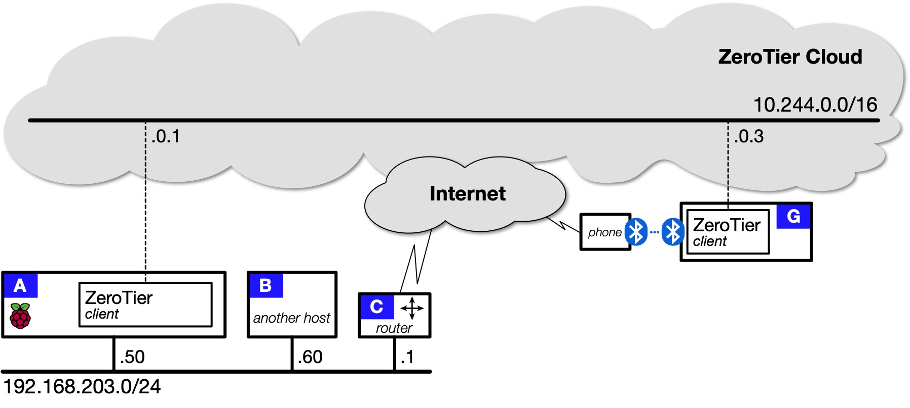
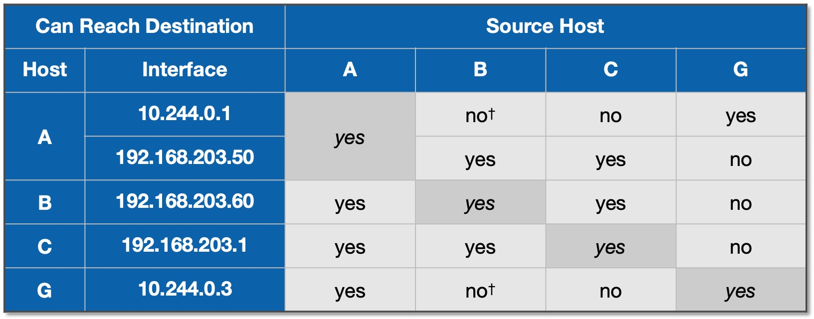
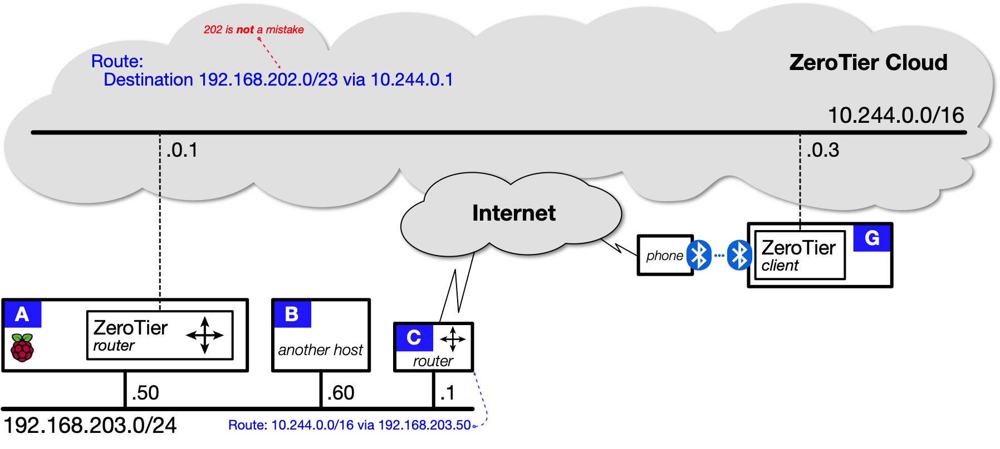
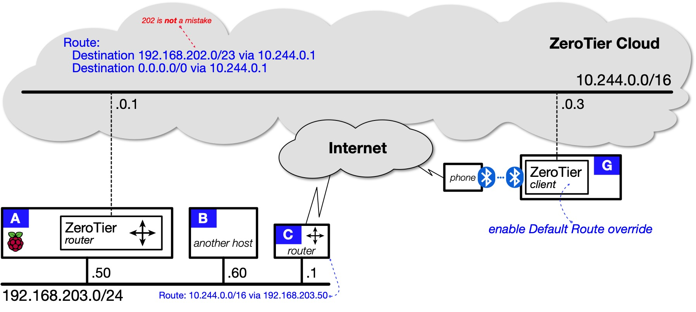
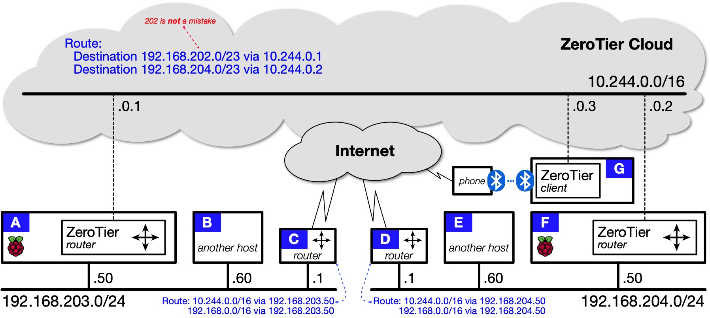
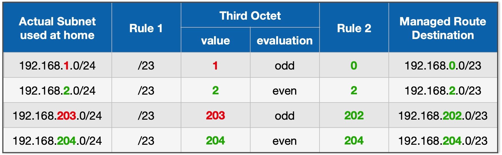
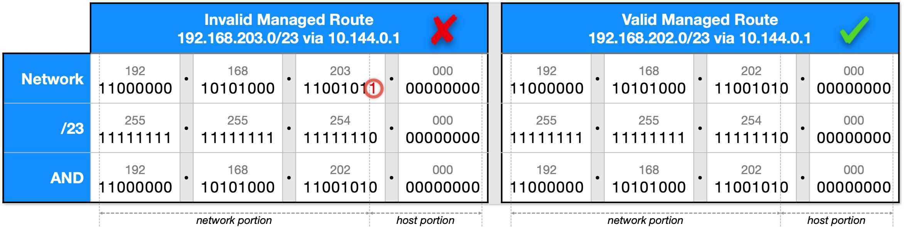

# ZeroTier

ZeroTier is a Virtual Private Network (VPN) solution that creates secure data-communications paths between devices at different locations. You can use ZeroTier to:

* give remote devices secure access to your home network's local services;
* provide secure network-to-network communications between your home network and the home networks of your friends and relations; and
* bypass carrier-grade network address translation (CGNAT) which can befuddle WireGuard.

## ZeroTier Docker images { #zeroTierImages }

This documentation covers two DockerHub images and two IOTstack templates:

* `zyclonite:zerotier`

	This image implements a standard ZeroTier client. It is what you get if you choose "ZeroTier-client" from the IOTstack menu. Its function is identical to the clients you install on Android, iOS, macOS and Windows.

* `zyclonite:zerotier-router`

	This is an enhanced version of the ZeroTier client. It is what you get if you choose "ZeroTier-router" from the IOTstack menu. In addition to connecting your Raspberry Pi to your ZeroTier network, it can also forward packets between remote clients and devices attached to your home LAN. It is reasonably close to WireGuard in its general behaviour.

## References { #references }

* ZeroTier:

	- [Home Page (sign-up)](https://www.zerotier.com)
	- [ZeroTier Central (management)](https://my.zerotier.com)
	- [Documentation](https://docs.zerotier.com)
	- [Knowledge Base - Networking](https://zerotier.atlassian.net/wiki/spaces/SD/pages/7110657/Networking)
	- [GitHub (ZeroTier source code)](https://github.com/zerotier/ZeroTierOne)

* zyclonite/zerotier:

	- [GitHub (image source code)](https://github.com/zyclonite/zerotier-docker)
	- [DockerHub (image repository)](https://hub.docker.com/r/zyclonite/zerotier)

* [IOTstack discussion paper : ZeroTier vs WireGuard](ZeroTier-vs-WireGuard.md)

## Definition { #definitions }

* *Catenet* (a con**cate**nation of **net**works) means the collection of networks and clients that can reach each other either across a local network or via a path through a ZeroTier Cloud.

## Getting started with ZeroTier { #gettingStarted }

### Create an account { #createAccount }

ZeroTier offers both free and paid accounts. A free account offers enough for the average home user.

Go to the [Zerotier downloads](https://www.zerotier.com/download/) page. If you wait a little while, a popup window will appear with a "Start here" link which triggers a wizard to guide you through the registration and setup process. At the end, you will have an account plus an initial ZeroTier Network ID.

> Tip: Make a note of your ZeroTier network ID - you will need it!

You should take the time to work through the configuration page for your newly-created ZeroTier network. At the very least:

1. Give your ZeroTier network a name. At this point you only have a single network but you may decide to create more. Meaningful names are always easier on the brain than 16-hex-digit numbers.
2. Scroll down until you see the "IPv4 Auto-Assign" area. By default, ZeroTier will have done the following:

	- Enabled "Auto-Assign from Range";
	- Selected the "Easy" button; and
	- Randomly-selected one of the [RFC1918](https://www.rfc-editor.org/rfc/rfc1918.html) private ranges below the line.

	If the range selected by ZeroTier does not begin with "10.x", consider changing the selection to something in that range. This documentation uses `10.244.*.*` throughout and it may be easier to follow if you do something similar. 

	> Tip: avoid `10.13.*.*` if you are also running WireGuard. 

	The logic behind this recommendation is that you can use 10.x.x.x for ZeroTier and 192.168.x.x for your home networks, leaving 172.x.x.x for Docker. That should make it easier to understand what is going on when you examine routing tables.

	Nevertheless, nothing about ZeroTier *depends* on you using a 10.x network. If you have good reasons for selecting from a different range, do so. It's *your* network! 

### Install client on "remote" { #singleRemote }

You should install ZeroTier client software on at least one mobile device (laptop, iDevice) that is going to connect remotely. You don't need to go to a remote location or fake "remoteness" by connecting through a cellular system. You can do all this while the device is connected to your home network.

Connecting a client to your ZeroTier network is a three-step process:

1. Install the client software on the device. The [Zerotier downloads](https://www.zerotier.com/download/) page has clients for every occasion: Android, iOS, macOS, Unix and Windows.

2. Launch the client and enter your ZeroTier Network ID:

	- on macOS, launching the app adds a menu to the right hand side of your menu bar. From that menu, choose "Join New Network…", enter your network ID into the dialog box and click "Join".

	- on iOS, launching the app for the first time presents you with a privacy policy which you need to accept, followed by a mostly-blank screen:

		- Tap <kbd>+</kbd>, accept the privacy policy (again) and enter your network ID into the field.
		- Leave the other settings alone and tap "Add Network". Acknowledge any security prompt (what you see depends on your version of iOS).
		- Turn on the slider button.

	- Android and Windows – follow your nose.

3. In a web browser:

	- connect to ZeroTier Central: [https://my.zerotier.com](https://my.zerotier.com)
	- login to your account
	- click on your network ID
	- scroll down to the "Members" area
	- find the newly-added client
	- authorise the client by turning on its "Auth?" checkbox
	- fill in the "Name" and, optionally, the "Description" fields so that you can keep track of the device associated with the client ID. Again, names are easier on the brain than numbers.  

Each time you authorise a client, ZeroTier assigns an IP address from the range you selected in the "IPv4 Auto-Assign" area. Most of the time this is exactly what you want but, occasionally, you may want to override ZeroTier's choice. The simplest approach is:

- Type a new IP address into the text field to the right of the <kbd>+</kbd>&nbsp;;

	> your choice needs to be from the range you selected in the "IPv4 Auto-Assign" area

- Click the <kbd>+</kbd> to accept the address; then
- Delete the unwanted address by clicking the trash-can icon to its left.

ZeroTier IP addresses are like fixed assignments from a DHCP server. They persist. The same client will always get the same IP address each time it connects. 

Key point:

* Clients can't join your ZeroTier network without your approval. If a new client appears in the list which you don't recognise, click the trash-can icon at the far right of its row. That denies the client access - permanently. The client needs to be reset before it can make another attempt.

### Other devices { #otherRemotes }

Do **not** install ZeroTier on your Raspberry Pi by following the Linux instructions on the [Zerotier downloads](https://www.zerotier.com/download/) page. Those instructions lead to a "native" installation. We are about to do all that with a Docker container.

You *can* install ZeroTier clients on other systems but you should hold off on doing that for now because, ultimately, it may not be needed. Whether you need ZeroTier client software on any device will depend on the decisions you make as you follow these instructions.

## Topology 1: ZeroTier client-only { #topology1 }

To help you choose between the ZeroTier-client and ZeroTier-router containers, it is useful to study a network topology that does not include routing.
 
| Topology 1: Remote client accesses client on home network |
|:--:|
|  |

Four devices are shown:

* <mark>A</mark> is a Raspberry Pi running "ZeroTier-client" installed by IOTstack.
* <mark>B</mark> is some other device (another Pi, Linux box, Mac, PC).

	> The key thing to note is that <mark>B</mark> is **not** running ZeroTier client software.

* <mark>C</mark> is your local router, likely an off-the-shelf device running a custom OS.

	>Again, assume <mark>C</mark> is **not** running ZeroTier client software.

* <mark>G</mark> is the [remote client](#singleRemote) you set up above.

Table&nbsp;1 summarises what you can and can't do from the remote client <mark>G</mark>:

| <a name="table1"></a>Table 1: Reachability using only ZeroTier clients |
|:--:|
|  |

<mark>G</mark> can't reach <mark>B</mark> or <mark>C</mark>, *directly,* because those devices are not running ZeroTier client software.

<mark>G</mark> *can* reach <mark>B</mark> and <mark>C</mark>, *indirectly,* by first connecting to <mark>A</mark>. An example would be <mark>G</mark> opening an SSH session on <mark>A</mark> then, within that session, opening another SSH session on <mark>B</mark> or <mark>C</mark>.

It should be apparent that you can also solve this problem by installing ZeroTier client software on <mark>B</mark>. It would then have its own interface in the 10.244.0.0/16 network that forms the ZeroTier Cloud and be reachable directly from <mark>G</mark>. The *no<sup>†</sup>* entries would then become *yes*, with the caveat that <mark>G</mark> would reach <mark>B</mark> via its interface in the 10.244.0.0/16 network.

The same would be true for your router <mark>C</mark>, providing it was capable of running ZeroTier client software.

Lessons to learn:

1. All hosts running a ZeroTier client and sharing a common ZeroTier Network ID can reach each other.
2. You can springboard from a host that is reachable to a host that is otherwise unreachable, but your ability to do that in any given situation may depend on the protocol you are trying to use.

ZeroTier clients are incredibly easy to set up. It's always:

1. Install the client software.
2. Tell the client the network ID.
3. Authorise the device.

After that, it's full peer-to-peer interworking.
 
The *problem* with this approach is that it does not scale if you are only signed up for a free ZeroTier account. Free accounts are limited to 25 clients. After that you need a paid account.

### Installing ZeroTier-client { #topology1install }

Now that you understand what the ZeroTier-client will and won't do, if you want to install the ZeroTier client on your Raspberry Pi via IOTstack, proceed like this:

1. Run the IOTstack menu and choose "Zerotier-client".
2. Bring up the container:

	``` console
	$ cd ~/IOTstack
	$ docker-compose up -d zerotier-client
	```

3. Tell the container to join your ZeroTier network by replacing «NetworkID» with your ZeroTier Network ID:

	``` console
	$ docker exec zerotier zerotier-cli join «NetworkID» 
	```

	You only need to do this **once**. The information is kept in the container's persistent storage area. Thereafter, the client will rejoin the same network each time the container comes up.

4. Go to [ZeroTier Central](https://my.zerotier.com) and authorise the device.

Job done! There are no environment variables to set. It just works.

## Topology 2: ZeroTier router { #topology2 }

This topology is a good starting point for using ZeroTier to replicate a WireGuard service running on your Raspberry Pi. Remember, you don't have to make an either/or choice between ZeroTier and WireGuard. You *can* run both containers side-by-side.

| Topology 2: Remote client accesses home network |
|:--:|
|  |

With this structure in place, all hosts in [Topology&nbsp;2](#topology2) can reach each other *directly.* All the cells in [Table&nbsp;1](#table1) are *yes.* Full peer-to-peer networking!

### Installing ZeroTier-router { #topology2install }

The ZeroTier-router container is just the ZeroTier-client container with some `iptables` rules. However, you can't run both containers at the same time. If ZeroTier-client is installed:

1. Terminate the container if it is running:

	``` console
	$ cd ~/IOTstack
	$ docker-compose down zerotier-client
	```
	
	> See also [if downing a container doesn't work](../Basic_setup/index.md/#downContainer)

2. Remove the existing service definition, either by:

	- running the menu and de-selecting "ZeroTier-client"; or
	- editing your `docker-compose.yml` to remove the service definition.

The ZeroTier-router *can* re-use the ZeroTier-client configuration (and vice-versa) so you should **not** erase the persistent storage area at:

```
~/IOTstack/volumes/zerotier-one/
```

Keeping the configuration also means you won't need to authorise the ZeroTier-router client when it first launches.

To install Zerotier-router:

1. Run the IOTstack menu and choose "Zerotier-router".

2. Use a text editor to open your `docker-compose.yml`. Find the ZeroTier service definition and the environment variables it contains: 

	``` yaml linenums="5"
	  environment:
	  - TZ=${TZ:-Etc/UTC}
	  - PUID=1000
	  - PGID=1000
	# - ZEROTIER_ONE_NETWORK_IDS=yourNetworkID
	  - ZEROTIER_ONE_LOCAL_PHYS=eth0 wlan0
	  - ZEROTIER_ONE_USE_IPTABLES_NFT=true
	  - ZEROTIER_ONE_GATEWAY_MODE=both
	```

	You should:

	1. Set your timezone.
	2. Uncomment line 9 and replace "yourNetworkID" with your ZeroTier Network ID. This variable only has an effect the first time ZeroTier is launched. It is an alternative to executing the following command after the container has come up the first time:

		``` console
		$ docker exec zerotier zerotier-cli join «NetworkID»
		```

		The reason for the plural variable name ("IDS") is because it supports joining multiple networks on first launch. Network IDs are space-separated, like this:
	
		``` yaml linenums="9"
		- ZEROTIER_ONE_NETWORK_IDS=3926d64e8ff148b3 ef7a364a687c45e0
		```

	3. If necessary, change line 10 to represent your active local interfaces. Examples:

		- if your Raspberry Pi only connects to WiFi, you would use:

			``` yaml linenums="10"
			- ZEROTIER_ONE_LOCAL_PHYS=wlan0
			```

		- if both Ethernet and WiFi are active, use:

			``` yaml linenums="10"
			- ZEROTIER_ONE_LOCAL_PHYS=eth0 wlan0
			```

3. Launch the container:

	``` console
	$ cd ~/IOTstack
	$ docker-compose up -d zerotier-router
	```

4. If the Raspberry Pi running the service has not previously been authorised in [ZeroTier Central](https://my.zerotier.com), authorise it. Make a note of the IP address assigned to the device in ZeroTier Central. In [Topology&nbsp;2](#topology2) it is 10.244.0.1.

5. You also need to set up some static routes:

	* In ZeroTier Central …

		Please start by reading [Managed Routes](#managedRoutes).

		Once you understand how to construct a valid less-specific route, go to [ZeroTier Central](https://my.zerotier.com) and find the "Managed Routes" area. Under "Add Routes" are text-entry fields. Enter the values into the fields:

		```
		Destination: 192.168.202.0/23 (via) 10.244.0.1
		```

		Click <kbd>Submit</kbd>.

		With reference to [Topology 2](#topology2):
		
		- 192.168.202.0/23 is the less-specific route to the home network; and
		- 10.244.0.1 is the IP address of <mark>A</mark> in the ZeroTier Cloud.

		This route teaches ZeroTier clients that the 10.244.0.0/16 network offers a path to the less-specific range (192.168.202.0/23) encompassing the home subnet (192.168.203.0/24).

		Remote clients can then reach devices on your home network. When a packet arrives on <mark>A</mark>, it is passed through NAT so devices on your home network "think" the packet has come from <mark>A</mark>. That means they can reply. However, this only works for connections that are initiated by remote clients like <mark>G</mark>. Devices on your home network like <mark>B</mark> and <mark>C</mark> can't initiate connections with remote clients because they don't know where to send the traffic. That's the purpose of the next static route.

	* In your home router <mark>C</mark> …

		Add a static route to the ZeroTier Cloud pointing to the IP address of your Raspberry Pi on your home network. In [Topology 2](#topology2), this is:

		```
		10.244.0.0/16 via 192.168.203.50
		```

		> You need to figure out how to add this route in your router's user interface.

		Here's an example of what actually happens once this route is in place. Suppose <mark>B</mark> wants to communicate with <mark>G</mark>. <mark>B</mark> is not a ZeroTier client so it doesn't know that <mark>A</mark> offers a path to <mark>G</mark>. The IP stack running on <mark>B</mark> sends the packet to the default gateway <mark>C</mark> (your router). Because of the static route, <mark>C</mark> sends the packet to <mark>A</mark>. Once the packet arrives on <mark>A</mark>, it is forwarded via the ZeroTier Cloud to <mark>G</mark>.

		The process of a packet going into a router and coming back out on the same interface is sometimes referred to as "one-armed routing". It may seem inefficient but <mark>C</mark> also sends <mark>B</mark> what is called an "ICMP Redirect" message. This teaches <mark>B</mark> that it reach <mark>G</mark> via <mark>A</mark> so, in practice, not every <mark>B</mark>-to-<mark>G</mark> packet needs to transit <mark>C</mark>.

## Topology 3: Full tunnel { #topology3 }

The ZeroTier Cloud does not offer a path to the Internet. It is not a VPN solution which will allow you to pretend to be in another location. Every ZeroTier client still needs its own viable path to the Internet.

| Topology 3: Remote client tunnels to Internet via Home Network |
|:--:|
|  |

In terms of traffic flows, what this means in a practical sense is:

* Traffic from <mark>G</mark> to [<mark>A</mark>, <mark>B</mark> or <mark>C</mark>] (and vice versa) flows over the ZeroTier Cloud and is securely end-to-end encrypted in transit; but
* All other traffic goes straight to the ISP or cellular carrier and is not encrypted.

This is the routing table you would expect to see on <mark>G</mark>:

``` data linenums="1"
Destination     Gateway         Genmask         Flags   MSS Window  irtt Iface
0.0.0.0         172.20.10.1     0.0.0.0         UG        0 0          0 wlan0
10.244.0.0      0.0.0.0         255.255.0.0     U         0 0          0 ztr2qsmswx
172.20.10.0     0.0.0.0         255.255.255.240 U         0 0          0 wlan0
192.168.202.0   10.244.0.1      255.255.254.0   UG        0 0          0 ztr2qsmswx
```

Executing a `traceroute` to 8.8.8.8 (Google DNS) shows:

``` data
$ traceroute 8.8.8.8
traceroute to 8.8.8.8 (8.8.8.8), 30 hops max, 60 byte packets
 1  172.20.10.1 (172.20.10.1)  4.706 ms  4.572 ms  4.398 ms
 2  10.111.9.189 (10.111.9.189)  49.599 ms  49.807 ms  49.626 ms
…
11  dns.google (8.8.8.8)  32.710 ms  32.047 ms
```

You can see that the first hop is via 172.20.10.1. This means the traffic is not flowing over the ZeroTier Cloud (10.244.0.0/16). The traffic is reaching 8.8.8.8 via the default route through the phone's connection to the carrier's network (172.20.10.0/28).

ZeroTier supports an option for forcing all of a client's traffic to pass over the ZeroTier Cloud. The client's traffic is then end-to-end encrypted, at least until it reaches your home. Traffic destined for the Internet will then pass back out through your home router. From the perspective of the Internet, your remote client will appear to be at your home.

Enabling this feature is a two-step process:

1. In ZeroTier Central, find the "Managed Routes" area and add:

	```
	Destination: 0.0.0.0/0 (via) 10.240.0.1
	```

	This is setting up a "default route". 10.240.0.1 is the IP address of <mark>A</mark> in the ZeroTier network.

2. Each remote client (and **only** remote clients) needs to be instructed to accept the default route from the ZeroTier Cloud:

	- iOS clients:

		1. Launch the ZeroTier One app.
		2. If the connection is not already enabled, turn it on and wait for it to start.
		3. Tap on the network ID (brings up a details sheet).
		4. Turn on "Enable Default Route".
		5. Tap outside the details sheet to dismiss it.
		6. Turn the connection off.
		7. Turn the connection on again.

	- Linux clients: execute the command:

		``` console
		$ docker exec zerotier zerotier-cli set «yourNetworkID» allowDefault=1
		```

		See [change option](#cliOptionSet) for an explanation of the output and how to turn the option off.

	- macOS clients: open the ZeroTier menu, then the sub-menu for the Network ID, then enable "Allow Default Router [sic] Override".
	- Android and Windows clients: follow your nose.

Once `allowDefault` is enabled on a client, the routing table changes:

``` data linenums="1"
Destination     Gateway         Genmask         Flags   MSS Window  irtt Iface
0.0.0.0         10.244.0.1      128.0.0.0       UG        0 0          0 ztr2qsmswx
0.0.0.0         172.20.10.1     0.0.0.0         UG        0 0          0 wlan0
10.244.0.0      0.0.0.0         255.255.0.0     U         0 0          0 ztr2qsmswx
128.0.0.0       10.244.0.1      128.0.0.0       UG        0 0          0 ztr2qsmswx
172.20.10.0     0.0.0.0         255.255.255.240 U         0 0          0 wlan0
192.168.202.0   10.244.0.1      255.255.254.0   UG        0 0          0 ztr2qsmswx
```

Close inspection will show you that **two** entries have been added to the routing table:

Line | Route       | Destination | Mask      | Address Range
:---:|------------:|:-----------:|:---------:|:------------------------:
2    | 0.0.0.0/1   | 10.244.0.1  | 128.0.0.0 | 0.0.0.0…127.255.255.255
5    | 128.0.0.0/1 | 10.244.0.1  | 128.0.0.0 | 128.0.0.0…255.255.255.255

Taken together, these have the same effect as a standard default route (0.0.0.0/0) but, because they are more-specific than the standard default route being offered by the cellular network, the path via ZeroTier Cloud will be preferred.

You can test this with a `traceroute`:

``` data
$ traceroute 8.8.8.8
traceroute to 8.8.8.8 (8.8.8.8), 30 hops max, 60 byte packets
 1  10.244.0.1 (10.244.0.1)  98.239 ms  98.121 ms  98.042 ms
 2  192.168.203.1 (192.168.203.1)  98.038 ms  97.943 ms  97.603 ms
…
 7  dns.google (8.8.8.8)  104.748 ms  106.669 ms  106.356 ms
```

This time, the first hop is via the ZeroTier Cloud to <mark>A</mark> (10.244.0.1), then out through the local router <mark>C</mark> (192.168.203.1).

## Topology 4: Multi-site routing { #topology4 }

| Topology 4: Site-to-Site with ZeroTier-router |
|:--:|
|  |

In this topology, everything can reach everything within your catenet. The installation process for <mark>F</mark> is the same as it was for <mark>A</mark>. See [Installing ZeroTier-router](#topology2install).

In ZeroTier Central you need one "less-specific" [Managed Route](#managedRoutes) pointing to each site where there is a ZeroTier router.

At each site, the local router needs two static routes, both via the IP address of the local host running the ZeroTier-router container:

1. A static route pointing to the ZeroTier Cloud (10.244.0.0/16); plus
2. A static route covering all of 192.168.0.0/16.

If the second route does not make sense, think of it like this:

* A packet destined for the local network (at any site) will match the more-specific routing table entry for that local network and be sent direct to the destination host.
* Otherwise, the packet will be sent to the local router (default gateway).
* On the router (<mark>C</mark> or <mark>D</mark>), the packet will match the less-specific static route for 192.168.0.0/16 and be forwarded to the local host running the ZeroTier-router container (one-armed routing).
* Courtesy of the Managed Routes set in ZeroTier Central, the local host running the ZeroTier-router container (<mark>A</mark> or <mark>F</mark>) will either have a more-specific route through the ZeroTier Cloud to the destination network, or it won't.
* If it has a more-specific route, the packet will be forwarded across the ZeroTier Cloud.
* Otherwise the packet will be dropped and the originator will receive an "ICMP destination network unreachable" message.

In essence, both these static routes are "set and forget". They assume catenet growth is a *possibility,* and that it is preferable to set up schemes that will be robust and not need constant tweaking.

### tunnelling remote clients { #topo4tunnel }

The diagram above for Topology 4 does not include a default route in ZeroTier Central. If you implement Topology 4 according to the diagram:

* traffic between <mark>G</mark> and your sites will travel via the ZeroTier Cloud (tunnelled, encrypted); but
* traffic between <mark>G</mark> and the wider Internet will not be tunnelled, will not be encrypted by ZeroTier, and will reach the Internet via the ISP or cellular carrier.

If you want remote clients like <mark>G</mark> to use full tunnelling, you can follow the same approach as for [Topology 3](#topology3). You simply need to decide which site should used by <mark>G</mark> to reach the Internet. Having made your decision, define an appropriate default route in ZeroTier Central. For example, if <mark>G</mark> should reach the Internet via:

- the left-hand site, the default route should point to the ZeroTier-router running on <mark>A</mark>:

	```
	Destination: 0.0.0.0/0 (via) 10.240.0.1
	```

- the right-hand site, the default route should point to the ZeroTier-router running on <mark>F</mark>:

	```
	Destination: 0.0.0.0/0 (via) 10.240.0.2
	```

Once you implement the default route, everything else is the same as for [Topology 3](#topology3).

## Managed Routes { #managedRoutes }

### TL;DR { #managedRoutesTLDR}

If your home network is a single subnet with a /24 prefix (a subnet mask of 255.255.255.0), you need to follow two rules when constructing the "destination" field of a Managed Route in ZeroTier Central:

1. use a /23 prefix.
2. if the third octet of your home network range is an odd number, subtract 1 to make it an even number.

Examples:

| <a name="table2"></a>Table 2: Constructing Managed Routes for Subnets - examples |
|:--:|
|  |

If your home network has multiple subnets and/or you do not use /24 prefixes then you should either read through the next section or consult one of the many IP address calculators that are available on the Internet. One example:

* [www.calculator.net](https://www.calculator.net/ip-subnet-calculator.html)

### The details { #managedRoutesDetails}

This is a slightly contrived example but it will help you to understand why you need Managed Routes and how to construct them correctly in ZeroTier Central.

Assume we are talking about [Topology&nbsp;1](#topology1) and that this is the routing table for host <mark>A</mark>:

``` data linenums="1"
Destination     Gateway         Genmask         Flags   MSS Window  irtt Iface
0.0.0.0         192.168.203.1   0.0.0.0         UG        0 0          0 eth0
192.168.203.0   0.0.0.0         255.255.255.0   U         0 0          0 eth0
```

Suppose <mark>A</mark> wants to send a packet to <mark>B</mark>. The IP stack starts searching the routing table. For each row:

1. The destination IP address for <mark>B</mark> (192.168.203.60) is ANDed with the subnet mask (255.255.255.0). Given the last row in the routing table above:

	```
	candidate = destinationIP AND Genmask
	          = 192.168.203.60 AND 255.255.255.0
	          = 192.168.203.0
	```

2. The candidate (192.168.203.0) is compared with the value in the Destination column (192.168.203.0). If the two values are the same, the route is considered to be a match:

	```
	match = compareEqual(candidate,Destination)
	      = compareEqual(192.168.203.0, 192.168.203.0)
	      = true
	```

3. The result is a match so the packet is handed to Layer 2 for transmission via the `eth0` interface.

Now suppose <mark>A</mark> wants to send a packet to 8.8.8.8 (Google DNS). The last row of the routing table will evaluate as follows:

```
candidate = destinationIP AND Genmask
          = 8.8.8.8 AND 255.255.255.0
          = 8.8.8.0
    match = compareEqual(candidate,Destination)
          = compareEqual(8.8.8.0, 192.168.203.0)
          = false
```

The result is no-match so the routing algorithm continues to search the table. Eventually it will arrive at the 0.0.0.0 entry which is known as the "default route":

```
candidate = destinationIP AND Genmask
          = 8.8.8.8 AND 0.0.0.0
          = 0.0.0.0
    match = compareEqual(candidate,Destination)
          = compareEqual(0.0.0.0, 0.0.0.0)
          = true
```

The result of comparing anything with the default route is always a match. Because the "Gateway" column is non-zero, the IP address of 192.168.203.1 (<mark>C</mark>) is used as the "next hop". The IP stack searches the routing table again. This new search for 192.168.203.1 will match on the bottom row so the packet will be handed to Layer 2 for transmission out of the `eth0` interface aimed at <mark>C</mark> (the local router, otherwise known as the "default gateway"). In turn, the local router forwards the packet to the ISP and, eventually, it winds up at 8.8.8.8.

Let's bring ZeroTier into the mix.

The local subnet shown in [Topology&nbsp;1](#topology1) is 192.168.203.0/24 so it seems to make sense to use that same subnet in a Managed Route. Assume you configured that in ZeroTier Central:

```
192.168.203.0/24 via 10.144.0.1
```

When the ZeroTier client on (<mark>A</mark>) adds that route to its routing table, you get something like this:

``` data linenums="1"
Destination     Gateway         Genmask         Flags   MSS Window  irtt Iface
0.0.0.0         192.168.203.1   0.0.0.0         UG        0 0          0 eth0
10.244.0.0      0.0.0.0         255.255.0.0     U         0 0          0 ztr2qsmswx
192.168.203.0   10.244.0.1      255.255.255.0   UG        0 0          0 ztr2qsmswx
192.168.203.0   0.0.0.0         255.255.255.0   U         0 0          0 eth0
```

> To all network gurus following along: please remember this is a *contrived* example.

Study the last two lines. You should be able to see that both lines will match when the IP stack searches this table whenever <mark>A</mark> needs to send a packet to <mark>B</mark>. This results in a tie.

What normally happens is a tie-breaker algorithm kicks in. Schemes of route metrics, route weights, hop counts, round-trip times or interface priorities are used to pick a winner. Unfortunately, those schemes are all "implementation defined". Although the algorithms *usually* converge on a good answer, sometimes Murphy's Law kicks in. Routing problems are notoriously difficult to diagnose and can manifest in a variety of ways, ranging from sub-optimal routing, where the only symptom may be sluggishness, to forwarding loops, which can render your network mostly useless.

Prevention is always better than cure so it is preferable to side-step the entire problem by taking advantage of the fact that IP routing will always match on a *more-specific* route before a *less-specific* route, and employ slightly less-specific Managed Routes in ZeroTier Central.

What do *"more-"* and *"less-"* mean when we're talking about searching a routing table? The terms refer to the length of the network prefix. In "/X" notation, a larger value of X is *more-specific* than a smaller value of X:

* a "/25" is *more* specific then a "/24"
* a "/23" is *less* specific than a "/24"

To ensure that the IP stack will always make the correct decision, the Managed Route you configure in ZeroTier Central should always be slightly *less-specific* than the actual subnet it covers. Given 192.168.203.0/24, your first attempt at constructing a less-specific route might be:

```
192.168.203.0/23 via 10.144.0.1
```

Sadly, that won't work. Why? Because the 192.168.203.0/23 **subnet** does not actually exist. That may surprise you but it's true. It has to do with the requirement that subnet masks use **contiguous** one-bits. It's easier to understand if you study the binary:

| <a name="table3"></a>Table 3: Invalid vs Valid Managed Route |
|:--:|
|  |

The left hand side of [Table&nbsp;3](#table3) shows a network prefix of 192.168.203.0/23 along with what that /23 expands to as a subnet mask of 255.255.254.0. The last row is the result of ANDing the first two rows. Notice the right-most 1-bit in the third octet (circled). That bit hasn't made it to the last row and that's a problem.

What's going on here is that the right-most 1-bit in the third octet is not actually part of the *network* portion of the IP address; it's part of the *host* portion. For a network prefix to be valid, all the bits in the host portion must be zero. To put it another way, the IP address 192.168.203.0/23 is host .1.0 (ordinal 256) in subnet 192.168.202.0/23.

Read that last sentence again because "in subnet 192.168.202.0/23" is the clue.

The right hand side of [Table&nbsp;3](#table3) starts with network prefix 192.168.202.0/23 and ANDs it with its subnet mask. This time the host portion is all-zero. That means it's a valid subnet and, accordingly, can be the subject of a Managed Route. 

[Table&nbsp;3](#table3) tells us something else about a /23 prefix. It tells us that whatever value appears in that third octet, the right-most 1-bit must always be zero. That's another way of saying that a /23 subnet is only valid if the third octet is an even number.

At this point, you should understand the reason for the two rules in [TL;DR](#managedRoutesTLDR) above, and have a better idea of what you are doing if you need to use a subnet calculator.

## Network Design considerations { #designConsiderations }

If you intend to set up multiple sites and route between them using ZeroTier, you need to be aware of some of the consequences that flow from how you need to configure Managed Routes.

First, it should be obvious that you can't have two sites with the same network prefix. You and a friend can't both be using 192.168.1.0/24 at home.

The second is that the set of less-specific prefixes in Managed Routes can't overlap either. If you are using the 192.168.0.0/24 subnet at home while your friend is using 192.168.1.0/24 at her home, both of your less-specific Managed Routes will be the same: 192.168.0.0/23. If you set up two Managed Routes to 192.168.0.0/23 with different "via" addresses, all the routers will think there's a **single** site that can be reached by multiple routes. That's a recipe for a mess.

Putting both of the above together, any network plan for multiple sites should assume a gap of two between subnets. For example, if you are using the subnet 192.168.0.0/24 then your friend should be using 192.168.2.0/24. Your Managed Route will be 192.168.0.0/23, and your friend's Managed Route will be 192.168.2.0/23.

None of this stops either you or your friend from using both of the /24 subnets that aggregate naturally under your respective /23 prefixes. For example, the single Managed Route 192.168.0.0/23 naturally aggregates two subnets:

* 192.168.0.0/24 - eg your Ethernet
* 192.168.1.0/24 - eg your WiFi

<a name="subnetsThree"></a>Similarly, if you are using more than two subnets, such as:

* 192.168.0.0/24 - your house Ethernet
* 192.168.1.0/24 - your house WiFi
* 192.168.2.0/24 - your workshop WiFi

then you would slide your ZeroTier Managed Route prefix another bit to the left and use:

```
192.168.0.0/22 via 10.144.0.1
```

Notice what happens as you slide the prefix left. Things change in powers of 2:

* a /24 prefix Managed Route spans exactly **1** /24 subnet
* a /23 prefix Managed Route spans exactly **2** /24 subnets
* a /22 prefix Managed Route spans exactly **4** /24 subnets
* a /21 prefix Managed Route spans exactly **8** /24 subnets
* …
* a /17 prefix Managed Route spans exactly **128** /24 subnets

The direct consequence of that for Managed Routes is:

* a /23 prefix means values in the third octet must be wholly divisible by **2**
* a /22 prefix means values in the third octet must be wholly divisible by **4**
* a /21 prefix means values in the third octet must be wholly divisible by **8**
* …
* a /17 prefix means values in the third octet must be wholly divisible by **128**

Understanding how adjacent subnets can be aggregated easily by changing the prefix length should also bring with it the realisation that it is unwise to use a scattergun approach when allocating the third octet among your home subnets. Consider this scheme:

* 192.168.0.0/24 - your Ethernet
* 192.168.100.0/24 - your house WiFi
* 192.168.200.0/24 - your workshop WiFi

You would need three /23 Managed Routes in ZeroTier Central. In addition, you would prevent anyone else in your private ZeroTier catenet from using 192.168.1.0/24, 192.168.101.0/24 and 192.168.201.0/24. It would be preferable to use a single /22 as shown in the [example](#subnetsThree) above.

Sure, that third octet can range from 0..255 but it's still a finite resource which is best used wisely, particularly once you start to contemplate using ZeroTier to span multiple sites.

## Host mode and ports { #hostPorts }

The default service definition for ZeroTier-router contains the following lines:

``` yaml linenums="13"
  network_mode: host
  x-ports:
  - "9993:9993"
```

Line 13 tells ZeroTier to run in Docker's "host mode". This means the processes running inside the container bind to the Raspberry Pi's network ports.

> Processes running inside non-host-mode containers bind to the container's ports, and then use Network Address Translation (NAT) to reach the Raspberry Pi's ports.

The `x-` prefix on line 14 has the effect of commenting-out the entire clause. In other words, the single `x-` has exactly the same meaning as:

``` yaml linenums="14"
# ports:
# - "9993:9993"
```

The `x-ports` clause is included to document the fact that ZeroTier uses the Raspberry Pi's port 9993.

> Documenting the ports in use for host-mode containers helps IOTstack's maintainers avoid port conflicts when adding new containers.

You should **not** remove the `x-` prefix. If docker-compose complains about the `x-ports` clause, the message is actually telling you that your copy of docker-compose is obsolete and that you should upgrade.

## The Domain Name System { #dnsConsiderations }

### Normal DNS { #normalDNS }

If you have a DNS server running somewhere in your catenet, you can ask ZeroTier to propagate that information to your ZeroTier clients. It works the same way as a DHCP server can be configured to provide the IP addresses of DNS servers when handing out leases.

It is a two-step process:

1. In ZeroTier Central, find the "DNS" area, complete the (optional) "Search Domain" and (required) "Server Address" fields, then click <kbd>Submit</kbd>.

	Examples. In [Topology&nbsp;4](#topology4), suppose the DNS server (eg PiHole or BIND9) is host:

	- <mark>A</mark>, then "Server Address" = 10.244.0.1 (preferred) or 192.168.203.50 (less preferred);
	- <mark>B</mark>, then "Server Address" = 192.168.203.60 

2. Each client needs to be instructed to accept the DNS configuration:

	- iOS clients: always enabled.
	- Linux clients: execute the command:

		``` console
		$ docker exec zerotier zerotier-cli set «yourNetworkID» allowDNS=1
		```

		See [change option](#cliOptionSet) for an explanation of the output and how to turn the option off.

	- macOS clients: open the ZeroTier menu, then the sub-menu for the Network ID, then enable "Allow DNS Configuration".
	- Android and Windows clients: follow your nose.

Notes:

* Notice that clients need to opt-in to receiving DNS via ZeroTier. It is generally more appropriate for remote clients to do this than devices attached to a home network. This is probably why ZeroTier-managed DNS is "always on" for iOS clients. Android clients may be the same. For local clients, is usually better to let DHCP hand out DNS servers with the lease.
* There are reports of `allowDNS` being unreliable on Linux clients. If you have trouble on Linux, try disabling `allowDNS` and add the DNS server(s) to:

	```
	/etc/resolvconf.conf
	```

### Multicast DNS { #mDNS }

The ZeroTier Cloud relays multicast traffic. That means that multicast DNS (mDNS) names are propagated between ZeroTier clients and you can use those names in connection requests.

In terms of [Topology&nbsp;4](#topology4), <mark>A</mark>, <mark>F</mark> and <mark>G</mark> can all reach each other using mDNS names. For example:

``` console
pi@a:~$ ssh pi@f.local
```

However, even if <mark>B</mark> and <mark>C</mark> were advertising mDNS names over 192.168.203.0/24, they would be unreachable from <mark>D</mark>, <mark>E</mark>, <mark>F</mark> and <mark>G</mark> using those mDNS names because <mark>B</mark> and <mark>C</mark> are not ZeroTier clients. The same applies to reaching <mark>D</mark> and <mark>E</mark> from <mark>A</mark>, <mark>B</mark>, <mark>C</mark> or <mark>G</mark> using mDNS names.

## Resolving address-range conflicts { #addressConflicts }

As your network infrastructure becomes more complex, you may find that you occasionally run into address-range conflicts that force you to consider renumbering.

ZeroTier Central is where you define the subnet used by the ZeroTier Cloud (eg 10.244.0.0/16), while your home router is generally where you define the subnets used on your home networks.

Docker typically allocates its internal subnets from 172.16/12 but it can sometimes venture into 192.168/16. Docker tries to stay clear of anything that is in use but it doesn't always have full visibility into every corner of your private catenet.

The IOTstack menu adds the following to your compose file:

``` yaml
networks:

  default:
    driver: bridge
    ipam:
      driver: default

  nextcloud:
    driver: bridge
    internal: true
    ipam:
      driver: default
```

That structure tells docker-compose that it should construct two networks:

* `iotstack_default`
* `iotstack_nextcloud`

but leaves it up to docker-compose to work out the details. If you need more control, you can tell docker-compose to use specific subnets by adding two lines to each network definition:

``` yaml
networks:

  default:
    driver: bridge
    ipam:
      driver: default
      config:
        - subnet: 172.30.0.0/22

  nextcloud:
    driver: bridge
    internal: true
    ipam:
      driver: default
      config:
        - subnet: 172.30.4.0/22
```

A /22 is sufficient for 1,021 containers. That may seem like overkill but it doesn't really affect anything. Nevertheless, no part of those subnet prefixes is any kind of "magic number". You should feel free to use whatever subnet definitions are appropriate to your needs.

Note:

* If you are never going to run NextCloud on your Raspberry Pi, you can omit that network definition entirely. Doing so will silence unnecessary messages from docker-compose.

## Global addressing { #globalAddressing }

Everything in this documentation assumes you are using RFC1918 private ranges throughout your catenet. ZeroTier Cloud makes the same assumption.

If some parts of your private catenet are using public addressing (either officially allocated to you or "misappropriated" like the 28/7 network), you *may* need to enable assignment of Global addressing:

- iOS clients: not mentioned - likely enabled by default.
- Linux clients: execute the command:

	```
	$ docker exec zerotier zerotier-cli set «yourNetworkID» allowGlobal=1
	```

	See [change option](#cliOptionSet) for an explanation of the output and how to turn the option off.

- macOS clients: open the ZeroTier menu, then the sub-menu for the Network ID, then enable "Allow Assignment of Global IPs".
- Android and Windows clients: follow your nose.

## Allow Managed Addresses { #aboutAllowManaged }

The "Allow Managed Addresses" command (aka `allowManaged` option) is enabled by default. It gives ZeroTier permission to propagate IP addresses and route assignments. It is not a good idea to turn it off. If you turn it off accidentally, you can re-enable it either in the GUI or via:

``` console
$ docker exec zerotier zerotier-cli set «yourNetworkID» allowManaged=1
```

See [change option](#cliOptionSet) for an explanation of the output.

## Useful Commands { #usefulCommands }

The commands in this section are given using this syntax:

```
$ zerotier-cli command {argument …}
```

When ZeroTier client software is running in a container, you can execute commands:

* directly using `docker exec`:

	``` console
	$ docker exec zerotier zerotier-cli command {argument …}
	```

* or by first opening a shell into the container:

	``` console
	$ docker exec -it zerotier /bin/ash
	# zerotier-cli command {argument …}
	# exit
	$
	```

On macOS you can run the commands from a Terminal window with `sudo`:

``` console
$ sudo zerotier-cli command {argument …}
```

Windows, presumably, has similar functionality.

### Networks  { #cliNetworks }

#### Check networks { #cliNetworksCheck }

To check the ZeroTier networks the client has joined:

```
$ zerotier-cli listnetworks
200 listnetworks <nwid> <name> <mac> <status> <type> <dev> <ZT assigned ips>
200 listnetworks 900726788b1df8e2 My_Great_Network 33:b0:c6:2e:ad:2d OK PRIVATE feth4026 10.244.0.1/16
```

#### Join network { #cliNetworksJoin }

To join a new ZeroTier network:

```
$ zerotier-cli join «NewNetworkID» 
```

#### Leave network { #cliNetworksLeave }

To leave an existing ZeroTier network:

```
$ zerotier-cli leave «ExistingNetworkID» 
```

### Client status { #cliInfo }

To check the status of a device running ZeroTier client:

``` console
$ zerotier-cli info
200 info 340afcaa2a 1.10.1 ONLINE
```

### Peer status { #cliPeer }

To check the status of peers in your ZeroTier Networks:

``` console
$ zerotier-cli peers
200 peers
<ztaddr>   <ver>  <role> <lat> <link> <lastTX> <lastRX> <path>
7492fd0dc5 1.10.1 LEAF       2 DIRECT 5407     5407     17.203.229.120/47647
f14094b92a 1.10.1 LEAF     227 DIRECT 1976     1976     34.209.49.222/54643
C88262CD64 1.10.1 LEAF       2 DIRECT 5411     5408     192.168.1.70/64408
…
```

Tip:

* In the `<link>` column, `DIRECT` means ZeroTier has been able to arrange for *this* client (where you are running the command) and *that* peer to communicate directly. In other words, the traffic is not being relayed through ZeroTier's servers. Seeing `RELAY` in this field is not necessarily a bad thing but, to quote from the ZeroTier documentation:

	> If you see the peer you're trying to contact in the RELAY state, that means packets are bouncing through our root servers because a direct connection between peers cannot be established. Side effects of RELAYING are increased latency and possible packet loss. See "[Router Configuration Tips](https://docs.zerotier.com/zerotier/troubleshooting#router-configuration-tips)" above for how to resolve this.

### Options { #cliOptions }

At the time of writing, these options are defined:

option       | Let ZeroTier …
-------------|------------------------------------------------
allowDefault | … modify the system's default route
allowDNS     | … modify the system's DNS settings
allowGlobal  | … manage IP addresses and Route assignments outside the RFC1918 ranges
allowManaged | … manage IP addresses and Route assignments

#### Check option  { #cliOptionCheck }

To check an option:

``` console
$ zerotier-cli get «yourNetworkID» «option»
```

The result is either "0" (false) or "1" (true). Example:

``` console
$ zerotier-cli get 900726788b1df8e2 allowDNS
0
```

#### Change option { #cliOptionSet }

* To enable an option:

	``` console
	$ zerotier-cli set «yourNetworkID» «option»=1
	```

* To disable an option:

	``` console
	$ zerotier-cli set «yourNetworkID» «option»=0
	```

The response to changing an option is a large amount of JSON output. The updated state of the options is near the start. In practice, you can limit the output to just the options with a `grep`:

```
$ zerotier-cli set 900726788b1df8e2 allowDNS=0 | grep allow
 "allowDNS": false,
 "allowDefault": false,
 "allowGlobal": false,
 "allowManaged": true,
```

## About persistent storage

Both ZeroTier-client and ZeroTier-router use the same persistent storage area. Should you choose to do so, you can freely switch back and forth between the -client and -router containers without worrying about the persistent storage area.

The contents of ZeroTier's persistent storage uniquely identify the client to the ZeroTier Cloud. Unlike WireGuard, it is neither safe nor prudent to copy ZeroTier's persistent storage from one Raspberry Pi to another.

An exception to this would be where you actually intend to move a ZeroTier client's identity to a different machine. That will work, providing your migration procedure never results in the same ZeroTier identity being in use on two machines at the same time.

You can erase ZeroTier's persistent storage area like this:

``` console
$ cd ~/IOTstack
$ docker-compose down {zerotier-client | zerotier-router}
$ sudo rm -rf ./volumes/zerotier-one
```

Tips:

1. always double-check `sudo` commands **before** hitting <kbd>Enter</kbd>.
2. see also [if downing a container doesn't work](../Basic_setup/index.md/#downContainer)

Erasing persistent storage destroys the client's authorisation (cryptographic credentials). If you start the container again, it will construct a new identity and you will need to re-authorise the client in ZeroTier Central. You should also delete the obsolete client authorisation.

## Container maintenance

ZeroTier (either -client or -router) can be kept up-to-date with routine "pulls":

```
$ cd ~/IOTstack
$ docker-compose pull
$ docker-compose up -d
$ docker system prune -f
```

## iOS tip

On iOS, you must decide whether to select "Custom DNS"  when you define the VPN. If you want to change your mind, you need to delete the connection and start over.

> Providing you don't delete the Zerotier app, the client's identity remains unchanged so you won't need to re-authorise the client in ZeroTier Central.

An example of when you might want to enable Custom DNS is if you want your remote clients to use PiHole for name services. If PiHole is running on the same Raspberry Pi as your Zerotier instance, you should use the IP address associated with the Raspberry Pi's interface to the ZeroTier Cloud (ie 10.244.0.1 in the example topologies).
