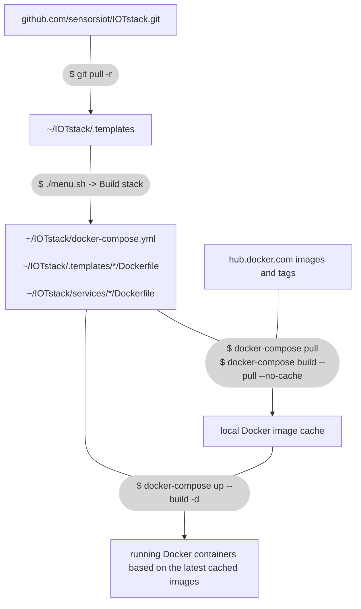

# Updating the project

There are two different sources: the IOTstack project (github.com) and
the Docker Hub (hub.docker.com). Both the initial stack creation and updates
come from these. To illustrate the steps and artifacts of the *update* process:



??? note "Minor details fudged in the graph"

    In order to keep the graph simple, some minor details were left unprecise:

    -   `$ docker-compose pull` will read `docker-compose.yml`, in order to know
        what image tags to check for updates.
    -   `$ docker-compose build --pull --no-cache` will use `docker-compose.yml`
        to find which of the "build:" sources are in use:

        * `~/IOTstack/.templates/*/Dockerfile`
        * `~/IOTstack/services/*/Dockerfile`
        * remote repositories with Dockerfiles

        and pull Docker images referenced in these while building.
    -   `$ docker-compose up --build -d` may not require the "--build"-flag,
        but having it won't hurt (and may help keep some corner-case problems
        away, docker may be a bit finicky).

## Backup and rollback

The usual way of backing up just your `~/IOTstack` contents isn't sufficient
for a 100% identical restore. Some containers may have local ephemeral
modifications that will be lost when they're recreated. Currently running
containers may be based on now outdated images. Recreating a container using an
old image is tricky. The local Docker image cache can't easily be restored to
the same state with old images and old tag references. The `docker pull` will
fetch the latest images, but it's not unheard of that the latest image may
break [something](
https://github.com/node-red/node-red/issues/3461#issuecomment-1076348639).

Thus to *guarantee* a successful rollback, you have to shutdown your RPi and
save a complete disk image backup of its storage using another machine.

For a hobby project, not having perfect rollback may be a risk you're willing
to take. Usually container image problems have fixes/workarounds within a day.

## Update Raspberry Pi OS

You should keep your Raspberry Pi up-to-date. Despite the word "container"
suggesting that containers are fully self-contained, they sometimes depend on
operating system components (WireGuard is an example).

``` console
$ sudo apt update
$ sudo apt upgrade -y
```

## Recommended: Update only Docker images

When you built the stack using the menu, it created the Docker Compose file
`docker-compose.yml`. This file or its linked `Dockerfile`s, use image name and
tag references (a missing tag defaults to `:latest`) to get the images from
hub.docker.com. Likewise, when Docker is told to pull updated images, it will
download the newest image for the tags into its local cache.

Updating the IOTstack project templates and recreating your
`docker-compose.yml` isn't usually necessary. Doing so isn't likely to provide
much benefits, and may actually break something. A full update is only
recommended when there is a new feature or change you need.

!!! tip "Recommended update procedure"

    1. Shutdown your RPi, remove the storage medium and do a full backup
       [image](https://www.howtogeek.com/341944/how-to-clone-your-raspberry-pi-sd-card-for-foolproof-backup/)
       of the storage to another machine. Reattach the storage back and power
       up your RPi.<br />
       NOTE: To skip this step may cause days of downtime as you debug a
       problem or wait for fixes.
    2. Get latest images from the web:
       ``` console
       $ docker-compose pull
       ```
    3. Rebuild localy created images based on new parent images:
       ``` console
       $ docker-compose build --pull --no-cache
       ```
       Note: this may not do anything, depending on your selected services.
    4. Update(recreate) containers that have new images:
       ``` console
       $ docker-compose up --build -d
       ```

If a service fails to start after it's updated, especially if you are updating
frequently, wait for a few hours and repeat the update procedure. Sometimes bad
releases are published to hub.docker.com, but they are usually fixed in under
half a day. Of course you are always welcome to report the problem to our
[Discord](https://discord.gg/ZpKHnks) server. Usually someone else has
encountered the same problem and reported the fix.

## Full update

Periodically updates are made to project which include new or modified container template, changes to backups or additional features. As these are released your local copy of this project will become out of date. This section deals with how to bring your project to the latest published state.

!!! danger "Breaking update"
    Recent changes will require [manual steps](
    https://github.com/SensorsIot/IOTstack/blob/master/README.md#significant-change-to-networking)
    or you may get an error like:  
    `ERROR: Service "influxdb" uses an undefined network "iotstack_nw"`

## Quick instructions

1. shutdown your RPi, remove its storage medium and do a full image backup of
   it to another machine. Reinstall your storage and power up your RPi.
2. backup your current settings: `cp docker-compose.yml docker-compose.yml.bak`
3. check `git status` for any local changes you may have made to project files, ignore any reported "Untracked files". Save and preserve your changes by doing a commit: `git commit -a -m "local customization"`. Or revert them using: `git checkout -- path/to/changed_file`.
4. update project files from github: `git pull -r origin master`
5. recreate the compose file and Dockerfile:s: `./menu.sh`, select Build Stack, don't change selections, press enter to build, and then exit.
4. get latest images from the web: `docker-compose pull`
5. rebuild localy created images from new Dockerfiles: `docker-compose build --pull --no-cache`
6. update running containers to latest: `docker-compose up --build -d`

### Troubleshooting: if a container fails to start after update

* try restarting the whole stack: `docker-compose restart`
* backup your stack settings: `cp docker-compose.yml docker-compose.yml.bak`
* Check log output of the failing service: `docker-compose logs *service-name*`
    * try googling and fixing problems in docker-compose.yml manually.
* try recreating the failing service definition using menu.sh:
    1. `./menu.sh`, select Build Stack, unselect the failing service, press
       enter to build, and then exit.
    2. `./menu.sh`, select Build Stack, select the service back again, press
       enter to build, and then exit.
    3. Try starting now: `docker-compose up -d`
* Go to the [IOTstack Discord](https://discord.gg/ZpKHnks) and describe your
  problem. We're happy to help.

## Details, partly outdated

!!! warning
    If you ran `git checkout -- 'git ls-files -m'` as suggested in the old wiki entry then please check your duck.sh because it removed your domain and token

Git offers build in functionality to fetch the latest changes.

`git pull origin master` will fetch the latest changes from GitHub without overwriting files that you have modified yourself. If you have done a local commit then your project may to handle a merge conflict.

This can be verified by running `git status`. You can ignore if it reports duck.sh as being modified.


Should you have any modified scripts or templates they can be reset to the latest version with `git checkout -- scripts/ .templates/`

With the new latest version of the project you can now use the menu to build your stack. If there is a particular container you would like to update its template then you can select that at the overwrite option for your container. You have the choice to not to overwrite, preserve env files or to completely overwrite any changes (passwords)


After your stack had been rebuild you can run `docker-compose up -d` to pull in the latest changes. If you have not update your images in a while consider running the `./scripts/update.sh` to get the latest version of the image from Docker hub as well
